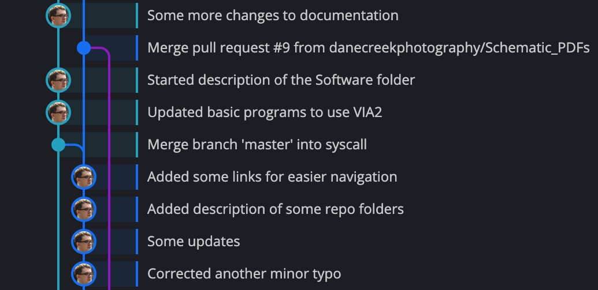
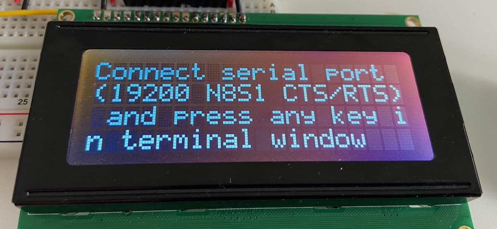

# Part one of many

There is no way I could fit all the things I learned, even if just using bullet points, in single blog entry. I will probably share these as I go, mixing them with general descriptions and new experiments. Starting with one that is most obvious: always have some reference point, working revision that you can revert to.

## Version control

Use it for anything and everything. Keep your sources, even if they are temporary, one-off experiments. Save your schematics, even if you design them for temporary ad-hoc device. Use branches to separate developments that might or might not go into final design – it will be easier to merge them with release branch than to remove them from it.

This was obvious, but what else? Well, in general it’s not recommended to store binary results of any build, it should be possible to generate them easily from sources (schematics, configuration, etc.) stored in repository. That being said, I was asked number of times to provide PDF of the schematic or HEX file with firmware by people who didn’t want to install the whole software stack just to take a look at how I did certain things.

What I also decided to keep was the datasheets of used chips – reason being: you can find different versions of datasheet when looking for it online and sometimes they differ significantly. Git handles large binary files that don’t change often very well, so don’t worry about repo size.

If you intend to go to PCB at some point, make sure your design your circuit first, build in on breadboard second, test third and move to PCB layout at the end. Things that are not documented properly will be missed when designing PCB. And no, you will not remember that one little obvious detail next week. You will forget it, trust me :)

## Fail often and fail early – but understand what happened

One of the most difficult parts at the beginning of the project was writing LCD interface. If you watched Ben Eater’s videos about it, you might be wondering what was so hard, he made it look easy.

Problem is that Ben uses the most “default” version of the interface, where I decided to go for more complex one (4 bit instead of 8 bit; 4x20 LCD instead of 2x20).

I built my LCD interface on breadboard and it worked. Sort of. Sometimes it did, sometimes it didn’t. I blamed instability of breadboards and moved on. I was lucky, it was only my software that was busted, and after migrating to PCB, when issue occurred again, I had to look closer at the code and fixed it. Then, couple of months later fixed it again :)

Similar thing happened when I started playing with new serial interface. It all seemed to work pretty well, with some exceptions. I blamed ribbon cables, was about to move on, but this time stopped and started looking at it again. And again. And again. What I almost attributed to ribbon cables was serious hardware design flaw that, when moved to PCB, would render it useless. There was no way of fixing that in code this time.

So, when it fails, even if rarely – don’t just rewire or shrug and move on. Try and understand what happened. It might have been freak accident, but most likely there is something you didn’t consider.

## Use the right tool for the job

So you want to build 6502 based computer? Or any other embedded hardware? It’s pretty obvious how to do it: prototype the whole thing on breadboard, write operating system for it, upload, test and then design PCB reflecting your breadboard connections. Easy-peasy :) 

Except it’s not. Not even close. I have tried and learned a lot from it, but the most important lesson is you don’t really want to do it. Do small things in isolation, and always, always, always use the right tool for the job.

No, you don’t need expensive 500$ 100MHz 4-channel 1GS/s scope for it. You might need 13$ cheap Saleae Logic8 clone. Sure, proper scope might come in handy, and it will help here and there, but you can easily do without it. Since you are dealing with digital electronics and the chips you use are pretty tolerant to poor design, most likely you will not encounter issues that can be found, understood or resolved only using a scope.

That said, building system like that from scratch (like I did) is plain stupid. I wasted countless hours troubleshooting my LCD interface (more on that one soon) and trying to guess what was happening, where the right thing to do was to hook it up to Arduino and bit-bang from there with serial monitor providing convenient access to debug information.

Remember that when you start you have very limited system with little to none information about what is going on inside. Sure, after a while, when your connections become “solid” (as in tested and working) and you get convenient I/O subsystem with some sort of monitor capability, you will be able to sort out most of the issues without external hardware, but when only starting and trying to bit-bang new chip? Use Arduino instead. You will learn much more about the hardware you are interfacing with.

## Beware of feature creep

That’s the worst part. You will always have one more idea. There will always be something more to do. Remember – one step too far can turn your PCB into useless crap. If you’re lucky, simple cut and patch will do, but sometimes it’s not that easy. Remember that with proper PCB design you can provide yourself with enough flexibility to make some decisions later. Don’t leave everything open, it defeats purpose of PCB, but don’t treat the first revision as the final one. Each is just a step in your journey.

To be continued...