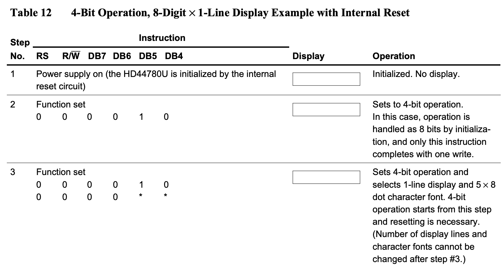
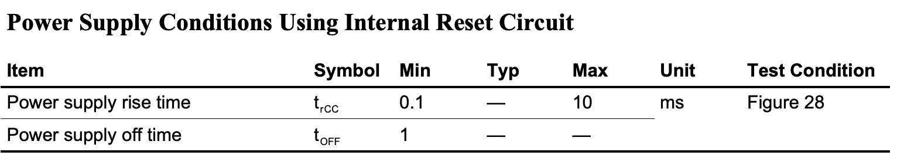
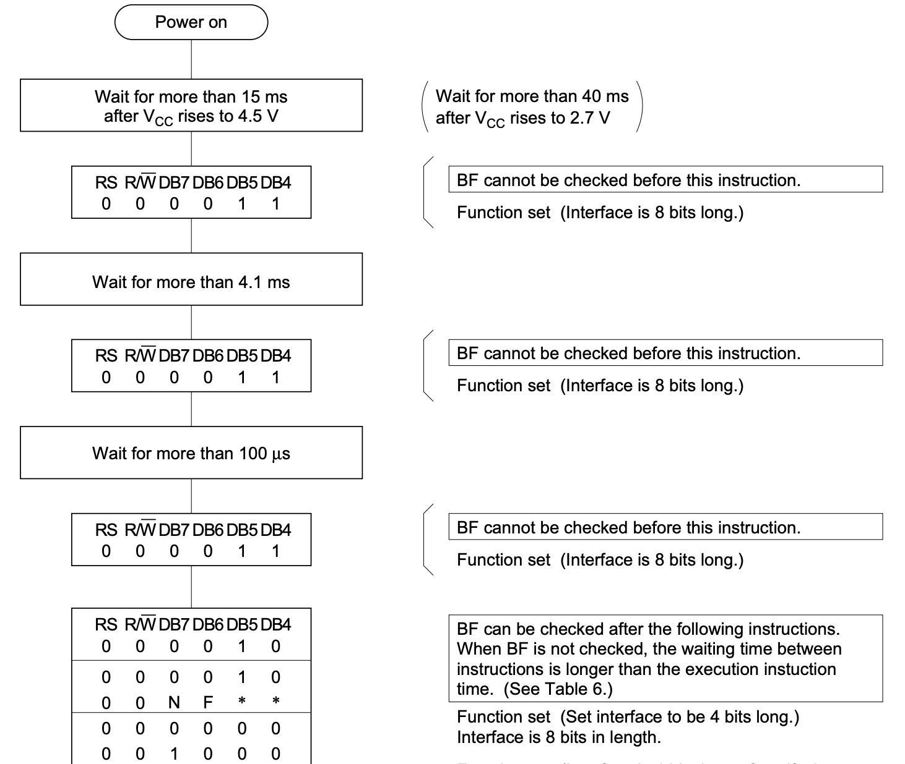
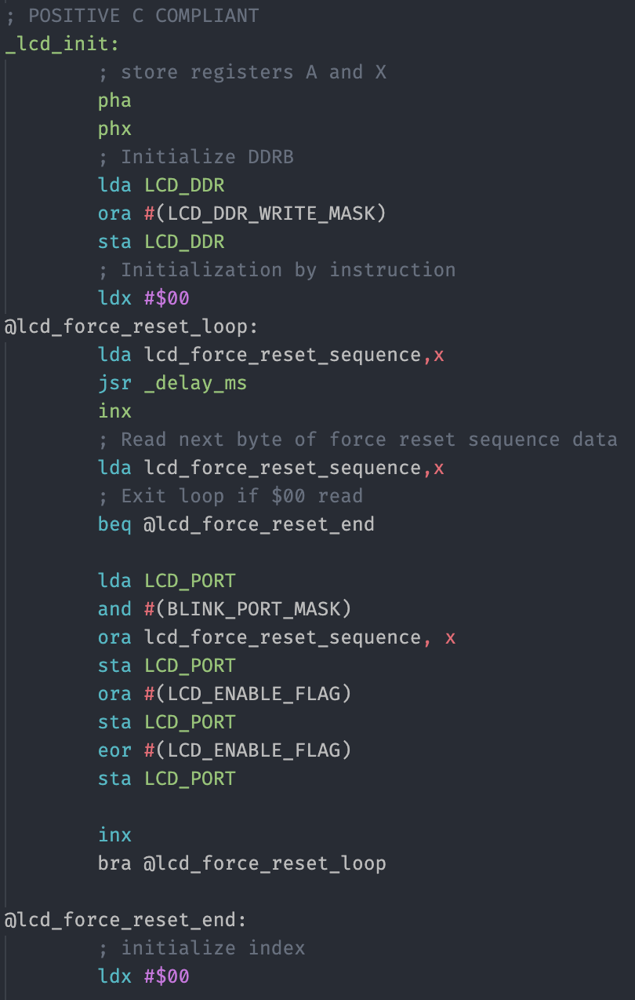

# That can't be hard, can it?

If you watched Ben Eater's [video](https://www.youtube.com/watch?v=FY3zTUaykVo) about interfacing with HD44780 LCD controller, you might be thinking - why bother writing about it? It's dead simple.

Well, as usual, yes and no. When you *finally* figure it out, it's actually pretty obvious, but it takes a while to get there. **And please note**: I don't mean to criticise Ben's work - his videos are awesome, and I would have never started my project without them. Having said that, he did omit certain details that might or might not cause issues with your build. Let's review them one by one.

## Initialisation sequence

There are two major modes of operation for this controller: 8-bit and 4-bit. Ben, in his videos, chose the former, and for a good reason: it's much easier to understand, programming model is less complicated and, last but not least, it's the default operation mode.

When you check out his [code](https://eater.net/downloads/hello-world.s), this is what you will notice:

```
  lda #%00111000 ; Set 8-bit mode; 2-line display; 5x8 font
  sta PORTB
  lda #0         ; Clear RS/RW/E bits
  sta PORTA
  lda #E         ; Set E bit to send instruction
  sta PORTA
  lda #0         ; Clear RS/RW/E bits
  sta PORTA
```

This is just beginning of the initialisation sequence, and it selects one of the modes of operation - the 8-bit interface. I chose to use 4-bit mode in my build (which, by the way, was pretty dumb on my part, but more on that later, in next "Lessons learned" entry), and I thought all I need is to change the code so that it initialises LCD with 4-bit mode, 2-line display and 5x8 font. Seems logical, right?

Now, if you check [schematic](https://eater.net/datasheets/HD44780.pdf), it even provides example of how this needs to be done. See Table 12 on page 42. Looks simple:



And the funny thing is - it does work... sometimes. It works **after internal reset**, and this is where the catch is. Internal reset is special "gizmo" for a lack of better word, that will set up the internals of the LCD controller after powering it up. It has specific electrical requirements (page 50):



So, for your LCD to operate correctly, you need to ensure that it reaches required power supply voltage in between 0.1ms and 10ms. In most cases this requirement will be met and LCD will initialise properly upon power-up. When this initialisation is completed, sequence described in Table 12 (page 42) will correctly toggle operation to 4-bit mode and everything will work just fine.

Problem is that you have to reset your CPU sometimes. When you do, strange things start happening: text on LCD appears corrupted or disappears altogether. The only way to fix this is to power it all off, wait a second, power it back up. What's the problem?

Well, once you figure it out, it's pretty obvious:

1. When you power-up your computer first, internal reset sets up LCD to work in 8-bit mode,
2. During initialisation routine your CPU sends command to toggle to 4-bit mode - and this is what LCD expects: single strobe of four bits 0b0010, so this works,
3. Everything keeps working nicely until you reset the CPU,
4. After reset, your CPU starts invoking initialisation sequence again, sending single 4-bit mode enable command (just 4 bits 0b0010),
5. Problem is that LCD is already in 4-bit mode, and it doesn't understand this single 4-bit command anymore. It expects to receive two nibbles 4-bit each this time.

It all goes south from there - everything you send to LCD is corrupted.

## How to solve this issue?

Well, this is also pretty well explained in the datasheet, but you need to read it carefully to make sure you implement it correctly (Figure 24, page 46):



This is backup procedure that will take care of proper LCD initialisation when power-up reset conditions are not met. Why not use it every time just to be safe then?

The weird thing about this process is that you have to send three consecutive single 4-bit instructions (as in: single 4-bit strobe, instead of two 4-bit strobes, as usual) to set the interface to 8-bit mode. It's not a typo! To enable 4-bit mode you have to say three times "I want 8-bit mode" with just half of your mouth open. Only then you say "Actually, I want the 4-bit mode", still with half of your mouth closed. And only after that you can start using proper 4-bit interface with dual strobes of 4-bit nibbles for each read/write operation.

EDIT: As [Ken Yap](https://hackaday.io/hacker/344094-ken-yap) mentioned in the comment below, there is actually very good explanation for this weird reset procedure in this [Wikipedia article](https://en.wikipedia.org/wiki/Hitachi_HD44780_LCD_controller#Mode_selection). Thanks for sharing!

Now, you might be wondering how comes Ben never included any of that in his videos, and it still worked. The answer is simple: as long as you use 8-bit interface and you are sure your power-up requirements are met (and they are with Ben's build), you never have to worry about reset sequence. You rely on default behaviour of the controller that will set your interface width to 8-bit and all commands will be recognised by the LCD automatically.

Obviously, Ben could have added this elaborate reset sequence (it's in Figure 23 on page 45) for 8-bit mode, but that would add to the complexity of his source without any added value really.

Now, if you want to stick to 4-bit interface, this is how the code should start:



Now, to add insult to injury, I decided to use 4-bit mode as single VIA port (more on that later) and since it used only 7 data lines (4-bit, R/W, RS, E), I decided to put blinkable LED on the remaining line. This is what complicates the code above, but let's look at it step by step.

```
; POSITIVE C COMPLIANT
_lcd_init:
        ; store registers A and X
        pha
        phx
```

First I store all the used registers on the stack. It's not really mandatory for init routines that are not to be frequently called, but for the same reason cost is minimal, so I would rather write interrupt-safe code.

```
        ; Initialize DDRB
        lda LCD_DDR
        ora #(LCD_DDR_WRITE_MASK)
        sta LCD_DDR
```

This part is related to the one remaining line (the blink LED) - I just don't want to change Data Direction Register for it, so I load and set the LCD lines to output (High).

```
        ; Initialization by instruction
        ldx #$00
@lcd_force_reset_loop:
        lda lcd_force_reset_sequence,x
        jsr _delay_ms
        inx
```

First thing in Figure 24 in the datasheet is that we have to wait some amount of time before each instruction is executed, and we can't use reading busy flag for it. That's why I keep the delays together with the commands to be invoked - first delay length in milliseconds, then the value to be sent:

```
lcd_force_reset_sequence:
        .byte 20
        .byte LCD_CMD_FUNCTION_SET | LCD_FS_8_BIT | LCD_COMMAND_MODE | LCD_WRITE_MODE
        .byte 5
        .byte LCD_CMD_FUNCTION_SET | LCD_FS_8_BIT | LCD_COMMAND_MODE | LCD_WRITE_MODE
        .byte 1
        .byte LCD_CMD_FUNCTION_SET | LCD_FS_8_BIT | LCD_COMMAND_MODE | LCD_WRITE_MODE
        .byte 1
        .byte LCD_CMD_FUNCTION_SET | LCD_FS_4_BIT | LCD_COMMAND_MODE | LCD_WRITE_MODE
        .byte 1
        .byte $00
```

Now, after the delay I send the actual value: three times 0b0011, and only then 0b0010. You might be wondering why I don't do any bit-level operation, like masking out the lower bits and shifting, but this is due to my wiring: four data lines are connected to VIA pins 4-7, and the lower bits are representing R/W, RS and E flags. R/W and RS are selected in the bytes above (LCD_COMMAND_MODE | LCD_WRITE_MODE). The only value not set is the E flag, and I will explain this below.

```
        ; Read next byte of force reset sequence data
        lda lcd_force_reset_sequence,x
        ; Exit loop if $00 read
        beq @lcd_force_reset_end

        lda LCD_PORT
        and #(BLINK_PORT_MASK)
        ora lcd_force_reset_sequence, x
```

So, when reading the value to set, I check if it's equal to zero indicating end of initialisation sequence.

Then, to preserve the value of blink LED, I read the value of the port and mask out all the remaining bits (set them to zero) using AND operation.

Last step is adding current value of the initialisation sequence and storing it in accumulator. All that remains, is to write the data and strobe E line:

```
        sta LCD_PORT
        ora #(LCD_ENABLE_FLAG)
        sta LCD_PORT
        eor #(LCD_ENABLE_FLAG)
        sta LCD_PORT
        inx 
        bra @lcd_force_reset_loop

@lcd_force_reset_end:
```

Plain and simple. 

Only after this forced initialisation is completed, I can start using 4-bit interface with my LCD controller. 

```
@lcd_init_loop:
        ; Perform actual init operation
        lda lcd_init_sequence_data,x
        beq @lcd_init_end
        ; Clear carry for command operation
        clc 
        jsr lcd_write_byte
        inx
        bra @lcd_init_loop
@lcd_init_end:
        plx
        pla
        rts
```

This part of the code reads the regular initialisation sequence (like in Ben's video, but with changes for 4-bit mode), and sends each byte in two 4-bit nibbles.

**One important remark:** if you compare reset by instruction (Figure 24) and initialisation sequence (Table 12), you will notice that the step 2 from Table 12 is actually the step 4 from Figure 24. Just to make things more complicated :)

Just for clarity, this is what my init sequence looks like:

```
lcd_init_sequence_data:
        .byte LCD_CMD_FUNCTION_SET | LCD_FS_FONT5x7 | LCD_FS_TWO_LINE | LCD_FS_4_BIT
        .byte LCD_CMD_DISPLAY_MODE | LCD_DM_DISPLAY_OFF | LCD_DM_CURSOR_OFF | LCD_DM_CURSOR_NOBLINK
        .byte LCD_CMD_CLEAR
        .byte LCD_CMD_ENTRY_MODE | LCD_EM_SHIFT_CURSOR | LCD_EM_INCREMENT
        .byte LCD_CMD_DISPLAY_MODE | LCD_DM_DISPLAY_ON | LCD_DM_CURSOR_OFF | LCD_DM_CURSOR_NOBLINK
        .byte $00
```

## Enable strobe - yet another pitfall

Another silly mistake I made was related to handling Enable strobe. When using 4-bit interface completely connected to single VIA port it's actually tempting to write code that will set all seven bits of the interface (4-bit, R/W, RS, E) in single instruction and then clean the strobe bit in another one.

Again, the problem with this approach is that it works... sometimes.

This time, however, I can't blame Ben's video or his code simplicity. It's all my own stupidity.

When you examine Ben's code you will notice how he handles it:

```
  lda #"H"
  sta PORTB
  lda #RS         ; Set RS; Clear RW/E bits
  sta PORTA
  lda #(RS | E)   ; Set E bit to send instruction
  sta PORTA
  lda #RS         ; Clear E bits
  sta PORTA
```

He first sets all the lines beside the E one, and only then he raises signal on E line. This is exactly how you should do it, as this allows outputs on VIA port to stabilise before they are read by LCD controller.

See, the problem is that these lines don't really change value immediately, and they definitely don't do this at the same time. When you write the data to your port together with the E bit set, most of the time it will assume the new value pretty much at the same time, but every now and then, one of your data lines will lag behind long enough to be read incorrectly.

As a result you get the worst possible bug: it fails randomly, not very often, and it's tempting to blame breadboard or jumper wires. Nope, it's all software.

Bottom line - whenever using 4-bit interface (or any other setup where it's actually possible to set E line together with the data lines) don't set E line high together with the data lines. Have at least one clock cycle between the two.

In the following entry I will write more about busy flag checking and implications of using slow clocks and/or inefficient software.