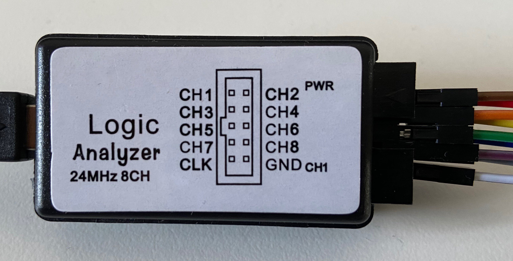
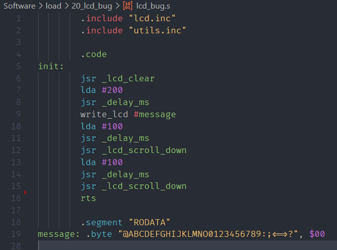
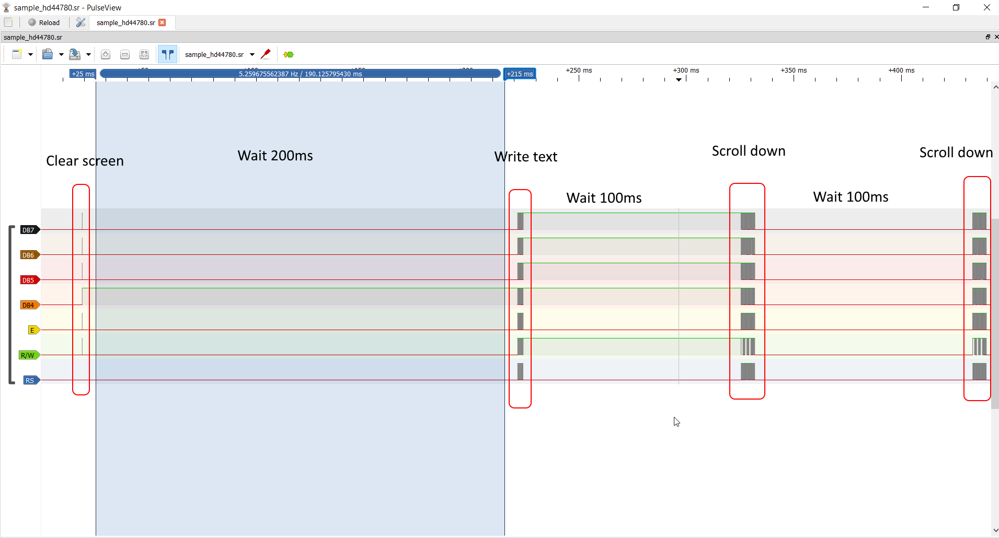
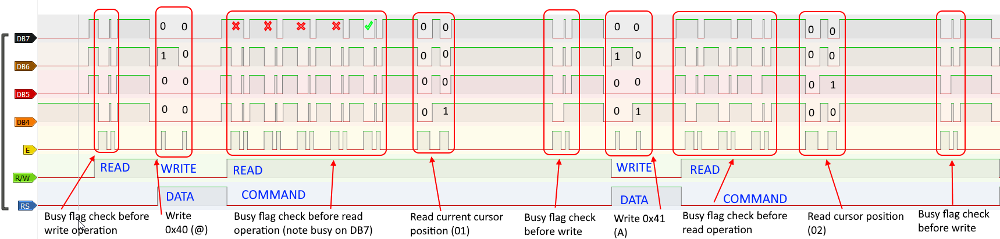
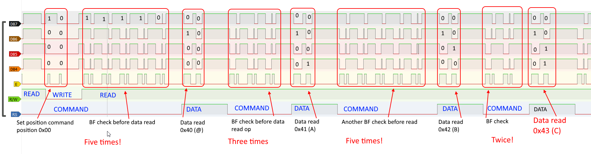
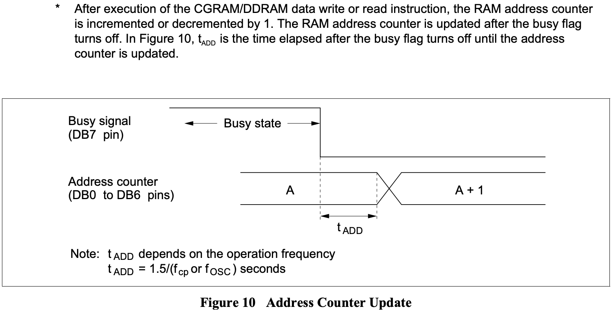

# What do I mean by "sloppy coding"

Well, each one of us has own definition of that term, right? Having had over 15 years of professional experience in enterprise applications maintenance and development I have a very specific definition of "sloppy": for me any code obfuscated for any kind of performance is "sloppy". Code should be easy to read, easy to test, easy to maintain years after it has been written. No magical side effects, no assumptions about call order, reentrancy, interrupt handling, database result ordering and so on.

However, for this particular post, I want to use a different definition. The one that I'm referring to right now is the "Superstar Hacker" mindset of the 80's: code that is not super efficient, super small, super optimised - it's just "sloppy".

Now, I don't agree with that approach, but I do accept the term for the purpose of this post. Hopefully it will become clear soon :)

## Waiting for your turn

When you start with Ben's video with slow clock it's all pretty nice and simple: you write characters to VIA output port and they magically show up on the screen. Everything works, no problem whatsoever. This is like speed 0 - several Hz at best. Your code doesn't have to worry about latency of the controller, internal memory operations and so on.

However, when you move to higher clock speed (like 1MHz), things become complicated - you need to start checking busy flag of the LCD controller to ensure that you don't issue new command while the last one is still running.

In Ben't videos it's also very well explained, how the busy flag checking should be done - basically, before each write operation you should first read current status to ensure that previous write has completed. Easy? [Sure!](https://eater.net/downloads/hello-world-final.s)

```
print_char:
  jsr lcd_wait
  sta PORTB
  lda #RS         ; Set RS; Clear RW/E bits
  sta PORTA
  lda #(RS | E)   ; Set E bit to send instruction
  sta PORTA
  lda #RS         ; Clear E bits
  sta PORTA
  rts
```

What happens is that each time you want to write character, you loop until previous operation is completed, indicated by 0 on the most significant bit of the status value:

```
lcd_wait:
  pha
  lda #%00000000  ; Port B is input
  sta DDRB
lcdbusy:
  lda #RW
  sta PORTA
  lda #(RW | E)
  sta PORTA
  lda PORTB
  and #%10000000
  bne lcdbusy
```

Now, I was ambitious. I wanted to use larger LCD: 20x4 characters. Soon I realised the crazy addressing scheme of this weird device. This is how the addressing is organised:

| 0x00 | 0x01 | 0x02 | 0x03 | ...  | 0x13 |
| ---- | ---- | ---- | ---- | ---- | ---- |
| 0x40 | 0x41 | 0x42 | 0x43 | ...  | 0x53 |
| 0x14 | 0x15 | 0x16 | 0x17 | ...  | 0x28 |
| 0x54 | 0x55 | 0x56 | 0x57 | ...  | 0x68 |

When you write consecutive characters, they will fill the **first** row, then wrap to **third** row, and when this one is full, move to **second** row followed by **fourth**.

I don't know how anybody came up with this idea, this must have been the easiest to do while maintaining backwards compatibility. Anyway, you have to handle it somehow. I noticed something nice: when reading for busy flag you get additional information - bits 0 thru 6 contain new cursor position (address in memory), after last read/write operation.

What I came up with was, in my opinion, pretty brilliant: instead of reading busy flag before each write, I read it afterwards. 

This seemed as perfect solution. While keeping the same number of read operations, I would get two things at once: I would know when the last write operation was completed, and I would get new cursor position after each character written. The algorithm was pretty simple: write single character, keep polling for busy flag, and when done, take the retrieved cursor position, compare against each of the possible line wrap points and when encountered, move cursor to proper line.

That way, when I wrote to address 0x13 (last address of first line), I would get back address 0x14 (first character of the third column). This means that I have to move to address 0x40 (beginning of second line). Lovely in its simplicity!

I was so proud of myself - after all, I had my first serious optimisations in the code. So hackery of me, and it worked as a charm!

Or I thought it did. The problem was that I was using relatively slow clock of 1MHz, and since I used 4-bit interface, it actually took quite a lot of clock cycles to write and then read busy flag. I remember contemplating whether I even get "busy" response, because of all the stack pushes, bit shifts and operations took so long it might actually never happen.

Since I had no way of checking it, I moved on. I wrote vertical scroll routines, optimised them as well (read full line to buffer, write full line in new position) and everything was fine.

## Another lesson learned

About this time I started sharing my PCB design with [Reddit community](https://www.reddit.com/r/beneater/) and some people decided to build my computer as well. I can't emphasise more how much I loved the feedback, constructive criticism and all the great ideas from people. 

**Lesson learned: share your work, you will learn so much more!**

One of the things I learned in the process was that there are special sockets for oscillators, just like those that I used for my ICs. This gave me the idea to put one in my computer to see how fast can I go - after all, WDC65C02 is rated for 14MHz, why not try to use some of this power? After studying datasheets I found that reasonable speed would be 8MHz, slightly too fast for ROM read time (150ns compared to 125ns cycle), but I wanted to try.

Obviously, since I used R6551 ACIA (I was afraid of the WDC65C51 bug, but this is something for another article), I had to rework my code to support the faster, yet buggy chip. To my surprise, this part was easy. Easy-peasy!

Another surprise wasn't so pleasant anymore: my super-awesome LCD routines stopped working. I was stuck trying to figure out what happened, but it just didn't make sense. I checked timing diagrams, all these convoluted graphs with access and hold times, and it seemed that it just had to work, but it didn't.

## Right tool for the job

When I purchased this lovely device few months ago, I was really skeptical. As in "this can't possibly work" kind of skeptical.



To my another surprise, this is actually the best way to spend 14 USD, really! Yeah, it has crappy bandwidth, and yes, it has no memory, so most of the time it will be limited by your USB port. Yes, it doesn't work very well with the official Saleae Logic software (I never managed to run it there with frequency higher than 4MHz).

But, since it's so cheap and easily available, it has great support from Open Source community, and sigrok/PulseView works with this one very well. No bandwidth limitations, more protocols support, lovely. Get one if you are starting with digital electronics, it will save you a lot of troubleshooting time!

This was the first time I used the logic analyser for troubleshooting, and I was surprised how it helped me out. Practically the same evening I had solution for my problem.

## What happened then?

Well, it was pretty simple. For some reason that I can't possibly understand, I assumed that I need to check busy flag when **writing** to the LCD, but it never occurred to me that I need to do this when I **read** from it as well. When my code performed standard write/read, write/read, write/read cycle it was all fine, but it failed in the scrolling routines, because there were consecutive read operations that failed badly. 

I was reading faster than the internal LCD pointer was advancing, resulting in reading totally corrupted data (partially from the old and partially from the new address).

How comes I never noticed the problem at 1MHz? As I expected, my "sloppy" (very verbose, self-documenting, safe) code was executing so slow it didn't matter at this clock speed, just like it didn't matter in the first LCD video by Ben when he used few Hz clock.

Actually, now that I think about it, my code was "double sloppy". It was "hacker sloppy" as in "slow, not optimised" and in other parts was "professional sloppy" as in "optimised beyond reason" (the part where I merged cursor read with busy flag check).

## Where the fun starts

Actually the best part of this experience was when I started using the logic analyser to troubleshoot. There is nothing better than to see your device operate in such a graphical manner. So, the program I used for troubleshooting was really simple:



It simply prints some characters (carefully picked for their ASCII codes being easy to recognise) and then scrolls the text down twice.



Looks nice, doesn't it?

Now, let's zoom in to see the specific operations happening:



The image above is annotated screenshot of the logic analyser output for the fixed code operation. 

First, I need to write first character of the string (@, 0x40), so I start with busy flag check - and the first check already is negative (not busy), so I can write. Since it's 4-bit interface, I need to send two nibbles of 4 bit each. After the character is written, I need to read current cursor position (read command operation, identical to BF check). Before the read can take place, I need to check for BF, and as you can see, I need to check five times!

After new position is read (01) it's compared against all possible "wrap" values (as explained above, in the addressing section), hence the delay before next write operation.

Again, BF check before write, and writing 0x41 (A). BF check before read (three times this one), and new cursor position is read (02). So on and so on.

It might be tempting to use some kind of arbitrary delay between the operations - instead of playing around with the busy flag check, I could add dead loop that would basically hold the execution for certain duration. Next image I wanted to show explains why arbitrary delays are BAD, BAD idea:



As you can see, I start with write operation of 0x80 - this is "set DDRAM address" command, setting the cursor position to 00, which is beginning of first line. I skipped BF check on the screenshot, but it had been done.

Then I continue to read the data, character after character to memory buffer (as explained above about the scrolling). Notice how the timings of busy flag check before read operation are inconsistent. Sometimes it takes just two queries for BF check to return negative, but sometimes it can be as much as five!

Now, writing from buffer is also very similar in that regard:


Now I move to beginning of second LCD line (position 0x40, as explained above), and I write characters from the buffer one by one. Notice another interesting thing - there must have been some kind of interrupt (from serial maybe?) serviced in one of the BF check routines, causing weird prolongation of the enable pulse.

Isn't that fun to watch?

## Another issue to watch out for

Because I stopped at 8MHz, I can (again) ignore another issue that might impact your operation at higher frequencies. You will find the information in [datasheet](https://eater.net/datasheets/HD44780.pdf), Figure 10 on page 25:



As you can see, when reading new cursor position you might end up in situation, where the busy flag is cleared, but read will return the old (not the new) address. This delay is approximately 4us - negligible with 6502 CPU at 8MHz, but might be issue at 20MHz and higher. Keep that in mind!

## Summary

There are key takeaway points from this log entry:

1. Get yourself logic analyser, these cheap ones are great for understanding what happens in your circuit,
2. Share your work with other people, their feedback is invaluable,
3. If you decide to optimise your code, make sure you know the code is correct. Fixing optimised code is painful experience!

As usual, please let me know what you think in the comments below, and I will be back soon with some new content :)