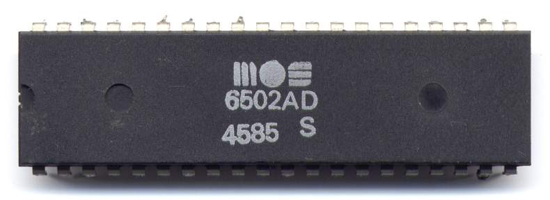
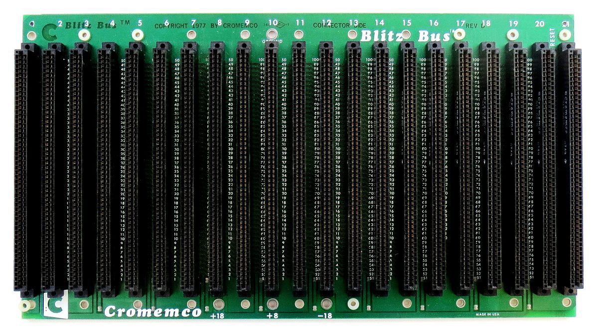

# General design guidelines (part 1)

I was a bit silent recently - went on vacation to Greece with my family and had to catch up with work after returning home. I hope to write a bit more often here now that I'm back to pandemic-normal :)

It’s time to write a bit more about the project being documented here – mostly about the purpose, goals and rationale behind them.

DB6502 was never intended to be commercial product, and definitely not a mass-market thing. I designed the first version as a stop-gap solution for BE6502 evolution. The idea was to get off the breadboards, design robust and flexible development toolchain to experiment with 6502 CPU and basic operating system design. To be perfectly honest, I have reached these goals already, and I could really stop here, but the journey has been fun all along, and I just want more. What could I add to my first design then, besides fixing some small issues in the original one?

## Self-contained, hackable 6502 development ecosystem

The problem with BE6502 and derivatives (including DB6502) is that it depends heavily on external hardware. You need Arduino Mega for very limited embedded debugger. You need TL866 II+ for ROM burning and we all hate chip flashing. You have to add serial connection on your own, and we all do it differently, using different chips.

I would like to combine all of these in one board: have 6502 run in its own environment with RAM and ROM with two VIA chips for general port based I/O and dual channel UART for high-speed external interface (serial terminal and file transfer separately if needed).

On top of that I want AVR chip connected to the system bus permanently that will act as debugger/monitor and fast ROM uploader. This design should enable very efficient software development without the hassle of OS recompilation and ROM flashing each time you need to use debugger.

AVR with its own serial channel will be able to stop, reset, single step CPU and run it at pretty high speed (up to 300KHz) in debug mode with limited stack trace and breakpoint functionality.

This combined with current state of my toy operating system should provide environment to experiment with all things 6502 is capable of with pretty much single board. It will also eliminate need for ROM removal/flashing using external programmer.

## Expandable bus

Based on the experiences with first version of DB6502, I consider expansion bus very important part of any successful build – it allowed for easy testing of new ideas without necessity to revert to breadboards. It also helps with hardware troubleshooting and analysis.

One of the mistakes in first revision was to disconnect all the “mystery” pins of 6502 (like MLB, RDY, BE or SYNC), since I have never used them in my simple breadboard experiments. Unfortunately, these turned out to be critical for proper debugging/monitoring by external tool, so in future revision these will be exposed via the system bus even if I can’t see any use for them now (MLB being perfect example here).

With proper expansion bus it should be possible to experiment with really advanced topics like video signal generation, DMA interfaces or multi-CPU designs, and the idea is to ensure that hardware design doesn’t limit my options here too much.

Another thing I considered was fully modular bus design where specific components could be made on separate PCBs and replaced without the need to redesign whole board. Currently, however, I don’t plan to implement anything like this.

## Better address decoder

My first invention ever for BE6502 was introduction of improved address decoder to enable better usage of available memory – instead of 16K RAM and 32K ROM in BE6502, DB6502 has 32K RAM and 24K ROM. It seemed to be good enough for anything I might ever do with it, but I actually managed to run out of ROM space and hit a few roadblocks with the RAM as well. Sure, most of these issues could be solved with clever optimisations of source code, but I need to learn something new, right?

I chose to use ATF22V10 GAL chip for address decoding in new revision. The main benefit of it is that it’s actually reprogrammable, so I can change the memory layout if needed. Could be useful down the road. The only downside – flashing ATF22V10 GAL will require dedicated hardware (external programmer), but I want to address this when I learn more about it.

The nicest thing about using programmable logic chip is that you can really change your mind about certain things later on, you don’t have to commit to certain things. Good example here would be CE/OE/RW lines for the ROM chip. Ben’s design actively prevents you from writing self-updating ROM, but with all my experiments so far it seems perfectly feasible. Having these signals controlled by the programmable logic chip will enable such interesting expansions.

## Test Driven Development platform

Some of the best experiences I had with first version of DB6502 were coming from merging two things: the brilliance and simplicity of 70’s hardware design and the maturity of software development practices that we have managed to accumulate over the decades since then.

When I started working on the OS/1 software I had huge advantage over the original software creators: I knew what works and what matters, I didn’t have to compete with rapidly growing market and I had simple laptop more powerful that all the computers combined of the 70’s. I admire people who managed without all this, without Arduino, static core CPU, graphical environments and portable cross-compilers, but I believe we should be using what we have learned so far in the area of software engineering.

That all being said, one of the things I miss a lot with my 6502 development toolchain is the lack of proper TDD toolset. I know that CC65 has something like sim6502, but that’s not really what I want – I would like to be able to run my tests on the actual hardware (like the 6502 CPU) with proper monitoring of the input/output conditions.

Connecting AVR to 6502 system bus might be just the solution for this idea – it would allow me to set up system scope, load code into memory, execute it and observe results. With proper automation of the debugger interface this might even be included in the standard make-based build process.

This is really ambitious goal, and I still need some time to think about it, but that’s what this post is about – ideas to explore.

So, these are the ideas I’m toying with right now. If you have any questions, comments, remarks – please let me know in the comments below.