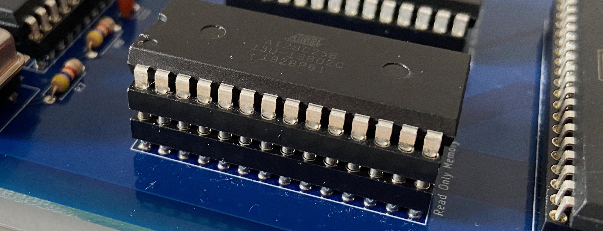

# How to lose your mind in three really simple steps

We have all been there, more than we care to remember. 

You are in the middle of creative frenzy, writing your code as the Devil himself. Compile, link, grab the programmer. Fish out that ROM chip carefully from breadboard, place in the socket. Take another look, notice the notch wrong side. Take a deep breath, rotate the chip, burn. Plug it back in, nervously connect power.

Trembling with anticipation you notice that nothing happens. Check power. Check reset switch, no it didn't fall out this time. Try one more time. Nope. Sigh, spend couple of minutes attaching Arduino debugger, step over first couple of instructions, but it all seems good for a while and fails only after several hundred cycles. Repeat - maybe it was freak occurrence.

After another half an hour you finally start checking wires and there it is - one of the suckers got loose. No, not so much to slide out of the breadboard, that would be just too convenient, just enough to make bad connection. Push it in, restart, it works, it works, it works, no it doesn't. Code bug again.

Where was I again? You no longer remember what you were doing, got distracted too much with silly wire not making good enough connection. Coming back to the point where you left off will take some time and impact your motivation.

## How to stay sane for a bit longer

If you search [/r/beneater for ZIF](https://www.reddit.com/r/beneater/search?q=zif&restrict_sr=1), you will find small sample of what people tried to do. Hell, even I did that for a while - as it turns out, you can make it fit in breadboard with simple hack (add header female pin header to the socket) so it doesn't loose connection each time you play with it.

For me the solution was to move to PCB, and put my EEPROM in secondary socket like so:

While this works surprisingly well (tooled sockets are perfectly matching each other, and are much more sturdy than the regular IC pins), it still frustrated me how often I have to pull the ROM out and flash it in my programmer. It was really annoying, so the next part of the code I wrote was bootloader functionality that was supposed to reduce the need for ROM flashing, and it worked for some time.

Unfortunately, with the limited resources of 64K address space I had to store at least some code in ROM and my OS was depending on it. Shortly after I added the option of static linking these routines in loadable modules so I could change them and experiment without EEPROM flashing. Again, it worked for a while, but when I started experimenting with higher clock frequencies and had to troubleshoot resulting issues it just wasn't enough.

At least I didn't have to worry about loose wires :)

## Does it have to be like this

Sorry to digress so much, but part of the experience for me is to see how my hobby ties into my day job in IT consulting company. One of the things that never ceases to amaze me is that people in my area of expertise are so clever when it comes to coming up with new ideas, and still they do so many things in such awkward way as if they have never known any better. Manual build processes. Awkward release management. Cumbersome testing procedures. Lack of any kind of DevOps culture. Nonexistent source code management procedures. We've all been there.

So, general word of advice would be: if you feel that your team is doing something in quite strange way and you suspect it could be done better - investigate. Challenge. Question. It's quite probable that this one thing can (and should) be done differently. Somebody out there might have came up with much better idea, and chances are you are the last ones to catch up :)

So, going back to the original issue: ROM programming. Does it have to be like that? Sure it doesn't, there is bloody Arduino sitting in your drawer, how many times did you have to fish out the effing EEPROM out of this thing to program it?!

Now that we have established that, let's consider our options here.

## ICSP options for 6502-based build

There is plenty of clever ideas out there, and here are some of them:

1. Have the 6502 run small bootloader off the ROM and use it to load the actual system software from PC over serial,
2. Give up ROM altogether and use RAM only. Copy code to the RAM using external CPU (again, Arduino/AVR/PIC/...)
3. Connect 6502 to some kind of Arduino/AVR/PIC that will be capable of ROM flashing.

Let's look at each of them separately.

## 6502 internal bootloader

I haven't explored this option too much, so I might be wrong, it might actually be perfectly feasible, but there are certain details you have to consider:

- **NMI interrupts** - can't block these, and they depend on ROM consistency. If one of these happens during programming, you can end up with seriously messed up situation. This could probably be addressed by having the actual programming routine run as NMI interrupt itself which might work.
- **Maskable interrupts** - yeah, these are pretty easy to avoid, as you can disable them, but you might need them for the ROM update operation. See, the problem is that in worst case scenario you need to flash 32K of ROM, and with stack/ZP you simply don't have enough RAM to store the whole image there. You need to rely on external data source which might be serial or SD card. It's easy if you can use synchronous data transfer, but if you need interrupts for hardware interface - you are in trouble, as they might not work in some cases,
- **Minimal ROM** - in order to fit in the whole image in memory you can reduce your ROM size and expose more RAM. This is how it has been done in the old days of Atari/Commodore. The smaller the ROM and larger RAM the more likely you will be able to load the full image and flashing code into RAM and update ROM without risk of interfering interrupts,
- **Dependency on external software** - the thing with the above approach is that you have to depend on external software source. If that's serial port you can't really run your 6502 computer in isolation. It might or might not be important for you, just have to keep that in mind,
- **Simplicity** - the best thing about this solution is that you end up with system that uses only 6502 chip, RAM, ROM and nothing else. It's "pure" so to speak.

In general I want to explore this path one day "just because". Might be interesting experiment, but this is not the way I want to go now.

## RAM based machine

This one is really interesting concept, and it has many advantages, unfortunately with some drawbacks:

- **Speed** - AVR can populate 6502 memory in an instant running at 16 MHz. It can load software from SD card using simple, off-the-shelf SD card interface and standard libraries. More importantly, the main factor limiting CPU speed in homebrew 6502 builds is the read access time of ROM chips. Standard AT28C256 chip in DIP package has 150ns access time compared to 55ns of 62256 RAM. This means that you can't really run 6502 based build with ROM faster than 8MHz. Sure, there are some alternatives (like using ROM in non-DIP package), but in general, you can go much faster with RAM only,
- **Runtime flexibility** - this approach allows you to run different programs, reusing full 64K as needed. In the old days of Commodore and Atari it was common to bank memory chips to enable/disable features like BASIC interpreter. With RAM-only approach you don't have to worry about it, as each loadable program can overwrite most of the "OS" code as long as it doesn't interfere with IRQ/Reset handlers, and these can be protected with smart programming,
- **Dependency on external hardware** - this is purely "religious" argument, so it might or might not appeal to you, but the fact is that build like this is completely dependent on external CPU and most of the "heavy lifting" is not done by 6502. One might argue that this kind of solution is too far from the original design intentions of 6502 creators.

I don't agree fully with criticism of the last point, but I do feel a bit uncomfortable with system that is not capable of running without much more powerful processor. Therefore I gave up on this idea as well, at least for now.

## Onboard ROM programmer

It's not hard to guess that this is the option I settled with in the end. I did it for the following reasons:

- **Speed** - using this approach allows you to use non-DIP EEPROMs with access time of 70ns, reaching maximum CPU speed that WDC 65C02 is rated for (14MHz),
- **No runtime dependency on external hardware** - while running, 6502 exists as if the AVR wasn't even there, it boots from ROM and uses software that is contained there. There are no interactions required with serial interface or SD card - it "just runs",
- **Similarity with the original BE6502** - this one, again, seems a bit "religious", but I don't want to forget where I came from. If not for Ben Eater, I would have never design my own build, and I want to keep my build at least partially compatible with his,
- **AVR based debugger** - this is something that can also be done in the RAM-only option. The idea is to have AVR on the board anyway (or available as external board some day?) which can be used to drive high-speed hardware debugger/monitor for 6502 computer. Why not use it for two purposes at the same time?

Now that it has been decided, the only thing was to write the simple software, right? After all, how hard can it be? In next post I will explore the details of writing AVR-based EEPROM programmer that is at least somewhat usable...