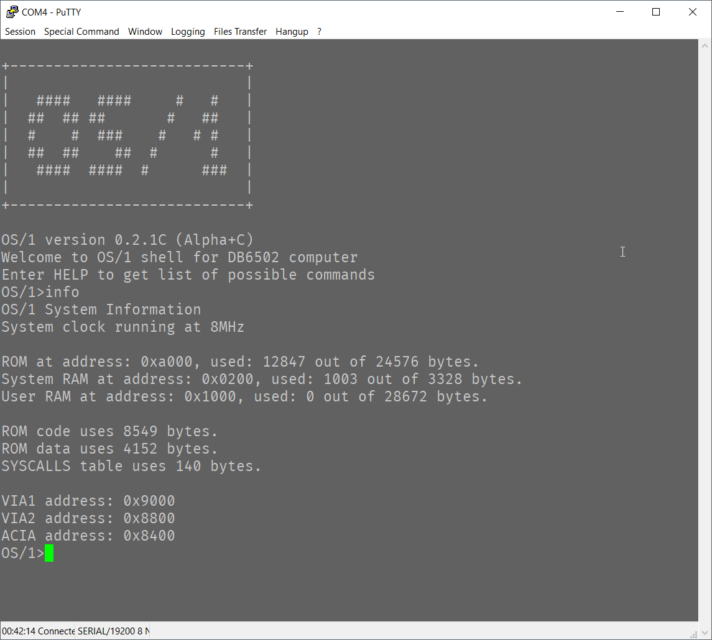
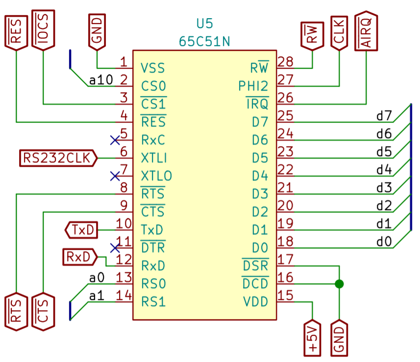
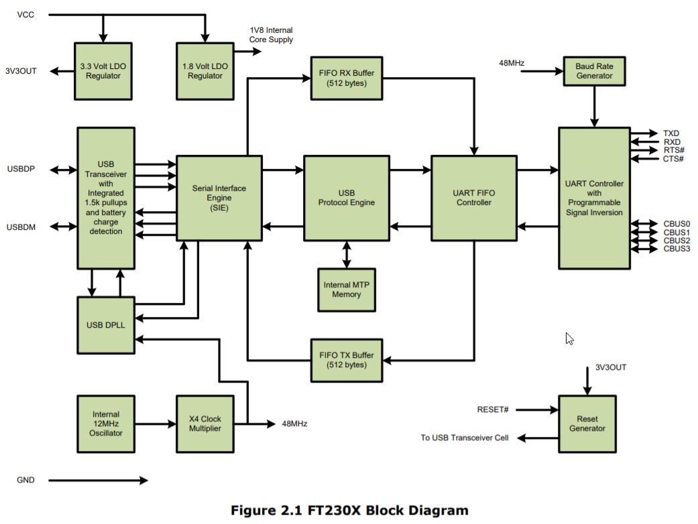
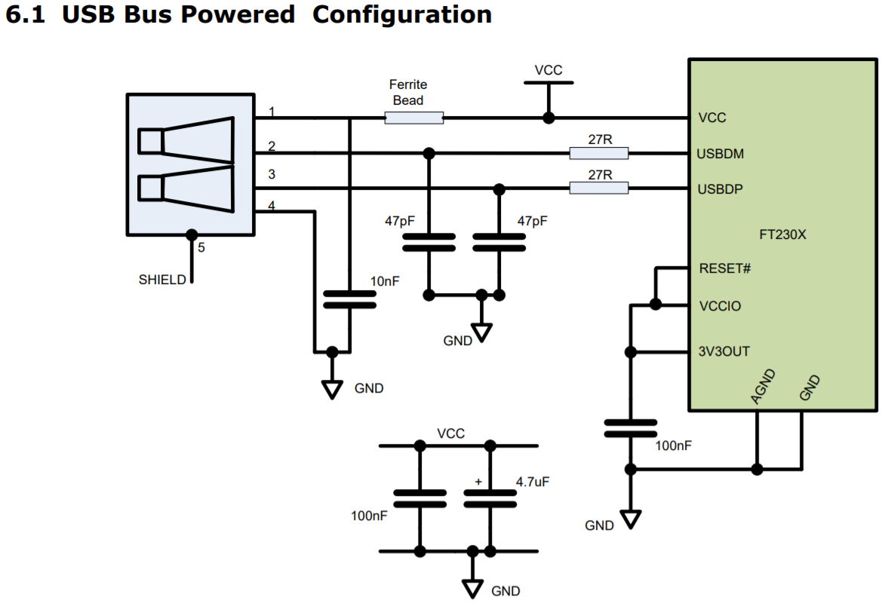
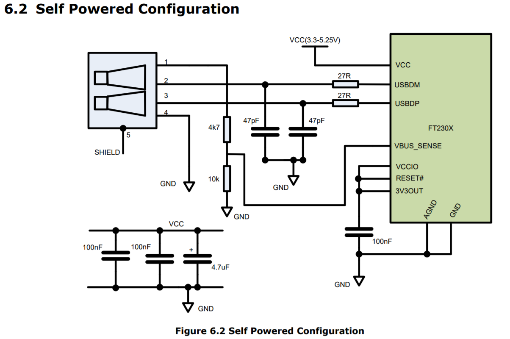
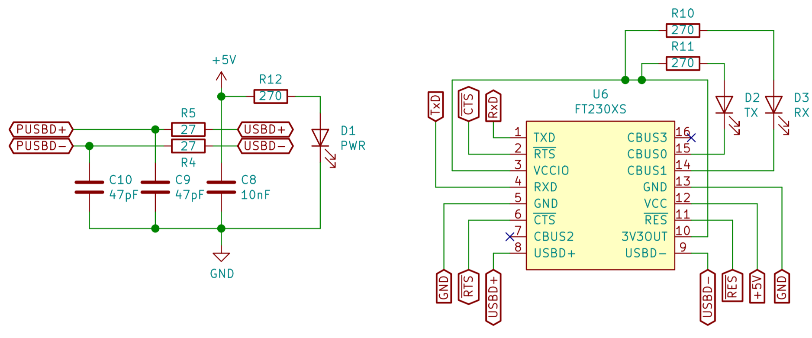
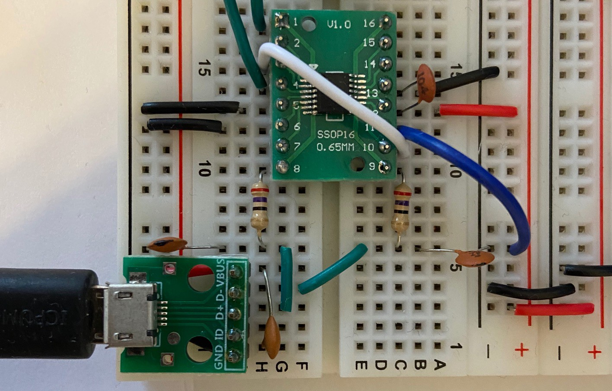
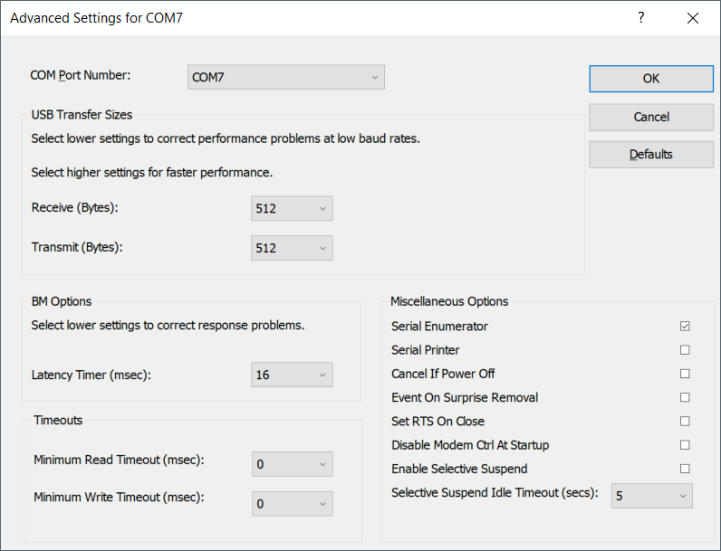

# Serial connection over USB for retro computer? Why not!

I was asked by someone in /r/beneater community to describe how to build USB -> UART interface using FT230XS chip, as this exercise might seem a bit intimidating for someone doing it for a first time. It was first time for me, and it did seem way more difficult than it really was. I'm happy to share what I have learned about how to do it (and what not to do). Also, I think it makes sense to explain even the more basic blocks of serial communication to make understanding of the whole flow easier.

## Understanding what the USB serial connection means for your computer

First things first - what do you need the serial connection for, and how it can be used. 

Well, obviously you can use this for simple shell connection. There is number of programs, including **picocom** for Unix/Linux/MacOS and **PuTTy** for Windows, that simply allow you to connect to the device and "talk" to it as a regular terminal app.

Please note, however, that you are not limited to such use! There are other use cases to consider, which can significantly improve the functionality of your homebrew machine:

1. File transfer protocol
2. Custom binary protocol

FIrst one is fairly standard: there is number of protocols invented back in a day that allow for file transfer using serial line. XMODEM is the one that is the simplest to implement and suitable for simple, single file transfers. I used this one for loading software (compiled on a PC) to my homebrew 6502 computer and it was pretty easy to use. Please note: for Windows machines you need to use specific fork of PuTTy called ExtraPuTTy.

Second use case is less obvious, but with serial protocol you can do whatever you please. For instance you can turn your PC into graphics display - have simple Python program read custom graphics data protocol from 6502 and display it on PC screen. You can even use this to route HTTP over TCP/IP traffic (after some simplification) to homebrew machine and react to REST calls over WiFi. That's cool, right?

Basically - having serial protocol support enables you to do all sorts of things!

# Some basic terms for start

When I first started investigating options to connect my Ben Eater's 6502 computer to my PC it was literally overwhelming. There are so many standards, terms, schematics that it seemed like something very, very difficult. As with most things IT related it turns out that the complexity is rooted in history, and to navigate it you need to understand how things came to be. I don't want to spend too much time on it, but let's take a look.

## RS-232 serial protocol

This single concept is responsible for most of the confusion out there. [RS-232](https://en.wikipedia.org/wiki/RS-232) was a very popular communication standard for serial data transmission, and it was designed for standard communication between PC and external devices. These devices might have been computer mice, phone line modems, printers, etc. Unfortunately, due to hardware limitations (connection quality) it required pretty high voltages to send reliable signal. Also, since it was used to communicate over strange media (phone modems where you had to pay for the time spent in connection), it required complex circuitry to indicate all the conditions. 

The important part to know about RS-232 is that it's serial communication protocol from the old days, and you might need it if you need to talk to very old hardware that supports it. If you don't (and you intend to use serial over USB for instance), then most of the old stuff is irrelevant and some signal lines can be ignored (grounded or left unconnected). Examples of such lines are **RI** (ring indicator used to inform CPU that phone to be used for modem transmission is ringing) or **DCD** (data carrier detect). Sometimes you will find them in modern serial adapters, but don't worry, you don't have to use them.

If you do need to use RS-232, you can use MAX232 chip that will take care of translation of your TTL 5V signals to 12V RS-232 world. I will not cover this here unless somebody asks me to :)

## Universal Asynchronous Receiver-Transmitter (UART)

According to [wikipedia](https://en.wikipedia.org/wiki/Universal_asynchronous_receiver-transmitter), UART is a device capable of communicating asynchronously using serial communication protocol, and it can be used to send and receive simple packets of data over just two data lines (transmit and receive). It doesn't require high voltages (like RS-232 did), and the communication is reduced to absolute minimum.

Some UART->USB adapters have additional features (Clear To Send and Request To Send lines for instance), but these are also optional.

In general, UART is like a common language used for anynchronous communication between connected devices. It has specific timing requirements (please note: it doesn't require clock line, like for instance, shift registers) and there is set of standard baud rates, but most UART devices can use any arbitrary baud rate.

## TxD and RxD

These are two most important signal lines for UART, and you should always "cross" them, so TxD line from your UART should be connected to RxD on the interfacing chip (another UART or UART->USB adapter). The same goes for RxD line from your UART chip, it should be connected to TxD on the UART->USB adapter.

## CTS# and RTS# (hardware flow control)

All the UART devices have some sort of input/output queue that is used to store outgoing/incoming data. From one side CPU is responsible to check if there is enough space in transmit queue before writing and to make sure to pick up data from the receive queue before it overflows. This part is easy, because CPU has access to internal UART registers where status of each queue is available.

Now, for the external hardware (UART->USB adapter for instance) it's not that easy. Having just transmit/receive lines is not sufficient to tell if the last transmitted byte filled up to receive queue to the limit or not.

To mitigate issue of overflowing (or overrunning) transmit/receive queues, there are two additional lines: CTS# (input) and RTS# (output). Some UART->USB adapters have them, while some don't. Even if it does have them, you are not obliged to use them. You, as the computer designer and system software developer, are responsible for making sure that you handle the overflow issues correctly. There is number of ways to do so: interrupt-based processing and memory buffers, data transfer checksums and transfer restart requests. It's up to you.

However, if you do decide to use hardware flow control, you can do it with CTS#/RTS# lines. You connect them "crossed" as with the TxD/RxD lines, and the way it works, is that when you are not able to receive more data, you inform your UART to "raise" (send HIGH signal) RTS# line. This should prevent the interfacing chip (UART->USB adapter in this case) to send more bytes to you. At the same time your ACIA chip will stop sending data to the adapter if it raises CTS# line to indicate that it's not able to receive any more data.

Should you use it? I don't know. I do use it, but it doesn't prevent all overflow issues, and it does complicate the code quite a bit. For simple shell programs I wouldn't bother really, but it's up to you.

## Universal Serial Bus (USB)

This is something we all know and love. Awfully complex, yet extremely popular serial interface for connecting pretty much anything to everything. It was designed to rule all the PC->peripheral connections and largely succeeded at that.

The only problem is that it was invented when computers were infinitely more poweful than those good old 8-bit machines. As a result, simple homebrew computers built on top of 6502 or Z80 CPU just don't have the resources required to navigate complexities of USB transmission.

To mitigate this limitation we can use many chips available on the market that are essentially wrapping serial communication (UART) in USB data packets understandable to any PC out there. These chips (when connected to PC via USB cable) will appear as standard serial device that will be available for any program to interface with. Any byte sent to this device will "magically" be routed to your computer and delivered to your UART chip (WDC 65C51 ACIA for instance).

# Working solution architecture

Now that we have the basic terms clarified, let's talk about actual implementation. There are several components to it:

1. Microprocessor (6502 in my case, but can be anything really) that is capable of sending/receiving data to/from dedicated UART controller based on provided instructions (program),
2. UART controller that will take the data from CPU (or send it back to it) and transmit the data using serial protocol with given protocol parameters (baud rate, stop bits, data bits, etc.),
3. Communication media between UART controller and remote device. This can be RS-232 modem, USB adapter (like FT230XS or CH340G) or just plain wire if both devices "speak" UART.

Now, the above description is really simplified, but the important thing is to remember that there are like three layers to it: CPU speaks it's own language and uses system bus to talk to UART controller. UART controller converts data provided by CPU to serial protocol and communication media converts serial protocol to specific hardware transmission media.

In our particular case 6502 is the CPU talking via parallel system bus to WDC65C51 ACIA chip that converts parallel input to serial signal. In other cases (like the AVR devices) UART port can be directly exposed from the CPU.

FT230XS chip (and many other similar ones like PL2303, CP2102 or CH340G) take care of handling USB protocol complexity. From one end they seem like UART receiver/transmitter; from the other they are proper USB serial port devices that are correctly recognized by operating system of a modern PC.

## CPU to ACIA interface

This part isn't very difficult as long as you stay within the realm of "bus compatible" devices, meaning they all use the same types of signals. For 6502 the "bus compatible" ACIA is WDC65C51 or R6551 chip. They all share the same system clock (to indicate when data on system bus is valid), the same R/W line to indicate whether data is to be read or written to the chip. Their chip select signals are very similar to those of VIA chips. **Please note****:** it will be much easier to connect ACIA to your 6502 chip if you have already connected VIA as per Ben Eater's instructions and you reviewed them once of twice to understand how this has been done.

In my build this is how I connected ACIA chip to 6502 CPU:

As with the VIA chip, you need to connect the standard signal lines:

1. D0..D7 - data bus, this is where the data will be sent between CPU and ACIA,
2. RS0 and RS1 connected to A0 and A1 respectively - these will be used to read/write from/to specific ACIA registers (data, command, status and control),
3. CS0 and CS1# connected to your address decoder. Obviously, you will have to change it so that your ACIA chip is visible to your CPU as the VIA has been - as specific address in memory,
4. RES# - connect to standard RESET# line on your CPU and VIA chips,
5. R/W - connect to standard R/W on your bus,
6. PHI2 - connect to system clock line,
7. IRQ# - leave unconnected now, let's skip interrupts for now (as Ben did with VIA).

Aside from the above, there are some ACIA specific signals:

1. XTLI - You need to connect output of 1,8432 MHz oscillator here. The reason to use such a weird frequency is that it maps nicely to standard baud rates. You could use some other clock (or even the system 1MHz clock) instead, but then your baud rates would have changed. It's doable, but for now just use standard recommended clock,
2. DTR - leave unconnected, it's output signal for RS-232 compatibility,
3. DSR and DCD - connect to ground, these are input RS-232 compatible lines,
4. RTS# and CTS# - these will be connected to your UART->USB adapter if it supports them. If it doesn't, then RTS# should be disconnected (output signal) and CTS# should be connected to ground (input),
5. TxD - connect to RxD on your UART->USB adapter,
6. RxD - connect to TxD on your UART->USB adapter.

That seems simple, doesn't it? TxD for transmit, RxD for receive, the rest is just standard.

## Building USB interface between PC and ACIA

There are two main ways of building the interface, and you should actually use both at different stages of your build. First one involves using any of the USB->UART adapters. You can find plenty of those on the market like [this one from Sparkfun](https://www.sparkfun.com/products/12731). This will be very useful for beginning and I promise you will use it many times for all sorts of projects.

When you confirm that the connection between PC and UART interface (ACIA chip in 6502 world or UART port in AVR/PIC) works correctly with the off-the-shelf adapter, you can move on building your own adapter. **Please note:** this part only makes sense if you intend to design your own PCB with USB port on it; if the idea is to stay on breadboard, or expose only UART on your PCB, you are probably better off using the standard adapter.

# Including your own USB adapter on the PCB

This might seem much more complex, but in reality all you need to do is to follow precise instructions in the datasheet. Grab one [here](https://www.ftdichip.com/Support/Documents/DataSheets/ICs/DS_FT230X.pdf), and let's go through it.

Starting at page 4 there is high level diagram of the chip:

This picture shows exactly what does the chip do. Starting from the top you can see that there are two voltage regulators: 3.3V for compatible chips, and 1.8V for internal operation. As long as you are working in 6502 world (or any of the other 5V chips), none of them is really important now.

Below you can see several blocks responsible for USB protocol handling (transceiver, serial interface engine and USB protocol engine) - these are for the PC to talk to, and they hide from your computer all the complexity of devices identification, enumeration and so on. All the Plug&Play stuff is hidden here.

What is more important for us is the UART FIFO controller - this is the part that controls data flow between the USB bus and UART controller on the right side. UART controller speaks natively "serial protocol", so it can talk directly to your ACIA TxD/RxD pins.

All the lines on the right side of the diagram (TxD, RxD RTS#, CTS#, CBUS0..CBUS3) are to be used for interfacing with your system.

At the bottom of the diagram you can see internal 12MHz oscillator and clock multiplier - these are needed to generate specific baud rates (serial protocol requires precise timing of the data flow). Oh, and on the right lower corner there is Reset generator that will reset your device on power-up or when RESET# line is pulled low.

That's just it. Simple, isn't it?

## Connecting FT230XS to UART

This part is pretty easy - all you have to do is to connect RxD pin of your ACIA to TxD pin on FT230XS and TxD on ACIA to RxD on FT230XS. That being said, you still need to decide on hardware flow control (if using, connect CTS# from ACIA to RTS# of FT230XS and RTS# from ACIA to CTS# of FT230XS, otherwise, connect both CTS# pins - one on ACIA and one on FT230XS - to ground).

But hey, you would say, there are other pins there as well!

Yes, they are, and pages 22 through 24 explain pretty well what to do with them.

First diagram shows how to connect FT230XS when the whole computer will be powered up by the USB port connected to FT230XS:

Basically you need to connect USB port data lines to USBDP and USBDM pins of FT230XS via 27Ohm resistors. You also need 47pF caps between each of the lines and ground. On top of that 10nF cap between VCC and GND of USB port, two decoupling caps (100nF and 4.7uF) and another one of 100nF between 3V3OUT and GND.

The only tricky part here is the ferrite bead, as you will have trouble finding right one. I used first one I found and that's it :) According to my friend who is way more experienced you can safely ignore this one.

You might also want to power the computer up by another source, and this is nicely described here:

Again, very simple setup. No ferrite bead this time, and there is additional voltage divider here connected to VBUS_SENSE input pin. Quite honestly - this is another thing that you don't need, its purpose is to notify FT230XS that the host PC is suspended. For homebrew computers that information is completely irrelevant.

## Completed schematic

As you can see below, there is one more addition - I connected two LEDs to custom ports (CBUS0 and CBUS1), as described on datasheet page 31.

# Simplest possible build

This is how the simplest possible breadboard build looks like: it has RxD and TxD lines over the green wires (connected to ATMega644 UART port, not shown here), FT230XS on SSOP-16 to DIP-16 adapter and MicroUSB breakout board for connection. CTS/RTS disabled, all caps/resistors added. Ferrite bead ignored.

# Closing notes

As you can hopefully see from the post above, adding serial connection to your build together with USB adapter is much simpler than it might seem initially. There are some things that will help you, and I strongly recommend you get them:

1. SSOP-16 to DIP-16 adapters (get at least three, get some spare FT230XS chips as well), so you can connect FT230XS to your breadboard for prototyping; you can also practice SMD soldering here,
2. Micro USB breakout board for easy connection,
3. Cheapest logic analyzer - these are great for troubleshooting serial issues.

## Rationale behind FT230XS

As I mentioned before, there is actually number of different UART->USB converters. Why did I choose FT230XS? These are the reasons:

1. PL2303 has very poor support on Windows. Default driver doesn't work, installing old one helps, but it doesn't seem to be stable (crashed my system couple of times),
2. CH340G used in some Arduino boards is nice, but requires additional cristal to function, FT230XS has it built-in,
3. CP2102 is very good chip, but it's more complex, as it provides all the RS-232 signals. The same issue I had with FT232RL - also good one, but too many unnecessary pins.

The main problem I have with FT230XS is that at higher speeds (115200baud and up), when lots of data is transferred, the output on Windows seems "choppy". Luckily, there is a way to address this issue: go do Device Manager, select your adapter, click properties, and go to port settings tab. Click Advanced button and reduce the Receive/Transmit options. Default is 4096, which is good for higher bandwidth, but bad for user experience.

And that's really it! As usual, if you have any questions or comments, please let me know!