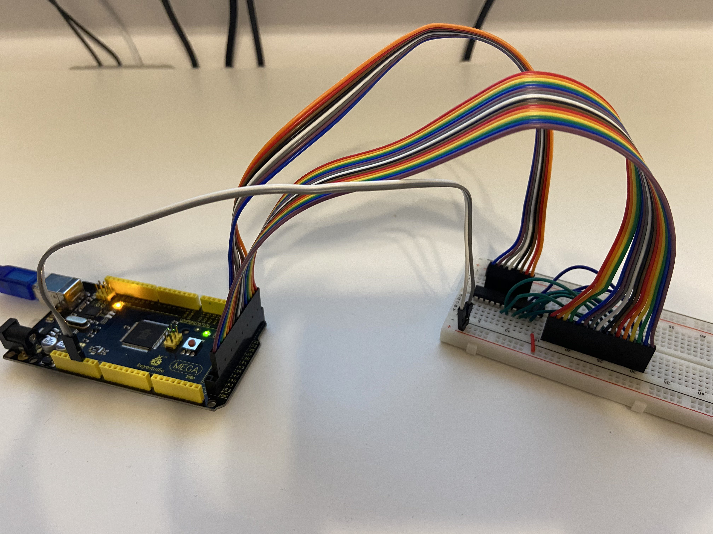
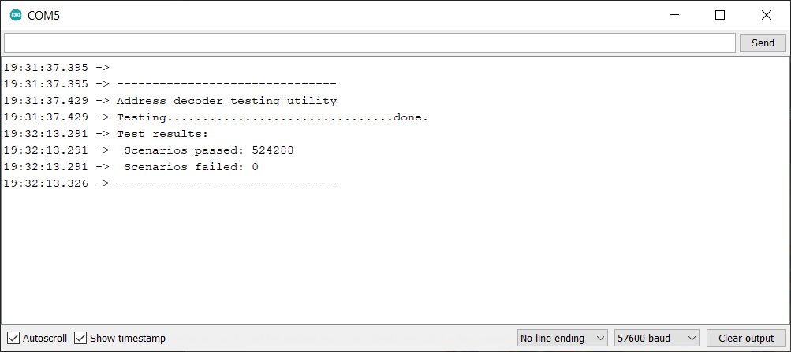

# Putting it all together

After having completed implementation of my PLD-based address decoder, I finally decided to try and program it. Obviously I expected issues, because these were supposed to be programmed by dedicated hardware. I read about many, many issues with chips available on the market, so I came prepared. Got myself decent cup of coffee, locked myself and told my family to not disturb me for another three to four hours.

Grabbed my [JED file](https://github.com/dbuchwald/6502/blob/master/WinCUPL/DB6502.jed), inserted ATF22V10 chip into my TL866 II+ and tried to guess proper minipro syntax:

```
dawid.buchwald@PL-2LGX4M2 ~/Documents/Personal/Development/6502/WinCUPL
$ ls -l
total 48
-rwx------+ 1 dawid.buchwald Domain Users 2777 Sep 10 15:40 DB6502.abs
-rwx------+ 1 dawid.buchwald Domain Users 4196 Sep 10 15:40 DB6502.doc
-rwx------+ 1 dawid.buchwald Domain Users 4261 Sep 10 15:40 DB6502.jed
-rwx------+ 1 dawid.buchwald Domain Users 3605 Sep 10 15:40 DB6502.pdf
-rwx------+ 1 dawid.buchwald Domain Users 2903 Sep 10 15:40 DB6502.PLD
-rwx------+ 1 dawid.buchwald Domain Users 1732 Sep 10 15:40 DB6502.si
-rwx------+ 1 dawid.buchwald Domain Users 1011 Sep 10 15:40 DB6502.sim
-rwx------+ 1 dawid.buchwald Domain Users 5287 Sep 10 15:40 DB6502.so
-rwx------+ 1 dawid.buchwald Domain Users 2343 Sep 10 15:40 DB6502.wo

dawid.buchwald@PL-2LGX4M2 ~/Documents/Personal/Development/6502/WinCUPL
$ minipro -p 'ATF22V10C' -w DB6502.jed
Found TL866II+ 04.2.112 (0x270)
Warning: Firmware is out of date.
  Expected  04.2.118 (0x276)
  Found     04.2.112 (0x270)

VPP=12V
Declared fuse checksum: 0x67A5 Calculated: 0x67A5 ... OK
Declared file checksum: 0x910D Calculated: 0x910D ... OK
JED file parsed OK

Use -P to skip write protect

Erasing... 0.33Sec OK
Writing jedec file...  5.01Sec  OK
Reading device...  0.41Sec  OK
Writing lock bit... 0.35Sec OK
Verification OK

dawid.buchwald@PL-2LGX4M2 ~/Documents/Personal/Development/6502/WinCUPL
$
```

Aaaaand that was it. Can't say I was disappointed to see it work the first time, but maybe I was? You know, just a little. I guess no troubleshooting for me now. Or so I thought.

Next step, obviously, was field testing the thing. The way I wanted to do this was to write simple Arduino program that would check all the possible combinations (64KB addresses accessed in 8 modes - CLK high/low, RW high/low, EXRAM high/low) and compare them against expected output.

I already implemented [something similar in the past](https://www.reddit.com/r/beneater/comments/ej3lqi/65c02_address_decoder_for_32k_ram_24k_rom_and_2/), but this time it was a bit more complicated. More vectors to test and a bit more outputs to verify.

The code I came up was along these lines:

```c
#define IN_CLK         0
#define IN_RWB         1
#define IN_EXRAM       2

#define OUT_WEB        0
#define OUT_OEB        1
#define OUT_RAM1_CSB   2
#define OUT_RAM2_CSB   3
#define OUT_ROM_CSB    4
#define OUT_IO_CS      5

#define MODES_COUNT    3
#define ADDR_COUNT     16
#define OUTPUT_COUNT   6
#define MAX_FAIL       1000

const char MODES[]   = {53, 51, 49};
const char ADDR[]    = {52, 50, 48, 46, 44, 42, 40, 38, 36, 34, 32, 30, 28, 26, 24, 22};
const char OUTPUTS[] = {47, 45, 43, 41, 39, 37};

uint16_t BIT_MASK[ADDR_COUNT];

bool ADDR_VAL[ADDR_COUNT];

uint16_t currentAddress;
uint8_t  currentMode;
uint8_t  currentOutput;

uint32_t passCount;
uint32_t failCount;

void setup() {
  setupPinModes();
  Serial.begin(57600);
  runTest();
  displayTestResult();
}

void setupPinModes() {
  uint8_t i;
  
  for (i=0; i<ADDR_COUNT; i++) {
    pinMode(ADDR[i], OUTPUT);
    digitalWrite(ADDR[i], LOW);
    ADDR_VAL[i]=false;
    BIT_MASK[i]=1 << i;
  }

  for (i=0; i<MODES_COUNT; i++) {
    pinMode(MODES[i], OUTPUT);
    digitalWrite(MODES[i], LOW);
  }

  for (i=0; i<OUTPUT_COUNT; i++) {
    pinMode(OUTPUTS[i], INPUT);
  }
}

void loop() {
}
```

This is basic init - setting Arduino pins to input/output, populating basic values (like bitmask) and so on. Nothing fancy here.

This is also pretty basic:

```c
void displayTestResult() {
  char output[128];
  Serial.println("Test results:");
  sprintf(output, " Scenarios passed: %lu", passCount);
  Serial.println(output);
  sprintf(output, " Scenarios failed: %lu", failCount);
  Serial.println(output);
  Serial.println("-------------------------------");
}
```

It summarizes test results and sends them to serial monitor.

```c
void runTest() {
  currentAddress = 0x0000;
  passCount = 0;
  failCount = 0;
  Serial.println();
  Serial.println("-------------------------------");
  Serial.println("Address decoder testing utility");
  Serial.print("Testing");
  while (true) {
    if (! (currentAddress & 0x07ff)) {
      Serial.print(".");
    }
    testAddress(currentAddress);
    if (currentAddress == 0xffff) {
      break;
    }
    currentAddress++;
  }
  Serial.println("done.");
}
```

Actual testing is also pretty simple. The only addition here is that I display one dot for each 0x0800 addresses just to indicate that the thing is alive. I expected it to be pretty slow.

For each address to be tested we need to run 8 scenarios for each combination of CLK, RW and EXROM pins:

```c
void testAddress(uint16_t address) {
  setAddress(address);
  uint8_t modeVariants = 1 << MODES_COUNT;
  uint8_t outputs;
  for (currentMode = 0; currentMode<modeVariants; currentMode++) {
    setMode(currentMode);
    outputs=readOutputs();
    if (verifyOutputs(address, currentMode, outputs)) {
      passCount++;
    } else {
      failCount++;
      if (failCount < MAX_FAIL) {
        char message[128];
        Serial.println();
        sprintf(message, " Test failed at address %04x, in mode %02x, resulting in output %02x", address, currentMode, outputs);
        Serial.println(message);
      }
    }
  }
}
```

There are some helper functions, like setAddress, that changes state of Arduino pins only if the expected value is already different - this optimization prevents too many digitalWrite operations, which are extremely slow.

```c
void setAddress(uint16_t address) {
  for(uint8_t i=0; i<ADDR_COUNT; i++) {
    bool bit =  address & BIT_MASK[i];
    if (bit != ADDR_VAL[i]) {
      digitalWrite(ADDR[i], bit ? HIGH : LOW);
      ADDR_VAL[i] = bit;
    }
  }
}
```

Now, I should have probably used direct port access, that would be much faster, but I didn't really want to bother with Arduino Mega wiring - it's insane how there ports are mapped to pins.

For all the possible modes I didn't bother with the optimization:

```c
void setMode(uint8_t mode) {
  for(uint8_t i=0; i<MODES_COUNT; i++) {
    bool bit =  mode & BIT_MASK[i];
    digitalWrite(MODES[i], bit ? HIGH : LOW);
  }
}
```

Reading outputs - trivial again. Would be even easier if I used ports directly, but whatever:

```c
uint8_t readOutputs() {
  uint8_t result=0;
  for (uint8_t i=0; i<OUTPUT_COUNT; i++) {
    if (digitalRead(OUTPUTS[i])) {
      result += BIT_MASK[i];
    }
  }
  return result;
}
```

And finally the function to verify the outputs:

```c
bool verifyOutputs(uint16_t address, uint8_t mode, uint8_t outputs) {
  bool clk     = mode & BIT_MASK[IN_CLK];
  bool rwb     = mode & BIT_MASK[IN_RWB];
  bool exram   = mode & BIT_MASK[IN_EXRAM];
  bool web     = outputs & BIT_MASK[OUT_WEB];
  bool oeb     = outputs & BIT_MASK[OUT_OEB];
  bool ram1Csb = outputs & BIT_MASK[OUT_RAM1_CSB];
  bool ram2Csb = outputs & BIT_MASK[OUT_RAM2_CSB];
  bool romCsb  = outputs & BIT_MASK[OUT_ROM_CSB];
  bool ioCs    = outputs & BIT_MASK[OUT_IO_CS];

  bool ram1    = (address <= 0x7fff);
  bool ram2    = (address >= 0x8000 && address <= 0xbfff);
  bool rom     = (address >= 0xc000 && address <= 0xffff);
  bool io      = (address >= 0x0200 && address <= 0x02ff);

  bool exp_web     = !(clk && !rwb);
  bool exp_oeb     = !(clk && rwb);
  bool exp_ram1Csb = !(ram1 && !io);
  bool exp_ram2Csb = !(exram && ram2);
  bool exp_romCsb  = !(rom || (!exram && ram2));
  bool exp_ioCs    = io;

  return (web     == exp_web) && 
         (oeb     == exp_oeb) &&
         (ram1Csb == exp_ram1Csb) &&
         (ram2Csb == exp_ram2Csb) &&
         (romCsb  == exp_romCsb) &&
         (ioCs    == exp_ioCs);
}
```

Same problem here - I calculate all the expected and actual values the slowest possible way, but what I was going for was clarity. I wanted the code easy to read and maintain.

Finally, I plugged ATF22V10 into breadboard and connected to Arduino Mega using special ribbons I made for my 6502 build:



You can see the PLD plugged into breadboard with the wires connected to input/output pins. Pretty simple, isn't it?

This is where the fun started. I ran my program:



Oh, I thought, it must have failed. I mean seriously, it couldn't have worked the first time around, right? Right?

Took me about an hour of various negative tests to come to final conclusion: the code just worked. Yes, the first time around. Yes, the PLD was correctly programmed. Yes, the first time around :)

I guess miracles do happen!