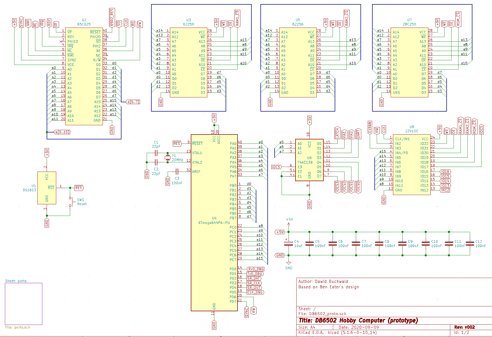
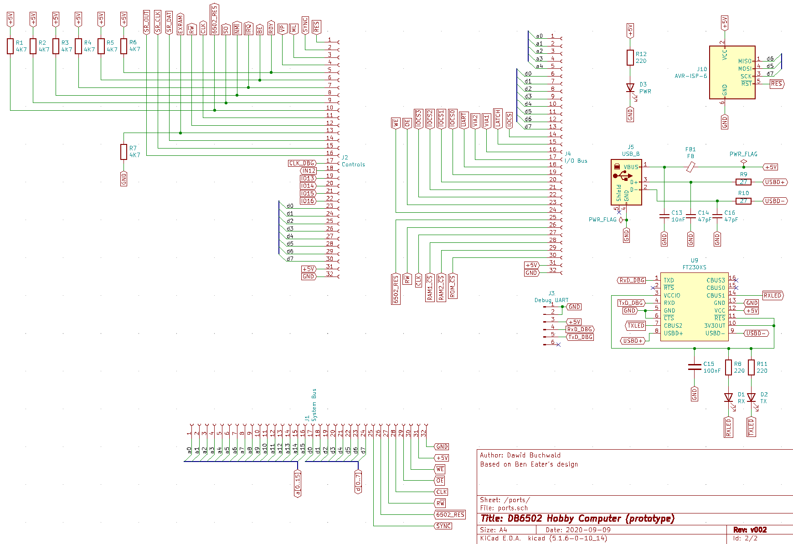
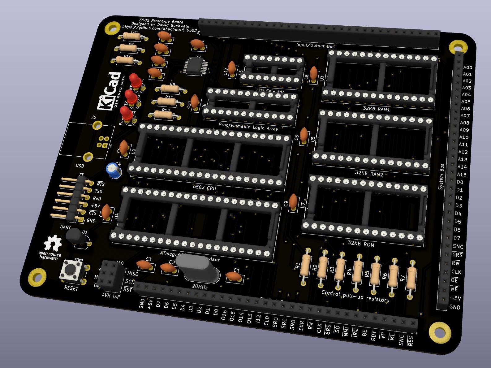
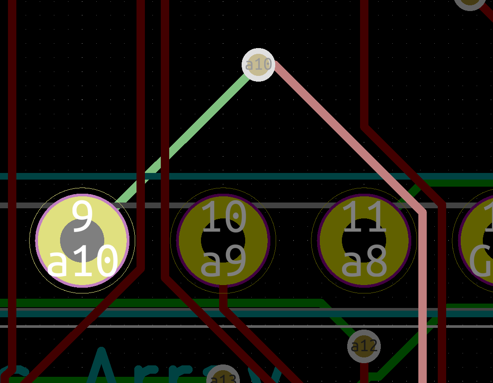
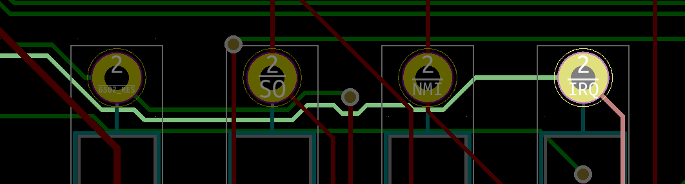
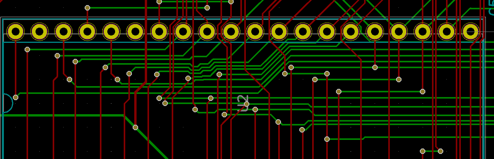
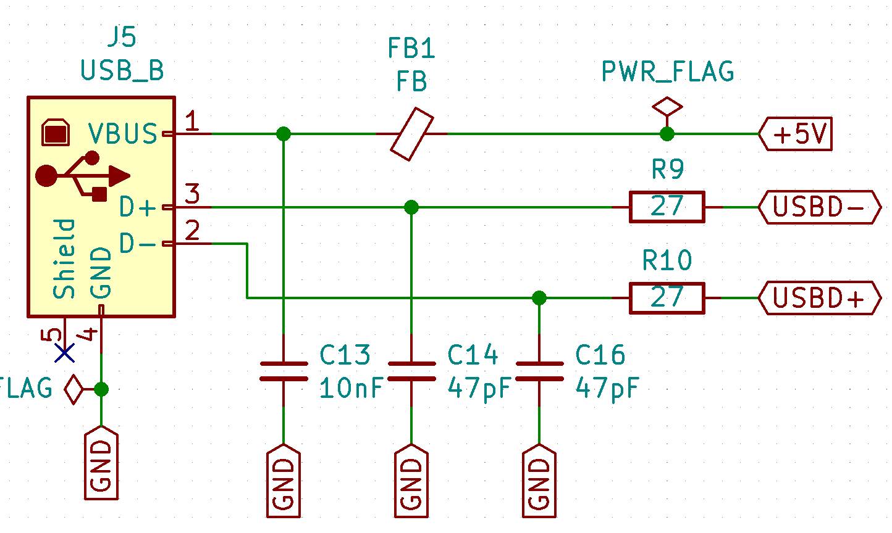

# Breadboards - the worst of best inventions ever...

When I first started contemplating getting into field of hobbyist electronics, it was the discovery of breadboards that sparked my interest. I understood that they are the magical devices that are perfect for all hackers and tinkerers alike. Devices from alien galaxy that allow you to build complex circuits that are pretty robust and yet completely modifiable over time. I loved the idea, but then I came across some book about beginner Arduino projects and couldn't understand pull-up resistor concept. It just didn't make a lot of sense, so I got into ceramics instead and spent couple of years on it.

Then one day I stumbled across first Ben's video about 6502 and I decided to give electronics another try. Maybe it was because he made me understand what the bloody pull-up is, or maybe it was simple childhood nostalgia about my Atari 800XE with tape drive.

One way or another, I started playing with breadboards. I really considered them the best invention ever! And they probably are, until, that is, you purchase Ben Eater's 6502 kit and try to wire CPU, ROM and RAM and Arduino Mega debugger on a single breadboard with AWG22 wire. And then fish out the ROM chip to program it and put back in while keeping all the connections intact.

This was my trauma with breadboards, and I believe we all have our own horror stories. All these loose wires, ZIF sockets slipping out of place, shorts and forgotten connections between power rails.

The thing is that there is no realistic alternative to breadboard, right? I knew I want to go full-on PCB one day and I spent literally months to design my very first board. [It turned out nice](https://www.reddit.com/r/beneater/comments/feehuz/the_boards_have_finally_arrived/), and it worked just fine to my honest surprise. OK, I might have made it faster, some of the time I spent perfecting it was because of COVID lockdown of my Chinese PCB manufacturer - lead times were like three or four weeks, so I figured I would rather spend this time checking my design over and over, improving it to perfection. Found couple of mistakes (mostly cosmetic, though), fixed all of them and one day the factory reopened.

Still, it was very long process. The main take-away from the situation was that you never ever put on PCB something that hasn't been tested on the breadboard. And PCBs take forever to make.

With that universal wisdom in mind, after couple of months I started toying with the idea of DB6502 v2.

## Enter nightmares...

OK, so I had some basic stuff figured out. I knew I want AVR (specifically ATmega644PA) to act as 6502 debugger and ROM programmer. I knew I want to use ATF22V10 PLD for address decoding, two RAM chips and one ROM. I knew I wanted to use SC26C92 for dual channel UART interface. I wanted selectable clock frequency (great idea if you want to start with slow clock, copy slow ROM contents into fast RAM, disable ROM and increase clock frequency to much higher), and many, many other features. Problem is that my "universal wisdom" was to test it all on breadboard.

I knew that was the right way to go, but man... Doing all that again?

I did build the SC26C92 DUART interface on breadboard and connected it to version one of my 6502 PC. It worked, kind of, and I know what that means - there is some very nasty bug in my design, and I still need to find it.

I did build the EEPROM programmer based on ATmega on breadboard, and it worked just fine. It was actually faster than the minipro software with TL866 II+.

But still, to add CPU and RAM and all these other components? No, seriously, I just couldn't force myself to wire the 6502 address/data busses to additional AVR and extra RAM chip. I was looking at the picture, and I was like "nope". I just can't go down that rabbit hole once again...

## Alternate idea

I recently played a bit with protoboards, or perfboards or whatever they are called. I made a simple POV toy for my kid, based on the awesome [AVR programming](https://www.oreilly.com/library/view/make-avr-programming/9781449356484/) book:

This was fun to make! I was thinking I found myself another silver bullet, so I bought large one online and while waiting for it to arrive I started thinking about placement of all the chips.

After couple of days, by the time the large protoboard arrived I realised how many wires I will have to solder. How many accidental bridges I will make and spend hours to look for. All the mistakes, rework... So, back to breadboard then? At least it will be easier to fix mistakes, right?

Seriously, I think I have spent weeks just contemplating the idea. Making one decision, approaching workbench, chickening out, changing my mind, and so on. Vicious cycle.

Tick-tock. Tick-tock. Tick-tock. Days go by, and I'm not any closer to my new design.

## Another idea altogether

Then I realised there is actually third option. There are things that I know, and these are unlikely to change. A03 on CPU has to be connected to A03 on RAM, ROM and specific input pin on my AVR debugger. The same goes for all the remaining address and data lines. These will not change for sure. Still, it's not enough to build the full PCB, because I need things like clock signal, and I have to decide what to do with NMI or RDY. I just can't decide yet.

This is where it dawned on me: what if I make smaller PCB where I place all the components that are simple and really unchangeable, and expose everything else as header pins on the side of the board? Would that be an option? Sure, I would violate my "universal wisdom", and I would probably spend weeks to make one, but it beats perfboards, breadboards and all that stuff. Sure, said my friend, you don't have to make it pretty, it should be fairly easy.

## Side note about software/hardware similarities

When you spend reasonable amount of time working with software you start to see patterns. You will notice that even the worst legacy code with hundreds of thousands of lines of spaghetti COBOL code has one important characteristic: it's not all interconnected equally. It's not uniform multidimensional space of idiocy, laziness and negligence. It seems like that at the beginning, but after some time you will notice clusters that are just denser, and these have usually much less dense interfaces to other clusters.

The same goes for electronics, at least to my admittedly limited experience. When you look at any schematic of 6502-based computer, there is this cluster of connections between CPU, RAM and ROM, but everything else is usually limited to just a handful of data lines.

I realised that if I put this particular "core" cluster on PCB, I should need probably much less interfaces on the breadboards, making the design and troubleshooting process much easier.

# Moving on to PCB prototype instead

I made contract with myself: make it as fast as I can. Ignore ugly tracks, stop playing with the most appropriate placement of components. Just drop them close to each other to keep the cost low and wire it whatever way I can make it work. If I make mistakes, so be it, I will have to find out how to fix them. I would rather play with single cut/patch on PCB than with several dozen misplaced wires on breadboard.

With that attitude I launched KiCAD and started working, and I wish I started weeks ago. I have wasted so much time just mulling over the idea of breadboard build, then some when came up with the perfboard option.

This is the schematic I came up with:

And there is the part with expansion ports:

Please note: parts of the schematic have already been done, I designed the CPU/RAM/ROM/AVR section before (for the programmer build), when I wanted to put it on breadboard, but then again, this part was easy.

So, what's there? AVR serving as debugger and programmer, connected to system bus of 6502. The CPU itself, ROM, two RAM chips, PLD for address decoding and 74AC138 for IO selection - it basically translated addresses A07-A05 to 8 separate IOCS# signals. Additional thing is (optional) FT230XS chip and USB port for communication between AVR and PC. No VIA, no serial chip, no LCD. Reset line is connected to AVR only. There is no clock.

These are the reasons for all the omissions:

1. VIA is not there, because this chip is "easy". I would rather put it on breadboard, as it's pretty simple to interface. Same goes for LCD - they all take a lot of space on PCB, and I might still change my mind as to how (and if) to use them,
2. ACIA is not there, and neither is SC26C92. ACIA I don't want to use anymore, and SC26C92 is a different story. I had some random issues with the interface with CPU when I connected it to my first board, so I wasn't sure if my schematic was correct. I would rather prototype this one on breadboard, and as in VIA case, it will be pretty simple,
3. RESET line is connected to AVR only for a reason - I want to build special circuit where the onboard reset button resets everything, but AVR can also invoke partial system reset which will be sent to 6502 and peripherals, but keeping AVR state intact. I have some ideas how to do it, but these are to be prototyped first,
4. Same goes for CLK line - I want to play with it, so there is none on the PCB,
5. Other things like NMI, IRQ, BE, RDY - all of these are pulled high, but there are ports to connect these lines to whatever circuitry I decide upon,
6. There is dedicated output for shift register connected to AVR - this will be used to transmit all the control signals like AVR taking over system bus to flash the EEPROM or to put CPU in hold state. These need to be prototyped first.

You should get the idea now - put the constant on PCB to reduce breadboard complexity and eliminate most common failure points. This way I might be able to build the complete computer and run OS/1 on it to test my new ideas.

## Important disclaimer

This is something I need to mention: this post **has not been** sponsored by PCBWay. They haven't asked me to write this. There is, however, one reason I do mention them. When I designed my first revision of DB6502, I shared the designs and gerbers online so that anybody could build it. I ordered my own PCBs via PCBWay and I noticed they have very nice program addressed for hobbyists and supporters of open hardware community: you can share your design (basically gerber files) on their website for others to order. It makes ordering PCBs for beginners very easy, as all the options are already pre-populated, so you just need to click "order" and you get the board exactly as the person who designed and shared it.

There is also incentive for the creators to share: they get small commission for each order of their design credited to their PCBWay account for future orders. I must say that this is pretty brilliant strategy from PCBWay - it keeps their customers loyal, and builds nice community around the company.

Anyway, I have always been open about this, as I wrote on the [GitHub project page](https://github.com/dbuchwald/6502/blob/master/Schematics/README.md#ordering-pcb), you can use this feature, and I get commission, but if you don't want that to happen, you can just download the gerbers and order your boards elsewhere (or even via PCBWay, just not using the "shared projects" page).

The reason I'm mentioning this is that it actually turned out pretty well for me: so many people ordered the DB6502 builds that the commissions I got were more than enough for one more order, so thanks to very nice idea from PCBWay (shared projects) I had my manufacturing of new DB6502 prototype board basically for free. Figured you guys might want to know.

# How long it takes to design PCB then?

As I said before, I have designed only two PCBs so far. One was the DB6502 version one and another was the modified version of Ben Eater's clock module. One would say that my experience was very, very limited - and that is sort of the point here. It doesn't take that much time to learn KiCAD, but it does take trial and error to get good feeling of the features.

Putting the above schematic on PCB took me approximately six hours, which is, quite probably, the equivalent of time spent on stripping ends of 22 AWG hookup wire for the similar breadboard build. I was really shocked how fast it went! Add to that typical PCBWay manufacturing time of 24-48 hours, and you really get your results **fast**! 

This is what I came up with. It's not pretty, especially if you check out these routing detail examples:

Then again, this was the point here: to see how fast can I go with this, and what would be the consequence of it. What can I learn, and where should I stop with all the changes.

## OK, but does it work?

At the time of writing this - I don't know. What I do know is that I did make one mistake in schematic which I noticed only after (shortly after!) ordering the PCB:

Take one sec to find it, and couple more to laugh when you do :)

Yeah, I connected USB D+ to D- and vice versa. Unfortunately, this would render the USB connection totally unusable. After looking at it for a while I noticed it will be very easy to fix, even without cutting traces on PCB - all I need to do is to connect R9 and R10 (which are, conveniently, next to each other) crosswise, so one end of R9 goes into left pad of R9 and right pad of R10; R10 goes into left pad of R10 and right pad of R9, and that's it.

Chances are that there are some other issues there, and I will hopefully find out in about a week, when the boards arrive at home.

The other thing I didn't consider was that I might actually want to disconnect the pull-up resistors, so some jumper headers would be in order.

Still - it's the small things like this that can make you work on the PCB for months, and you want that for a final product. For something that is intentionally stepping stone for your design, it doesn't matter that much.

Sure, one will say, but it still cost money. It does, indeed, but so does your space and time. I have very limited supply of both (EE is not my only hobby, and my wife has plenty of her own hobbyist things around), while the money, at least when it comes to spending 40USD on PCB, is not such an issue. I do realise that it varies, and some people (like students) will have plenty more time and much less money to spend - so they would probably go with breadboard, which is fine, I'm not evangelising here :)

The point I'm trying to make is that we humans are pretty bad at A/B testing. With thousands of years of evolution we learned to make assumptions (like the one that making PCB takes a long time) and stick to them, avoiding to reconsider. I believe it's very beneficial to everyone's wellbeing to test these assumptions every now and then, as the world around us changes so fast that they usually don't stand the test of time.

If the interest is there, I can try to write another post about KiCAD tips and tricks that I learned over time that improved my flow and made me more confident with the tool. Please. leave me a note below if you would like me to write something like that, I will be happy to share.

Oh, and this is also very valuable lesson - sharing is the most important part of the process. It helps you to learn new things, and the good things happen when you do. Even if that's just the credit for your next PCB order :)