# What is your excuse?

This header title of this section was supposed to be separate post on its own. One of the first things that surprised me when I started working on DB6502 version 1 design was the general hesitation for SMT soldering among beginner EE community. I did feel a bit intimidated by it as well, but I couldn't find UART->USB converter chip in DIP package, so I settled for not-so-beginner-friendly FT230XS in TSSOP-16 package. Got myself couple of chips, several adapters and while waiting for the delivery started watching YouTube videos about the process.

OK, it didn't seem trivial, but didn't seem that hard either. Then I came across this excellent post (which I, obviously, lost) where somebody proposed slightly different procedure. Since it seemed the most reasonable to me, I decided to give it a try.

Then the chips arrived. Much smaller than I expected :) Not to worry, I got to work. My first attempt at TSSOP-16 was horrible, I almost burned the chip, adapter and my apartment.

That being said, it actually turned out OK. After about an hour of experimenting with flux, wick, solder and different soldering tips it looked fine and worked as expected.

That's not hard, I thought to myself, and started with a second chip. Took me only five minutes. Later got myself SMT practice board (they are cheap and contain various footprints) and spent some time with it as well.

Recently, when playing around with the idea for DB6502 I wanted to try out some specific chips that, sadly, are not available in DIP package. I figured it would make nice post for my blog, where I would show the process. To get better light I moved to terrace on a sunny, exceptionally warm day. Long story short - I was sweating like a pig, cursing like a seaman, but hell-bent on making it happen. Took plenty of photos, soldered several chips. Moved inside to check out the pictures just to find out that most of them were utter shit. It was so bright I didn't notice they were out of focus... Here are some before and after:

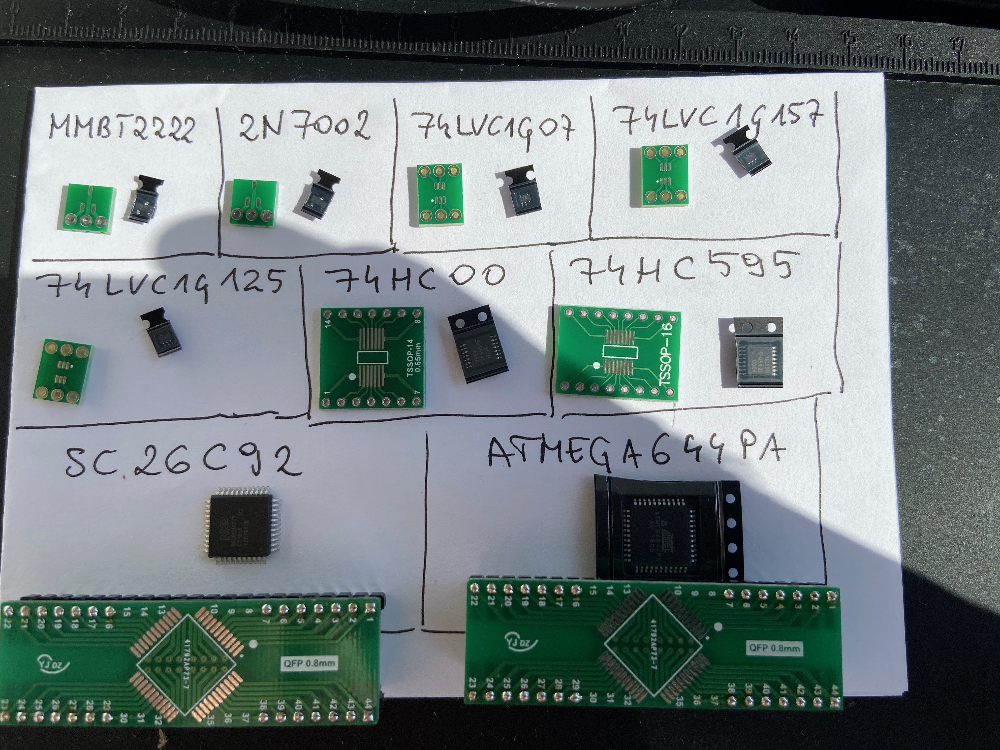

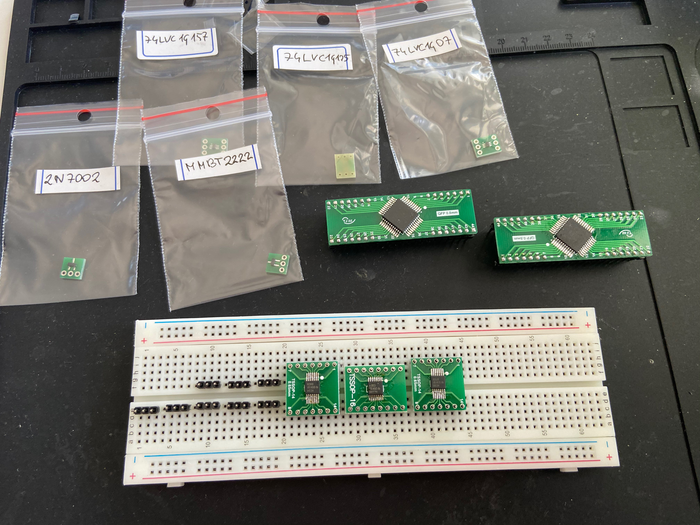

Oh, and out of the above, only one pin was not connected correctly. There were no bridges. All in under an hour.

## What's with the excuses then?

Well, actually two things: for one, my crappy pictures aside, there is no excuse really to give up on SMT soldering. You should try it, and I will demonstrate the process I use below. Now, I understand that some people can't do it due to physical conditions, sometimes caused by age or other diseases, so if you suffer from them, don't take it personally. I'm addressing here the healthy majority, especially younger engineers - guys, man up, try this. It might turn out easier than you think.

But I do have second takeaway from the story: as usual, I want to emphasise the importance of sharing with others. Working on a project? Share your stories. People will notice and they will give back. Recently I was contacted by another Hackaday user and he informed me that there are actually UART->USB adapter chips in DIP package. It's MCP2221A, and I will write more about it soon. Bottom line: what's your excuse to not share your work?

# Back to business, what about these PCB prototypes?

Again, this post is not sponsored by PCBWay, but I just have to recommend their service. The whole process (order validation, manufacturing, shipping and delivery) took under a week. This is really fast, and it ties perfectly in the "rapid prototyping" flow.

What about quality? Glad you asked:

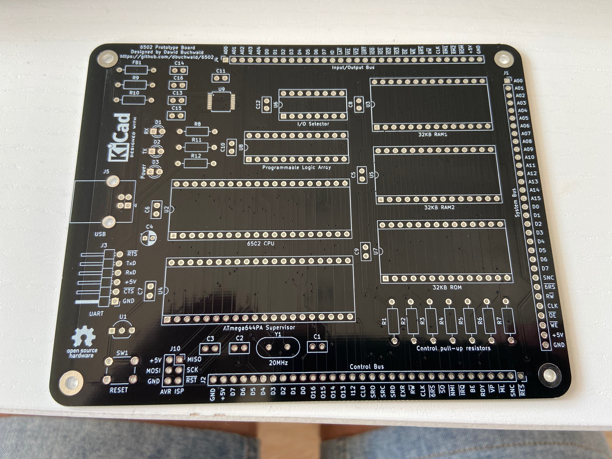

Lovely :)

## First things first: FT230XS soldering

So, what's the secret procedure I use?

First, soldering station: doesn't have to be something fancy. I use Zaoxhin 936DH with 1C Black tip. 340 degrees Celsius. Flux pen. Thinnest solder you can find - I use 0,56mm. That's it, really.

Now about the process up close:

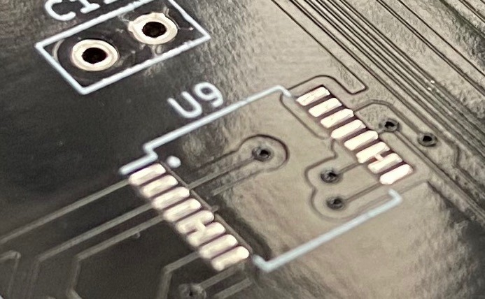

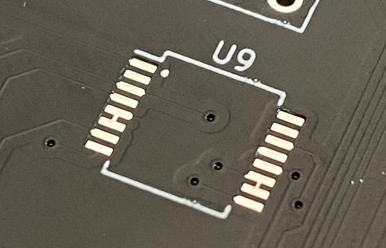

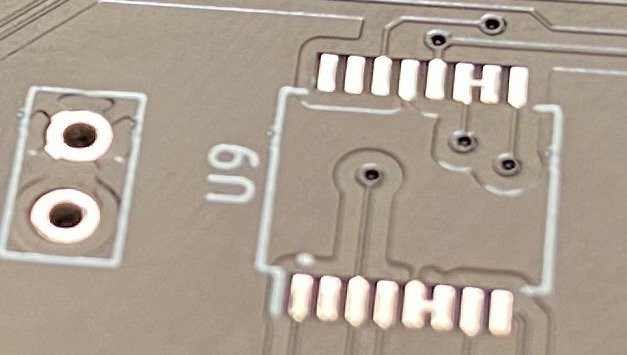

This is clean PCB, nothing happened yet. Sorry for pictures quality, but these are really small, and pictures have been taken with my phone...

Now, apply some flux. "Flux is your friend" - remember that, it will be your mantra for forseeable future. It will help you, and it's important you understand what it does, because it has two important properties. For one, it makes solder flow easier (original entry claimed that it lowers the melting point of solder, which is not true, sorry for this!). This makes it easier for solder to flow where it's needed. And the second property is even better - it cleans the surface of copper, making the solder easier to attach. As a result, flux will ensure that your solder flows and it flows exactly where you want it (on the pads and pins) and not elsewhere (on the soldermask or between the pins). Pure magic!

So, what's the appropriate amount of flux? Beats me, but this is what I give:

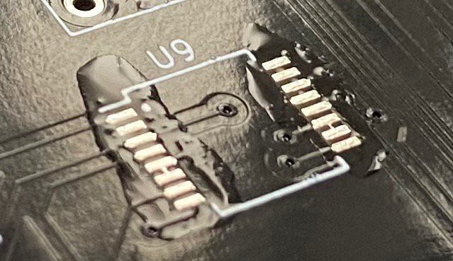

Now, the conventional wisdom says: put some solder on one-two pads, attach the chip to them, take more solder and put in on remaining pins, and if there is too much, use wick to get it off. Now, maybe it works for you, but I prefer to do it differently. Mostly because wick and thin traces/pads (typical for TSSOP package) don't mix well. If you let the wick attach to the pads and try to pull it off, you might rip off the trace. Don't do it, and remember, you have a friend that makes solder flow better. Guess what helps when removing solder with wick :)

Put some solder (just a little tiny bit) at the end of your cut tip like so:

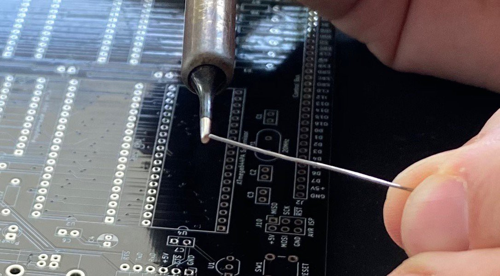

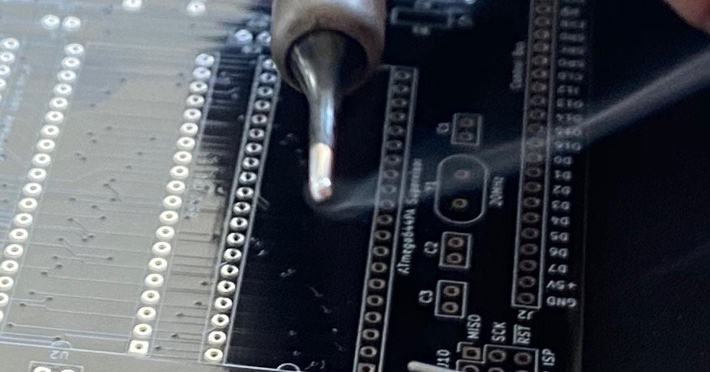

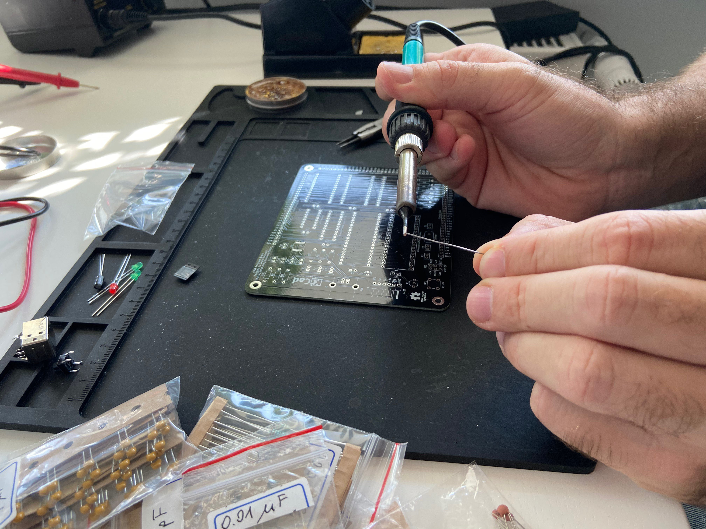

Then smear this small amount of solder on all the pads, so that very, very thin film of solder covers them:

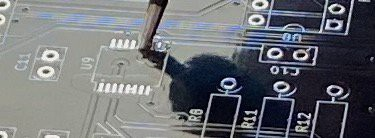

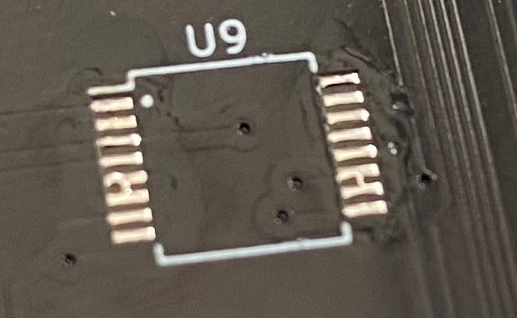

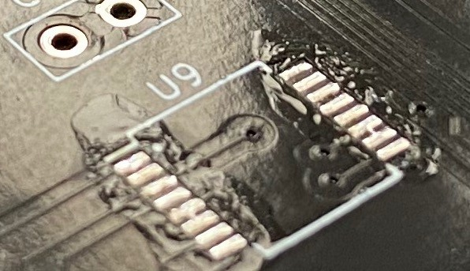

I bet you can't see the difference in these pictures, but you will see it if you do it. The pads are just a little thicker, that's it. You don't want them too thick, because the next step will be much harder.

Actually I did find two photos that should illustrate the difference before and after (these are from the terrace incident I mentioned previously):

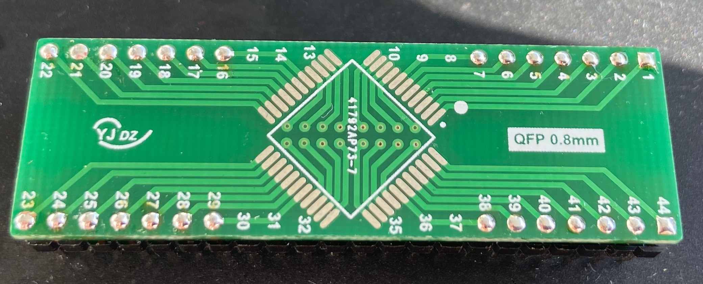

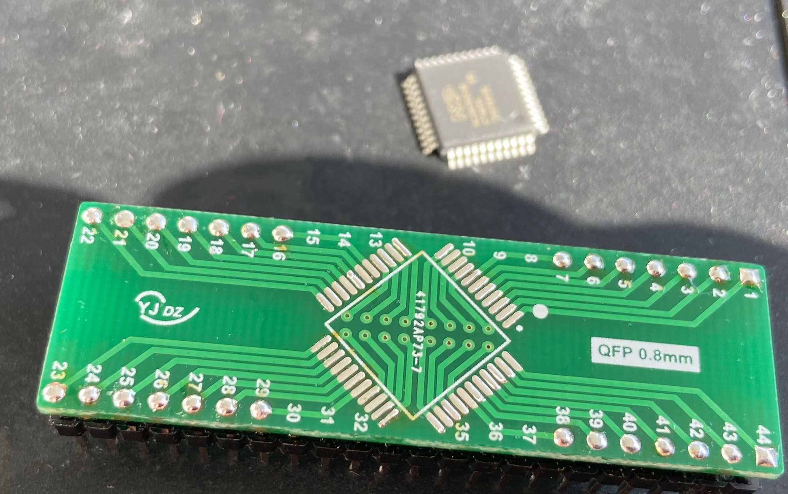

Place the chip on the pads. Take all the time you need to place it as nicely as possible:

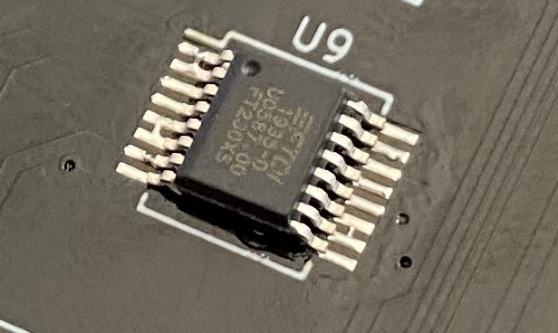

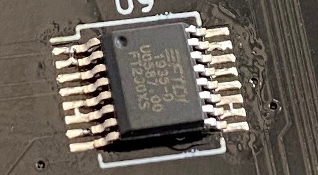

Are you ready for grand finale? The most difficult part will be soon over, and this is really trivial. Take your soldering iron, and if there is any solder or other crap on it - clean it on the sponge. Using your pliers (finger if you are brave or whatever), press the chip in place so it doesn't move when touched. Using clean soldering tip (and no solder!) just touch each of the pins for a second or two. Solder on the pads will melt and secure the chip in place.

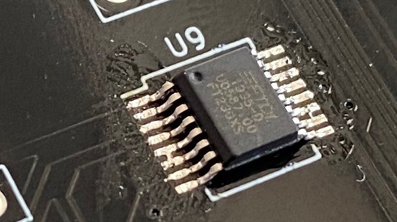

That's it, you are done. Congratulations. Wasn't that hard, was it? I had my wife (no experience in EE whatsoever) observe the process and she was genuinely surprised how easy it turned out to be.

Oh, and if you see bridges in the last photo, you are right, but they were there from the beginning, it's part of the design :)

Now, I don't know, maybe this process has some flaws. Maybe it's not kosher enough or whatever. The thing it works, and it prevents many issues like bridges or thermal damage.

One more note about QFP package (or any other package with more than two sides to it) - it's a bit harder, because you have to align the chip in two dimensions, so the procedure is slightly different. Start the same, put flux on all pads, take some solder to the tip of the iron, apply it to the pads. Then position your chip the best you can and when you think it's as good as it gets, secure it in place by touching just one pad on one of the corners. Put the solder iron away (clean it!) and check the alignment. There are two options: it's OK or it isn't. If it isn't (and probably won't be the first time), see if you can correct it by nudging the chip a little. If it works, move on, otherwise just touch the same pin with solder iron tip again and pull the chip gently - it will detach and you can try again. When you finally get the alignment OK, just secure it in place by heating up one of the pins on the opposite corner and then just move pin by pin, heating them up and locking in place. Easy-peasy:

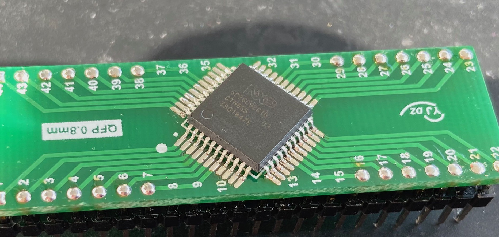

Now, you might be thinking I post about it just to brag, and sure, to some extent I am :) Still, the key message is the same: it's not as hard as it seems and it's very useful skill. You can use smaller, single gate chips. You can design significantly smaller boards. You can put your chips on both sides of them. It would be a shame not to try.

# What have I learned from the PCB prototyping lesson

Well, it will probably take me a week or so before I can test all the possible connections on the board and be able to say with 100% certainty whether it's correct or not. That being said, I have ran some tests on it already and it turned out OK. I will post the results below, but I would like to start with the most important errors I made and what I learned from them.

## Just check the bloody schematic!

Seriously, I wrote about it last time. It takes just one second, one critical review, to notice the schematic was wrong. D+ connected to D- and vice versa. Seriously. I should have looked at it, and I would have noticed it immediately. Thing is I was trying to be super-fast, just to see how many mistakes I make.

Turns out I'm not perfect. Need to double check!

## Cutting the traces is actually hard

Obviously, there was simpler way to fix the above problem. I could have soldered the resistors between USB port and FT230XS cross-wise and that would be easy. It wouldn't look nice, but would get the job done.

Then I thought to myself - come on, try the cut and patch method, you have never tried it. See what happens. Famous last words :)

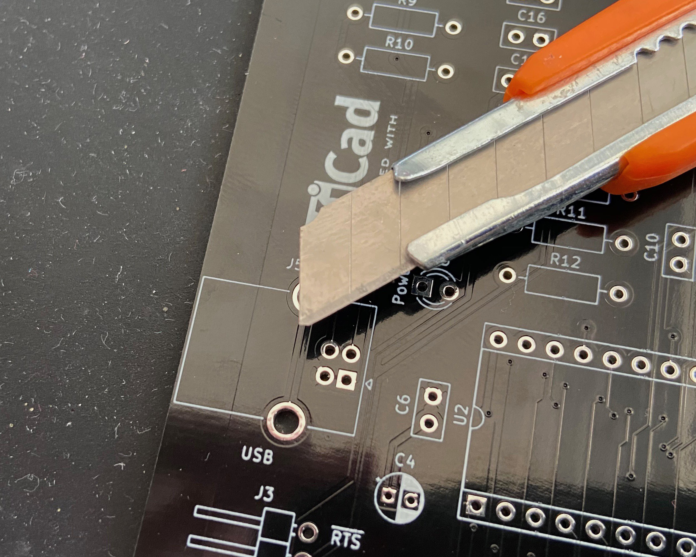

So I tested the continuity (to remember which trace goes where) and I cut the traces with wallpaper knife. Tested again for continuity. Beep. WTF?

Checked schematic to confirm that I'm [cutting the right trace](https://www.youtube.com/watch?v=RO7Q1tMGE7g&ab_channel=MondoMedia). I am. Cut again then:

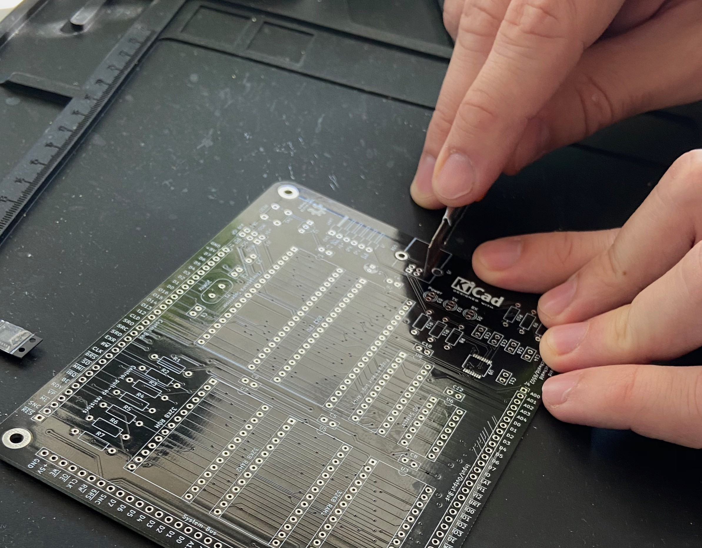

Beep. Beep. Beep. Cut. Cut. Cut.

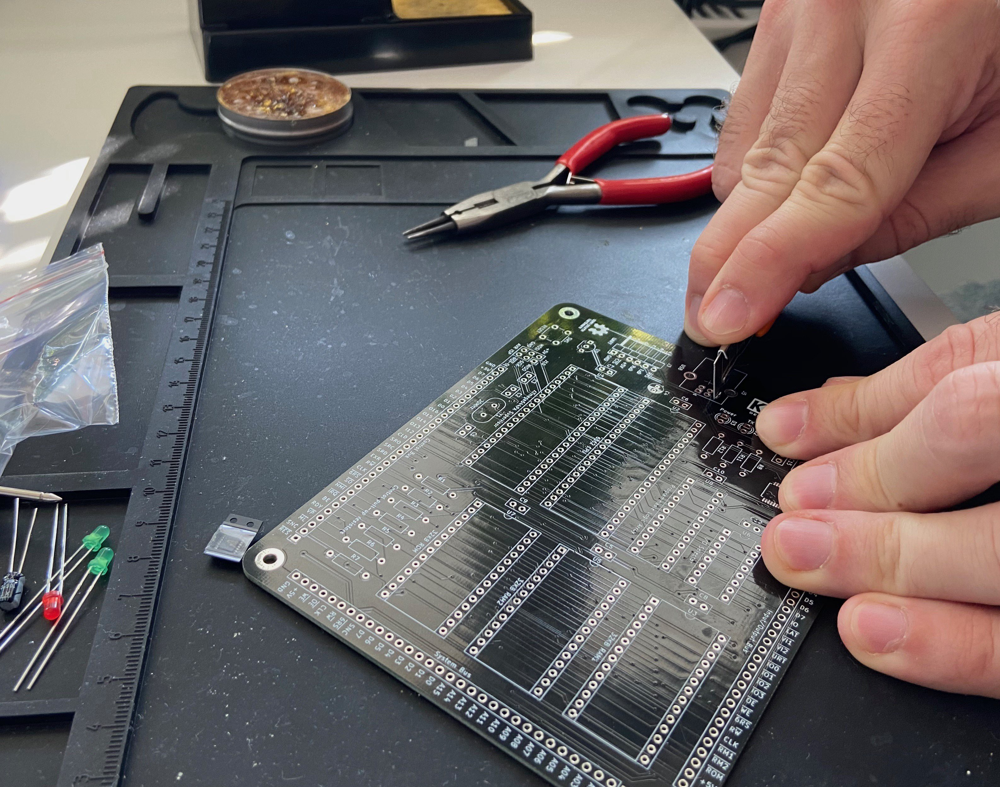

Silence. Silence. Silence.

What follows looks like a crime scene. I was right to decide to do it underneath the USB port so my shame is hidden forever (and yes, I did check the port to confirm there is no conductor there to short the cuts):

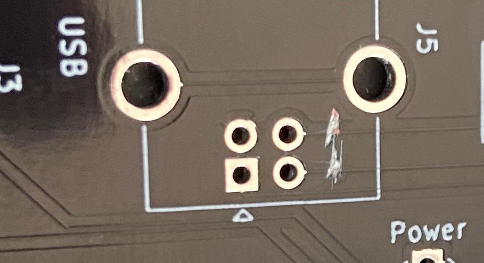

The important lesson here is that traces are not as fragile as they might seem. It takes deliberate action and quite a lot of effort to damage them. The main exception, obviously, being the solder wick accident, but it's also avoidable as long as you are gentle when pulling the thing.

## Make notes!

Remember how I checked which trace goes where before cutting them? I made it specifically to ensure that when I solder the patch wires below the board, they connect the right pads. I didn't note it down, because how could I forget, I'm not that stupid, right?

I think you know where this is going. Seriously, I'm not making this up, I really did solder them exactly the same way as the original traces were. I guess I am that dumb after all :)

MAKE. THE. BLOODY. NOTES. MAKE. THEM. NO. EXCUSES.

## Patches on PCB don't look THAT bad

Sure, it looks better if there are none, but is it worthy months of perfecting? Nope:

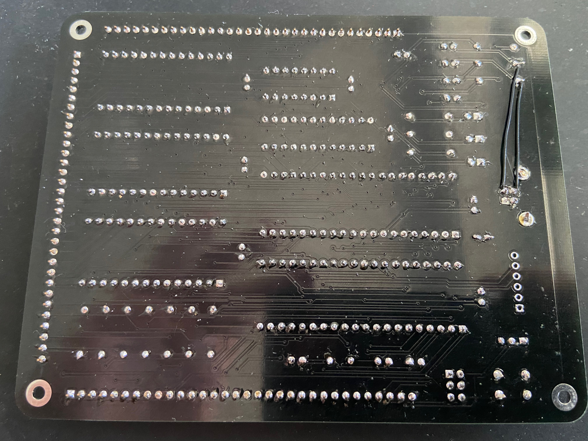

And the point is: I learned a lot. I guess you have to make mistakes to learn, right?

## Follow your gut feeling

There was one thing I noticed when I generated the 3D view of the board in KiCAD. I wonder if you noticed that too:

There is something off here. The ISP connector should be male, not female. I did notice it, and I was like "whatever, it's just 3D footprint, it doesn't matter". Well, as a matter of fact it does. This is what I placed on my board:

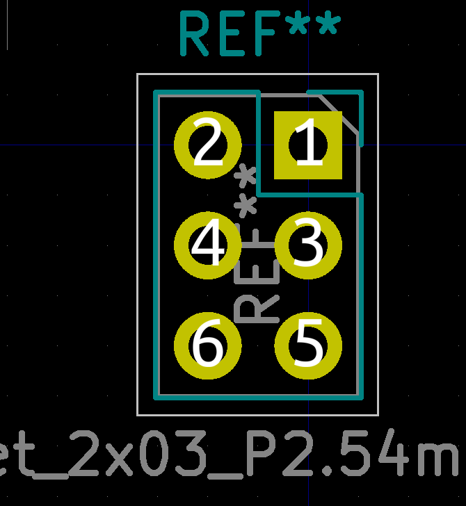

And this is what I should have placed:

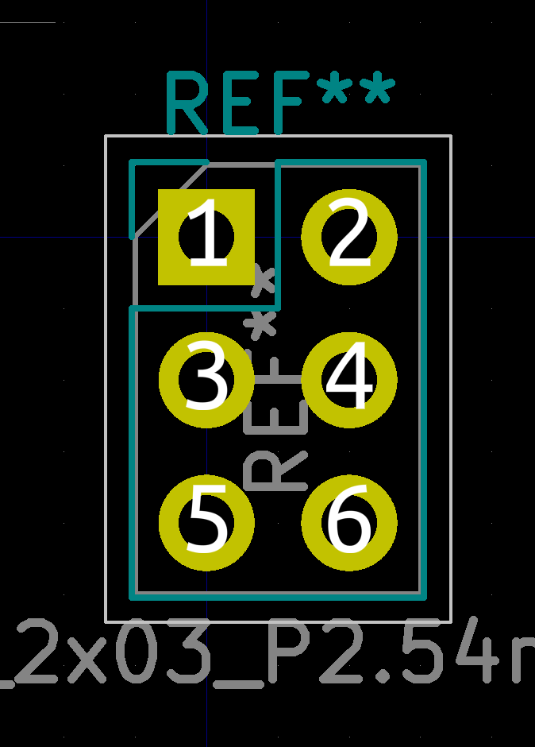

See the difference? Female socket is the mirror reflection of the male one, and for a good reason - so that when you plug the latter into the former, the pins line up perfectly.

And, to make things worse, all I had to do was to pick up the board I had laying around and see that again:

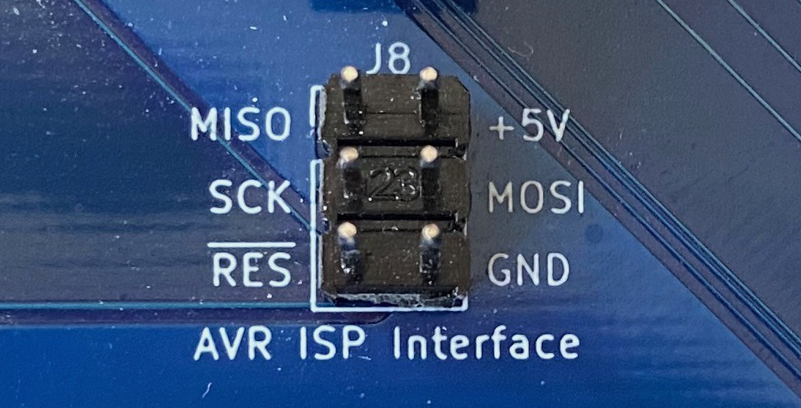

All I needed to do was to lean forward, open the drawer, pick that up and compare. I should have done it.

Was it hard to fix? Yes and no. Yes, because I just built an adapter to my USBAsp programmer that reverses the sides of the connector. Just a couple of male-female hookup wires and some tape to keep them together.

The problem, however, was that it might have not been that easy. If it was intended for a shield connector, I wouldn't get away with it that easily, and fixing that with cut and patch method would be much, much harder. No way to hide the cuts either.

And from the perspective the worst part is that I did notice the weird footprint. I had my gut telling me that maybe there is something wrong, but I ignored it. Key takeaway: never ignore your gut!

## Vias and silkscreen don't mix well

On a PCB design it looks innocent:

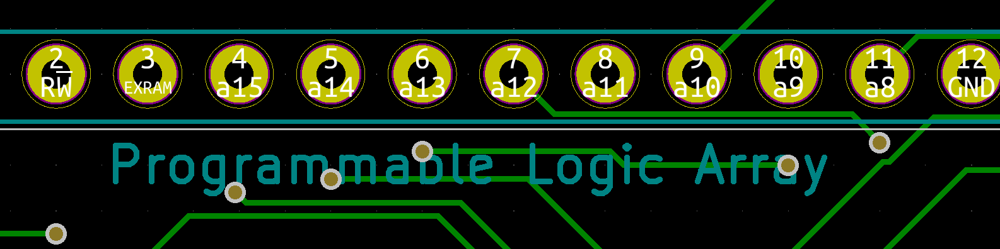

But in reality, it doesn't look that nice anymore:

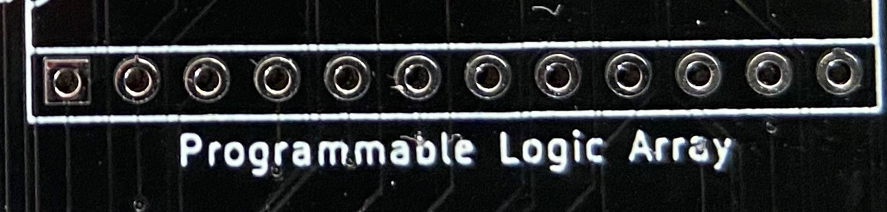

Is it cosmetic? Yes, sure, but it might make a lot of difference, making your silkscreen confusing or illegible.

## Consider the usability of the board

When I placed these "edge" connectors on my board, I wanted to make sure each of the 96 pins is described correctly:

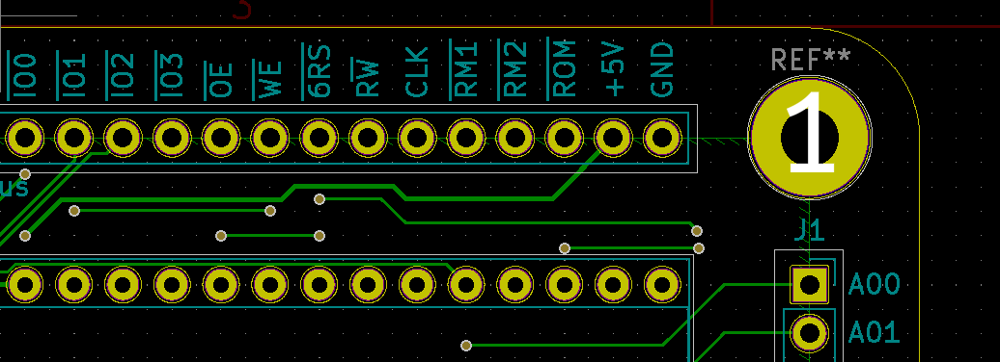

What I didn't consider was that the wires plugged into it would be going outwards, over the labels, effectively obscuring them:

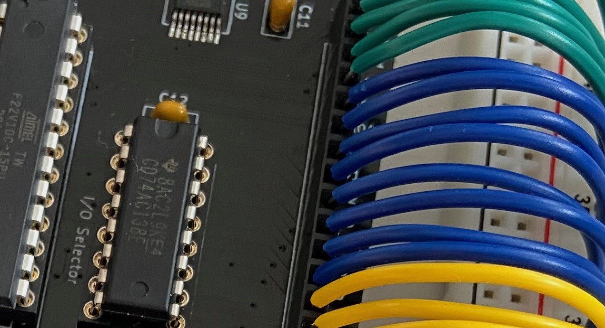

Again, this is cosmetic issue, but the board would be better, more usable, if I just moved the labels to the other side of the connectors.

## Think again about that usability

I placed IRQ and NMI connectors together with the BE and RDY signals on the control bus. For some reason it never occurred to me that I might actually need them also on the other side of the board - in the I/O port section. After all, this is where most of the interrupts come from :)

Yeah, it's a minor one, and all it requires is just one really long wire, but still. Stupid and avoidable with a little bit of consideration.

# So, was it worth it?

Hell yeah! I made some really silly mistakes, learned the limits of the process. Now I know that next time I will check these details carefully, but I will not spend months perfecting my design. Ugly traces are invisible under soldermask, and even if they were visible, it doesn't matter.

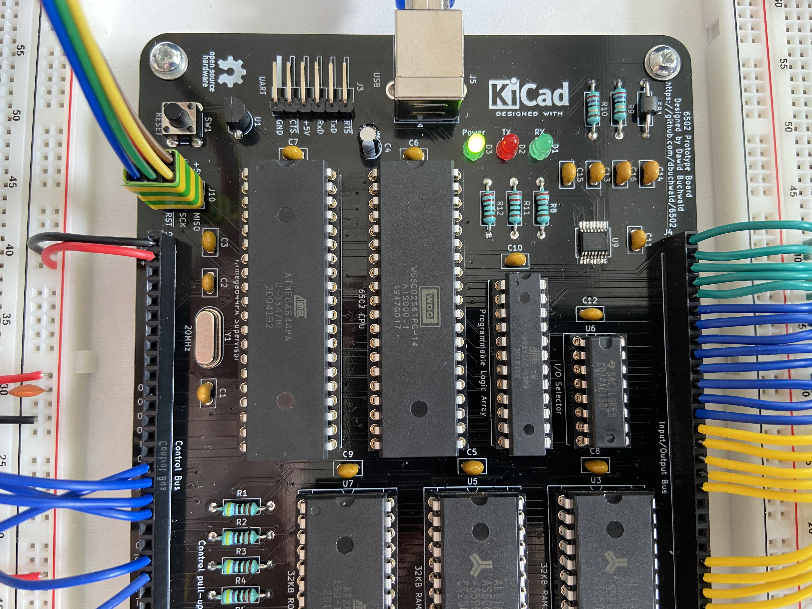

What does matter is that within a week I managed to test some of my ideas that would take long long weeks on breadboard and probably even longer on perfboard.

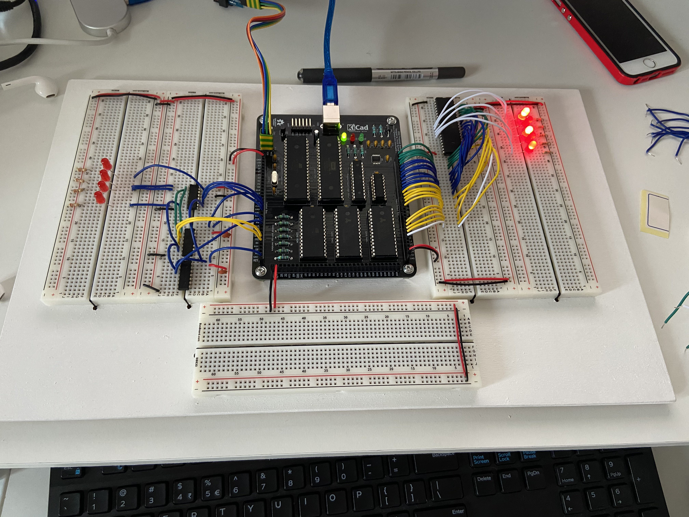

And man, this development process now is wonderful: plug the thing into USB port, upload ROM image in just a couple of seconds, step through the code and reset as needed.

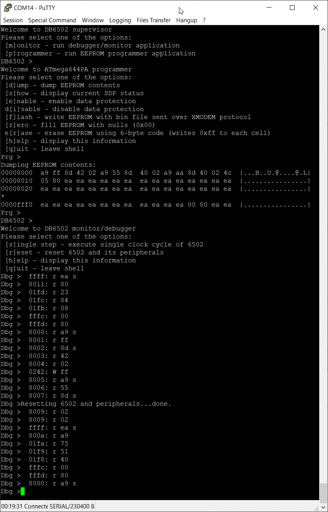

Supervisor firmware is still in very early stage, and there is quite a lot of work ahead of me to test all the features I had in mind, but it's really pleasant experience now, and finally I can move forward with DB6502 version 2. I don't have to worry about most of the wires, interfaces to external chips (like UART of VIA) are simple and limited to minimum. The whole thing is secured with prototyping breadboards to piece of plywood so I can move it around my apartment as needed without the worry of cables falling out.

Finally I can experiment with wait states, DMA, ROM/RAM banking, multi-CPU architecture (already on the board, mind you!). All of that within one week. Totally worth it!

Oh, and in case you are interested - I will be sharing the protoboard design and BOM on PCBWay and GitHub so you can get your own if you want, but before I do that I need to make sure that all the connections work and I have answers to some of the open questions.

In the meantime stay tuned, I will be sharing more updates soon. Let me know what you think in the comments below!