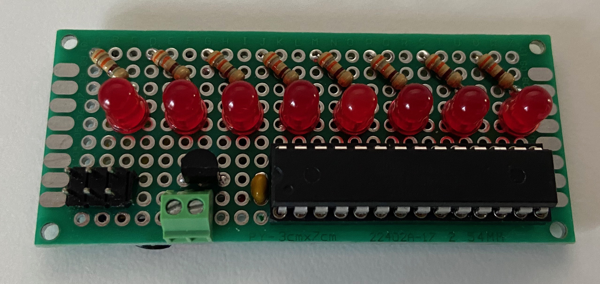
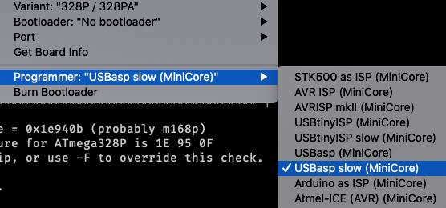

# Just a quickie

There are some steps in my project that take a lot of time and effort to document, and I love writing about them. There are, however, small issues, problems, obstacles that don't require full-blown post to describe, and yet I want to share them because they weren't that easy to research online. I will call these tech quickies and document them in much shorter posts.

## Using ICSP for AVR chips

Since my first version of 6502 computer, I loved the idea of being able to program AVR controllers directly on the board without the necessity to remove them. I was really proud of myself when, almost at the last minute, I added the port for it on my board, and it worked perfectly.

For me, that is, because some people complained about it, and they were right. Depending on the programmer you use and the origin of the chip it might be trivial or not so much, so lesson learned here. Consider how it works with fresh chip, be mindful of default fuse settings and quirks of different programmers.

Some time ago I built simple POV toy for my son (I mentioned it recently) and it is basically ATmega168P + some LEDs that blink very fast to make nice images when waving the thing in dark room. 



Now, when I built it on protoboard, I plugged in one of fresh ATmega168 chips (purchased just for this project specifically), plugged in my USBAsp programmer and tried programming it:

```
➜  ~ avrdude -p m328p -c usbasp -P usb  -t

avrdude: error: program enable: target doesn't answer. 1
avrdude: initialization failed, rc=-1
         Double check connections and try again, or use -F to override
         this check.


avrdude done.  Thank you.
```

Please note: this is not the exact command I used (this comes from further investigation), the original session output got lost in the fight.

## I have seen this one before

This reminded me that I have seen these errors before, and the way I solved them, after some head scratching, was basically to use Arduino Nano as ISP programmer. I remember doing some research online and just came to conclusion that I still don't know what it is, but using Arduino ISP and external crystal solved the problem.

Since I wanted to complete the toy project this was exactly what I did again: fished out the chip, put it into the breadboard, programmed there with Arduino ISP that didn't seem to have any problems with the chip.

It kept bothering me though. I hate to not be able to understand why something works or why it doesn't. I hate workarounds that don't address the underlying issue, they just obscure it so much that you forget what the actual problem was. And if you have ever ran into these issues with USBAsp, I bet you found these approaches:

1. Replace your AVR, because it's bricked,
2. Connect external crystal + 22pF caps,
3. Add capacitor to reset pin,
4. Remove capacitor from reset pin,
5. Throw a handful of caps at various pins in different locations,
6. Get yourself another programmer,
7. Update USBAsp firmware and/or Windows driver (if using),
8. Connect external power to your board, as USBAsp is not providing enough voltage/current.

Now, these are nice advices, but none of them has anything to do with the problem. And, more often than not, these will not help at all.

## How to troubleshoot it then?

Well, what I noticed is that once I got the first programming out of the way with Arduino ISP, the problem never occurred again, making it more difficult to investigate. As if there was some kind of magical formatting needed that the USBAsp wasn't capable of. I didn't like the explanation, especially because I wanted to start using SMD version of ATmega chips, and these you can't "fish out" of your board for breadboard programming. Somehow it never occurred to me that maybe I could use Arduino ISP with the onboard ICSP port. Well, brain is a funny thing :)

When purchasing some other chips for my project recently, I decided to put an end to the whole debate in my head. Get handful of fresh AVR chips, replicate the problem and instead of rushing to workaround, keep banging my head against it until I figure out the actual underlying problem and find proper, kosher solution to it. I'm happy to share that I managed to find and solve the issue once and for all.

## So, what is the real problem here?

Now, to find the solution, you have to understand the problem here. Sadly, it's stated clearly on the [USBAsp project website](https://www.fischl.de/usbasp/), but somehow Google got overran with the above advices, making it all too hard to find a link to observed problem.

> SCK option to support targets with low clock speed (< 1,5MHz).

Now, why is that important? 

The problem is that AVR chips have inbuilt oscillator running at 8MHz, but by default this frequency is lowered to 1MHz using inbuilt clock x8 prescaler. This is just how these are set up in the factory.

Sometimes when you buy them, they have already Arduino bootloader installed and their fuse configuration is changed to not use the prescaler anymore, and they run at full 8MHz. Sometimes you get used chips that have already been configured to use external crystal and simply won't run without one on breadboard, but if you add it, they will run at full speed of the crystal, probably 16 or 20 MHz not causing the issue anymore.

But, what is important here, default configuration of factory-fresh ATmega328 or ATmega168 or ATmega644 (these are the ones I tested it against) is to run at 1MHz using internal 8MHz clock and x8 prescaler.

This is just too slow for USBAsp. ISCP protocol uses SPI interface to transmit data, and USBAsp uses too high clock rate (384KHz I believe) for chips running at 1.5MHz or less. Arduino ISP apparently uses lower SPI speed or addresses the issue in some other way.

Point is: if your USBAsp programmer complains about target not responding start with checking if slowing it down helps.

# Proper solution

What doesn't help is that it's also not so very clear how to reduce the programmer speed. If you are using AVRDUDE, the option is **-B n** where **n** is by how much the SPI clock should be slowed down. [This is where I found the solution](https://github.com/MCUdude/MiniCore/issues/41), and it suggests to use factor of five. You can experiment with other values.

Unfortunately, this is what the help says:

```
➜  ~ avrdude
Usage: avrdude [options]
Options:
  -p <partno>                Required. Specify AVR device.
  -b <baudrate>              Override RS-232 baud rate.
  -B <bitclock>              Specify JTAG/STK500v2 bit clock period (us).
  -C <config-file>           Specify location of configuration file.
  -c <programmer>            Specify programmer type.
  -D                         Disable auto erase for flash memory
  -i <delay>                 ISP Clock Delay [in microseconds]
  -P <port>                  Specify connection port.
  -F                         Override invalid signature check.
  -e                         Perform a chip erase.
```

Now, I still don't know why I have to use option that is described as JTAG/STK500v2, since I'm not using any of those. And, to be fair, it has nothing to do with microseconds either.

This is what happens if you provide the proper option:

```
➜  ~ avrdude -p m328p -c usbasp -P usb -B 5  -t

avrdude: set SCK frequency to 187500 Hz
avrdude: AVR device initialized and ready to accept instructions

Reading | ################################################## | 100% 0.00s

avrdude: Device signature = 0x1e950f (probably m328p)
avrdude> dump lfuse
>>> dump lfuse
0000  62                                                |b               |

avrdude> dump hfuse
>>> dump hfuse
0000  d9                                                |.               |

avrdude> dump efuse
>>> dump efuse
0000  ff                                                |.               |

avrdude> dump lock
>>> dump lock
0000  3f                                                |?               |

avrdude> quit
>>> quit
```

Much better, isn't it?

When using Arduino IDE, you can select specific variant of programmer (slow one):



# Side note - burning the bootloader

One of the issues I had (or rather - people who built DB6502 version 1 had) was that if they installed fresh ATtiny4313 in the board for PS/2 connectivity it would work extremely slow (or not work at all). As it turns out, these chips have exactly the same issue: in order to make them work with the provided Arduino sketch you have to "Burn Bootloader" to them. And, what's funny, it has nothing to do with the bootloader itself - this is where the "set up AVR fuses" option is hidden in Arduino IDE.

So, the key message here is: keep in mind the default setup of fuses in your AVR chip, and if for one reason or another you expect the user of your project to use non-default settings, provide them with instruction how to change it. If you expect them to use USBAsp, and the default setting of your chip is to run below 1.5MHz, note this hint as well!