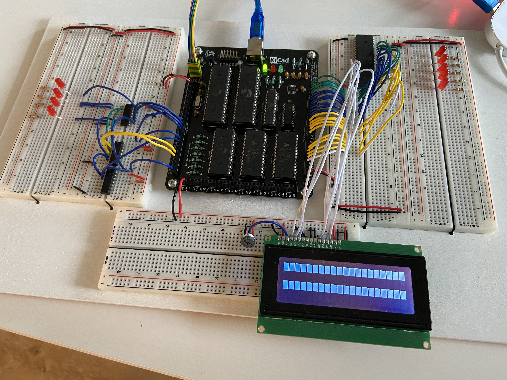
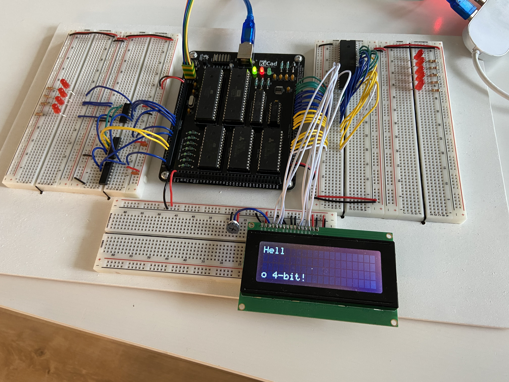
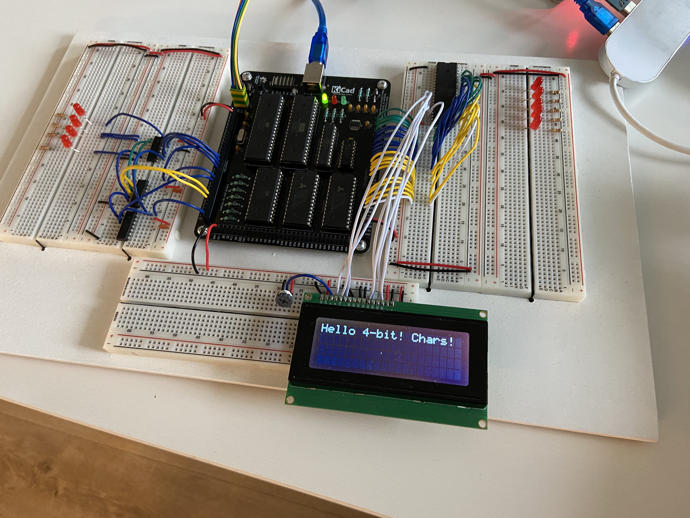
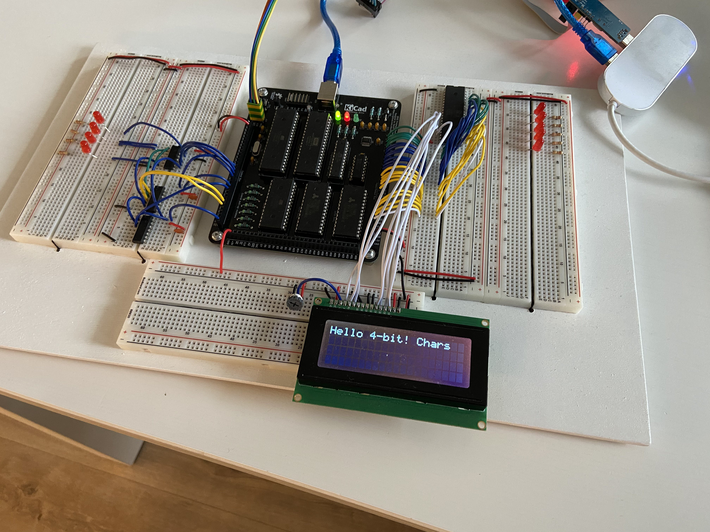

# Current status

Recently I promised to share the details of my rapid PCB prototyping exercise, and I wish I could do it being 100% certain about the results. Unfortunately, The Gods of Electrickery have not been kind to me recently, and I came across an issue that stopped me dead in my tracks.

As I wrote recently, the worst part of any project is when there seemingly insignificant things happen. Something works when it shouldn't, or doesn't where it should. Normal reaction would have been to shrug, rewire, reset and move on. Unfortunately, as I have learned the hard way, this is not a proper reaction. You should really get to the bottom of the issue for two reasons mostly:

1. Chances are that it will occur again in less favourable environment (like, you know, production, or on PCB),
2. Even if it doesn't, the Grand Issue is that you are supposed to understand your circuit. All the magicky stuff happening now and then is just your incompetence at play, and it will haunt you one day.

So, regardless of having at least three different solutions to the observed issue, I still don't know what happens and why these solutions work. To put it in proper context:


This is how I feel right now :)

# Call for help

So far my blog here was all about triumph of a mind over matter; spectacular success after another. That makes writing this post all that harder - I'm stumped and I really don't know how to proceed.

Again, more than one reason to share. First and foremost, I really hope that some of you might have seen something similar and can suggest other ways to investigate (or to solve) the issue further. Help me understand what I'm missing here and how to approach cases like that. Teach me where I'm failing.

But the other reason to share is that I would like to send a message to all the beginners like myself who come across similar roadblocks. This is normal, you can't let it discourage you. You can choose how to approach the situation (apply the first possible solution, keep digging, or just move on regardless), but don't let that situation let you down.

And, even if you don't understand what's happening, there is plenty of investigation you can do on your own just using the opportunity to learn more about analysis and troubleshooting.

So, please, if you have any idea what might be causing issue that I've been struggling with or what else could I check, please let me know in the comments below.

# The weird case of line wrapping

So, soon after receiving my DB6502 prototyping PCB (described [here](https://hackaday.io/project/174128-db6502/log/183760-rapid-pcb-prototyping-and-what-can-possibly-go-wrong) and [here](https://hackaday.io/project/174128-db6502/log/184019-rapid-pcb-prototyping-update-part-1)) and sorting out initial open questions (like feeding bus control signals from AVR to 6502) I started testing how the integration with external I/O components works. Plugged in my 20x4 LCD screen and ran some basic program to test it. The expected outcome was to display text "Hello 4-bit LCD! Chars!". I use 6522 VIA chip to interface to LCD. This is the basic setup:



Now, to shortly describe what is here: in the middle there is a PCB with the core components: ATmega644PA used as a supervisor - it feeds clock input to 6502, can take control of system bus and flash the ROM chip. You can use it to step through 6502 execution (cycle by cycle) while observing system bus activity; 6502 CPU (the CMOS variant from WDC), two 32KB RAM chips (one not being used), 32KB ROM, ATF22V10 PLD for address decoding and 74AC138 for I/O channel selection.

Mandatory to run there are also several chips on the left side: 74HC595 shift register that AVR uses to control signals like RDY or BE for 6502, 74HC00 inverter for them and 74HC08 AND gate for RES signal routing (you can reset 6502 from AVR without resetting the latter). Pretty basic stuff.

On the right side there is a single chip - 6522 VIA (also CMOS variant from WDC) used to drive the LCD in 4-bit mode. As you can see, each of the breadboard sections is fed power and GND connections from three breakout ports on each side of the PCB.

Sorry, if all the above was a bit confusing, I didn't want to get into details, as I believe most of it is pretty irrelevant to the observed issue here. I will provide evidence explaining this reasoning below.

# Get to the point, will you?

Right, to the point. Let's start with visual description of what really happens:



As you can see, text on the LCD has been wrapped incorrectly - after four characters there is a jump to last line.

Now, unless you have checked out my blog in the past, you might be thinking "this is just wrong LCD code", but that's not as simple as that. Please bear with me just a while longer, I promise it **will** get interesting.

I will describe the code that drives the LCD (and the details of the execution) in a more detail below when I discuss one of the possible solutions. I just want to present all the observations first to ensure proper context to this Electrickery Mystery.

## Observation 1

One of the things very important to the issue at hand is that it occurs **every single time**. As long as the conditions are met (as in: without certain exceptions or "solutions" noted below) the problem will happen each time I run the code. There hasn't been any single case of corrupted characters, incorrect output, timing issues or anything of that kind. Execution is rock solid: display four characters, wrap to last line, keep going. 

Again, you might be wondering why I don't just check the code. The reason is simple: the code is correct, I have the same code running in identical setup (but on PCB, not partially on breadboard) with speeds up to 8MHz just fine. So yeah, the code "should" work. **Please, bear with me.** And if you think I didn't check my code carefully, [here](https://hackaday.io/project/174128/log/181838-adventures-with-hd44780-lcd-controller) and [here](https://hackaday.io/project/174128/log/181887-amazing-upside-to-sloppy-coding-hd44780-part-2)I wrote much more about it.

## Observation 2

The picture above was taken when running 6502 CPU at relatively slow speed - few hundred Hz - while dumping all the bus activity to the serial. There is, however, alternate mode: you can run the CPU as fast as possible (up to around 800kHz), but then the bus activity is not written to serial output.

Guess what: running at fast speed prevents the issue from occurring.



There you go: the same hardware setup, different clock speed. No weird line wrapping occurs.

Please note: I have also tested the code in slow mode on another PCB-only build. The issue doesn't occur there either. This, most likely, is not timing issue. At least not as simple as it might seem.

## Observation 3 (and Solution 1)

If you read my post about this particular PCB design, you know that it was sort of "quick and dirty" job. Not that it should matter at such a low speeds (even the MHz range), and the traces itself should not be that important. Having that in mind I tested what happens if I move the GND connection from bottom breadboard to one of the alternate boards.

The reason I did that is that if you take a look at the build above, all the signals from the VIA come in the form of rather long wires (15cm+), while they are being referenced against GND level coming from the other side of PCB, near higher-frequency AVR clock (20MHz). So, I moved the black GND wire from between the PCB bottom connector and breadboard to connect the breadboards where the VIA signals are coming from (the right one):



You can see the black wire just above the center of LCD, hiding under the white signal lines. As you can see, the GND signal from the PCB bottom port is just disconnected.

And poof, issue gone. Tested about hundred times - each time it worked just fine. Slow, fast, no matter.

What I have also tested (but didn't take the picture of) was moving the GND connector to the left board, in theory making the route even longer - but it still worked just fine.

So, the observation is that whatever is causing the issue, it is somehow related to the GND connector on the bottom of PCB.

Now, I was tempted to stop there, but I wasn't satisfied with the explanation. Sure, if I put all this on PCB one day the traces will be shorter and the issue, most likely, won't occur again, but still: something is happening and I don't understand why. I mean if there is something wrong with the GND connector there I should be able to detect it or measure somehow, right? And there shouldn't be any other way to fix it, right?

## Observation 4

So, it was time to measure what happens here. I grabbed my logic analyzer, plugged it right next to the Enable pin of the LCD and to the ground connector on the bottom BB. Moved GND connector to the old spot and ran the software again to catch the issue.

Nope. Not occurring. As if the presence of the logic analyzer itself was sufficient to prevent the issue from manifesting itself.

Disconnected the logic analyzer from the PC. Issue still doesn't occur. Disconnected GND connector of the LA, leaving just one single connection from LA to the Enable pin. Issue doesn't occur. Removed LA, leaving only the single wire connected to Enable pin - issue occurs again.

How do you solve something you can't even measure?!

## Observation 5 (and Solution 2)

As you can see in the pictures above, I had handful of LEDs sitting there from the initial board testing. I grabbed one of the 220 Ohm current limiting resistors and I used it as pull-down resistor on LCD Enable line.

This solved the issue. I was so happy! 

This explains it, I figured: after all, even logic analyzer probe behaves like a very weak resistor (1MOhm or so), so I was unintentionally pulling down the E line with it. Problem sorted, right? I rushed to the internets to confirm my theory and found interesting clue: all the lines on the LCD controller have weak pull-downs on them, with the exception of the E line. That was it then!

Or so I thought.

To make things nice and neat, I decided to use another, more appropriate pull-down resistor: 4K7. Guess what. **The bloody issue returned!!!**

Yes, you are reading this right: 220 Ohm pull-down prevents the issue from occurring. Logic analyzer probe prevents the issue from occurring. 4K7 resistor doesn't. Too weak?

And yes, in case you are wondering, I tested the 4K7 resistor - after all it might have been damaged and not conducting any current at all - and it was just fine, my meter measured 4.6 KOhm. F**k.

So, what I do know now? Something must be driving the E pin. If it was just stray capacitance or ringing on the board, 4K7 would have been strong enough to prevent the issue, right? 

At the same time, the code should be fine if it's running correctly with just a minor tweaks to hardware (like moving GND connection or increasing speed).

I was just about to give up, but I figured there is another thing I haven't looked into: bus analysis.

## Observation 6

So, I decided to look at the bus activity. I will not post full dumps here, they are way too big, so I will try to describe how the thing works from software perspective. If needed, I can provide the full logs on request.

The algorithm of driving these LCD controllers in 4-bit mode is pretty simple. Start with software reset operation, set up basic details and move on to data communication. This part is where it is interesting, and this is how the code works:

- Write single character to the LCD
  - Start with reading the busy flag
    - Read two nibbles of 4-bit each, starting with the MSB
    - If the bit 7 is set, it means LCD is busy
    - Repeat as needed
  - Write single byte as two 4-bit nibbles, starting with the MSB
  - Check for line wrapping condition
    - Read current cursor location (after byte write)
      - Start with checking busy flag before read operation
        - Read two nibbles of 4-bit each
        - Check bit 7
        - Rinse and repeat
      - Read current position from LCD by reading two nibbles of 4-bit each
      - Compare read position against "wrap locations" - if match found, change address by writing another byte to LCD

This code has been tested in various configurations, at different speeds, with logic analyzer. It's basically bullet-proof. That being said, something must have been wrong with reading the position, because the line wrap happened too fast, and the resulting position wasn't in the next line.

After comparing system bus activity for scenario with or without pull-down resistor (or with different GND connectors) I noticed interesting discrepancy. The current position reads were not random in the faulty cases.

When GND rail was connected to another breadboard or the pull-down resistor of 220 Ohm was used, the consecutive reads of current cursor position after writing each character were, as expected:

```
01, 02, 03, 04, 05...
```

Now, the same operation without the pull-down and with GND connected to the bottom of the breadboard would read:

```
10, 20, 30, 40, 55, 65...
```

See the pattern? It's like there is an 4-bit offset in the operation. As if there was single, unintentional read at the beginning of the sequence, so instead of 01, 02 it reads 10, 2... Finally it reaches 40, and this is the signal to move to the last line - location 54 - which is correctly executed, followed by read 55 and 65 (55 and 56 in reality).

I figured I had to look for one single rogue signal that would raise E line shortly after reset sequence completed - that would explain the 4-bit offset.

Then I came up with another hypothesis to test: see what happens if I disconnect the pull-down resistor after first characters are written?

## Observation 7 (and Solution 3)

So I had it mostly figured out: something happens after LCD init operation causing single random spike on E line, and it's interpreted as 4-bit nibble read operation. If I prevent it with my pull-down resistor for long enough, it should be fine, right?

So I did. Ran the code slowly, with the pull-down connected, until the first 'l' character ('Hel' displayed on the screen). Then I paused the execution, disconnected the resistor and resumed execution.

Problem occured again.

Checked system bus log, and the reads were invalid again:

```
01, 02, 03, 40, 55, 65...
```

So, as it turns out, the weird "read" happens every cycle. With every single character. 

What's more interesting, is that theoretically the 4-bit offset should manifest itself in the busy flag checks as well - after all this is reading from the same register. It doesn't. While checking busy flag I can't see the offset - it's always read correctly, with leading zero (or five after wrap).

Started investigating the code even further, and came across something that could be described as inefficiency. Before each operation (write/read) I change the direction of the subset VIA port by writing to DDR register. For usual operation this is how it looks (compare algorighm above):

- Toggle to read mode (write 0x0e to DDR)

  - Read busy flag

- Toggle to write mode (write 0xfe to DDR)

  - Write character data

- Toggle to read mode (write 0x0e to DDR)

  - Read busy flag - this works fine

- Toggle to read mode (write 0x0e to DDR)

- - Read current cursor position - and this does not

As you probably noticed, there is one unnecessary write to the DDR: toggling to read mode in the last step, just before reading the current cursor position. That being said, it should not change anything, because 0x0e is the actual content of the DDR register:

```
/read
  0222: r 0e
  0222: W 0e

/bf-no
  0220: r f4
  0220: W 04
  0220: W 0c
  0220: r 0c
  0220: W 04
  0220: W 0c
  0220: W 04
  0220: r f4

/write
  0222: r 0e
  0222: W fe
  
/Letter 'e'
  0220: W 62
  0220: W 6a
  0220: W 62
  0220: W 52
  0220: W 5a
  0220: W 52
  
/read
  0222: r fe
  0222: W 0e
  
/bf-no
  0220: r f2
  0220: W 04
  0220: W 0c
  0220: r 0c
  0220: W 04
  0220: W 0c
  0220: W 04
  
/read
  0222: r 0e
  0222: W 0e
  
/position 20
  0220: r f4
  0220: W 04
  0220: W 0c
  0220: r 2c
  0220: r 2c
  0220: W 24
  0220: W 04
  0220: W 0c
  0220: r 0c
  0220: W 04
```

This is (filtered to VIA access only) system bus log of one of the executions. You can probably see the last DDR write:

```
/read
  0222: r 0e
  0222: W 0e
```

Does it make sense? No, not really, but the alternative would be to read it, manipulate bits as needed (there are certain calculations required, since one line in this port is not related to LCD), then read again to compare if change is needed, and write only if it really is.

This is the original code:

```
        ; Preserve direction of last four bits of DDRB
        ; but toggle LCD data lines to input
        lda LCD_DDR
        and #(BLINK_PORT_MASK)
        ora #(LCD_DDR_READ_MASK)
        sta LCD_DDR
```

And this is the same code with the modification:

```
        ; Preserve direction of last four bits of DDRB
        ; but toggle LCD data lines to input
        lda LCD_DDR
        and #(BLINK_PORT_MASK)
        ora #(LCD_DDR_READ_MASK)
        cmp LCD_DDR
        beq @no_change
        sta LCD_DDR
@no_change:
```

I guess you know where I'm going with this, right? This solved the issue again. No pull-down required, no need to move GND connection elsewhere.

# What's the problem then?

Well, the problem is that I'm not satisfied. There is no reason the VIA chip should behave this way, and even if it was, it would happen regardless of clock speed or GND connection layout. If the pull-down was required, then 4K7 would be just as good as 220.

And, what's worse, I should be able to observe the issue somehow. It would not disappear with single probe of LA attached.

You might be wondering why I haven't used scope to investigate. For one, I don't have it. At least not a proper one, all I have is a simple Hantek 6022BL USB toy that I borrowed couple of months ago and haven't even opened the box yet.

This seemed like the right moment to use it, and I did. I tried connecting it to E line next to the LCD, but this stopped the issue from occurring. When I moved the probe to the VIA side, the issue would keep occurring, but there was literally nothing on the scope that would look out of norm. Just a regular, clean signal.

Maybe the scope is crap (I mean I do know it is :)), but I can't really justify such an expense without being certain that the proper DSO would help me troubleshooting this. I mean it's nice to have scope and all, and my birthday is coming soon, so the excuse is there, but if I can't use it to solve problems then maybe, just maybe, I don't need one.

# HELP PLEASE :)

Please, if you have any idea what I should try next, what kind of test should I run to test any other hypothesis, then please let me know in the comments below. 

I know I have solution of sorts (actually, three of them so far), but it's not the LCD that I'm troubled by. My problem, for which I humbly request your assistance is in understanding what else can I do to get solid understanding of the underlying phenomena here. All help, clues, questions will be highly appreciated!

Thanks a lot in advance, and may Gods of Electrickery be kind to you :)