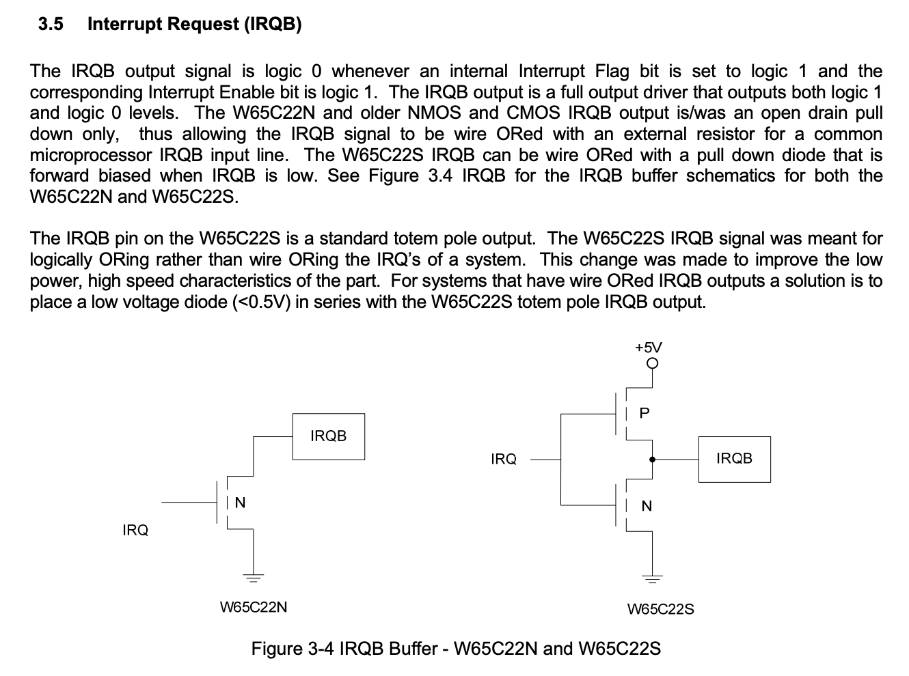
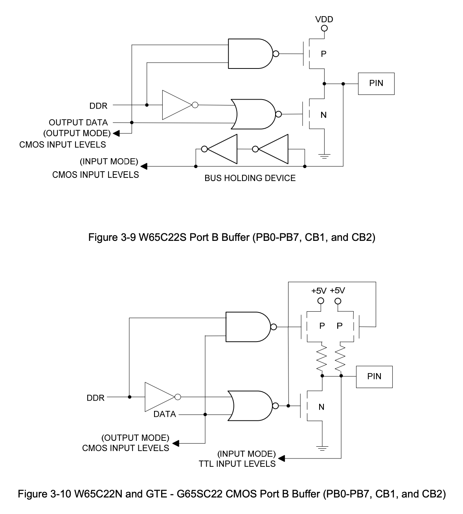

# Learning product development the hard way

One of the least expected consequences of sharing is that people actually take what you shared and start using it. To make things worse, these people are different than you, have diverse backgrounds, experiences and competences; they also use your design in a ways you have not imagined.

This, at least in my rather short experience, is the best part of the whole project. Every now and then I get messages from people all over the world who built DB6502 and ran into smaller or bigger issues while doing that. These issues let me see things from different perspective and are the best course in product design I could ever dream of.

At the same time this is the hard way, as you have to think of all the possible issues as much in advance as you can; negligence or ignorance can get you in trouble and while everyone seems to agree that authors of open sourced projects should not be held responsible for any consequences of their usage, you still will feel that you should address most of the comments you get in one way or another. So, prepare for bumpy ride and enjoy every single moment of the experience!

# Think about target audience

This is something we all should know - consider the background of the people who will follow your project, and make sure you don't assume certain level of expertise. And yes, while you can expect at least some of them to be similar to you (after all, all great minds work alike), you have to ask yourself if you provide enough details for users outside of your demographics, whatever they might be.

One instance of such omission from my side was the unwritten assumption that most users of my project will have background in software development. After all, if you host your sources on GitHub and write documentation about compilation flags, you should expect anybody interested to be familiar with these things, right?

Well, wrong actually. Your project might be also followed by people who have never used git, so it's common courtesy to describe how to use it for the purpose of your project. You never know who's on the other side!

Key takeaway here: be careful with your assumptions, especially regarding your core competences. Remember how you got into electronics first and was upset about certain things never being explained clearly? This is exactly what happens to non-developers if you tell them to fetch the latest version of repo and switch to specific branch :)

# The curious case of blink LED

One of the features I put on my DB6502 board was simple LED driven by remaining line on port B (other 7 lines are used to drive LCD screen). The schematic is as simple as it can possibly get:

Few weeks ago I was contacted by one user, let's call him Adam, who started building DB6502 and while very competent in electrical engineering, he was struggling with the software development toolkit that I used for my software. He managed to use VASM to create simple ROMs to run on the board, but was unable to follow the instructions for building my code.

I have to admit I put quite an effort to ensure that my software builds "out of the box" on each of the major operating systems (Windows/MacOS/Linux), but the documentation of the environment setup was lacking in that regard.

So, I started exchanging e-mails with Adam, guiding him step by step of the process.

To be fair - I have already done similar things in the past, improving my documentation with comments coming from other people, but it was first time that non-developer started working with my project. I expected this one to be pretty quick - five to ten e-mails maybe, simple suggestions and done. It turned out to be more complicated and it taught me a lot!

After we got to the point where ROM images would compile nicely, it seemed as if it would take just a few more steps to get to working OS/1 image. Unfortunately, this was not that easy. When we got to setting up the serial connection, weird things started happening. Transmit would work, but receive would fail. OS/1 image would not even boot properly. So many things seemed to fail it was a bit overwhelming - and to be fair, it's not easy to debug someone else's build with 11 hours timezone difference.

# Significance of "insignificant"

One of the things that happened over the course of investigation was that Adam told me that the Blink LED is constantly lit. While weird (it should not happen, come on, too simple to fail), it didn't seem as something that needed attention. Short maybe?

We focused on the more pressing issues with the transmit/receive operation on serial port. I was afraid it might have been caused by incorrect soldering of the FT230XS chip - it's the single most difficult part of the build and many people reported problems with it.

That being said, Adam was experienced engineer, people like him don't make such mistakes, and he didn't either.

I created several ROMs just to test his build. Programs as simple as they get to use different features of WDC65C51 (serial chip used by Adam) just to see where the problem might be. Pretty soon it turned out that synchronous communication (not using interrupts) worked just fine.

You are probably thinking "ah, the infamous WDC IRQ bug!". Nope, not this one :)

Being fully aware of the bug, I created the async version of the code using only the receive interrupt (transmit was still done in synchronous way), and it worked perfectly on my own board.

Yet, Adam's build didn't seem to work with it correctly. It would indicate (using other LEDs) that **receive** operation worked, but there was no **transmit**. As if the incoming data would not trigger receive interrupt?

After hours of looking at the schematic I started thinking that maybe the IRQ happens, but due to simple mistake Adam replaced 4K7 pull-up on the IRQ line by the adjacent 27Ohm resistor used for USB connection. This kind of strong pull-up might be too strong maybe?

Nope, this was not that again.

# What was it then?

Adam spent several hours troubleshooting this and noticed interesting thing: the IRQ line of WDC65C51 was actually being correctly pulled low after incoming byte, but CPU seemed to ignore it. Further inspection revealed the reason: both VIA chips were pulling their IRQ lines low **all the time**. He added pull-up resistors to their IRQ output lines and things started working.

Then again: why did he need to add these pull-ups? I mean: nobody has ever needed them.

Adam found the answer. There are actually two variants of WDC65C22 chips: WDC65C22N and WDC65C22S. What's the difference? Glad you asked. If you check the [datasheet](https://www.westerndesigncenter.com/wdc/documentation/w65c22.pdf), you will notice that there is important difference in how these chips handle IRQ line output:

So, as you can see, there is fundamental difference as to how these two chips work.

VIA was constantly pulling the IRQ line low (by simply floating), resulting in constant LOW on CPU input. As a result, CPU was executing only the IRQ handler code, and each time it exited IRQ handler, it would jump straight in. This is why it never could transmit any data - remember that WDC65C51 code for sending data can't use interrupts because of the bug.

## Why did the other things work?

This was another riddle. How comes the CPU worked fine with all the other ROMs? I mean being stuck in an endless IRQ handling loop doesn't seem like something that would go unnoticed, right?

Took me a while to figure it out, and it's pretty obvious when I finally did: 6502 boots into mode with IRQ handling disabled. You need to enable interrupts by invoking CLI opcode. All the other programs didn't use interrupts, and since the point was to make them minimal, there was no CLI opcode in them. Mystery solved :)

# So, what does this have to do with the Blink LED?

Apparently, IRQ handling is not the only difference between WDC65C22N and WDC65C22S. According to Adam (unfortunately, I don't have the former chip in my stock to confirm), the output pin was floating around 1.6V, since it was not being initialised as output. Or something like that, I might be mixing things up here. Here is the part from the datasheet describing the difference:

If you guys can explain to me why would pin float around 1.6V here in input mode I would be very grateful! I spent some time with this schematic and I think the culprit in WDC65C22N case is the right P MOSFET pulling the pin up when DDR is 0 (input), but would like to hear opinion of somebody smarter and more experienced.

The main point is still the same: something as small and seemingly insignificant as incorrect state of Blink LED was indicating much more serious issue of chip incompatibility. Luckily, thanks to Adam's remarkable perseverance, he managed to find the root cause and address it. 

You have to remember - if you see something small that is off and don't think much of it, this might actually be something way more serious. As long as you are in prototyping mode, it's fine, you can come back to it later, but if you let that kind of detail slip into your final product design you might be in serious, serious trouble. Never ignore the "insignificant details"!

# One more advice for the end

The main issue here is that on my PCB there was no place to solder in pull-up resistor for the VIA IRQ lines, it had to be done the hard way, by modifying the build a bit.

In future I will make sure that there is additional slot on the PCB where such pull-up can be installed - it just needs proper documentation in build notes.

And, while writing about it, there is another thing I learned recently. Some of the LCD screens, like the one I use (based on HD44780 controller) have current limiting resistor on their backlight LED, but that's not true for each and every single one of them. When using such LCD you will end up having much higher computer current usage and the display will be extremely bright.

I got really great advice for that from my friend: when designing port for LCD screen, just make sure to add footprint for additional resistor on the backlight power supply line. In case your user has the LCD screen with built-in resistor, they can solder in 0 Ohm resistor there (or simple jumper wire), and if they don't, they can install whatever they need for their specific screen. Great advice, isn't it? 