# Update on the DB6502 Proto Board

So, I've been playing with my DB6502 Proto Board for some time now, polishing the supervisor software recently, and it's pretty neat as it is now. You can flash ROM, you can obviously read its contents as well. You can run the 6502 using onboard AVR as clock source with speed ranging between 300KHz (system bus captured, no breakpoints yet) and 800KHz (system bus capture disabled). You can single step over single cycle or single instruction, so basic disassembler is already in place. Some screenshots:

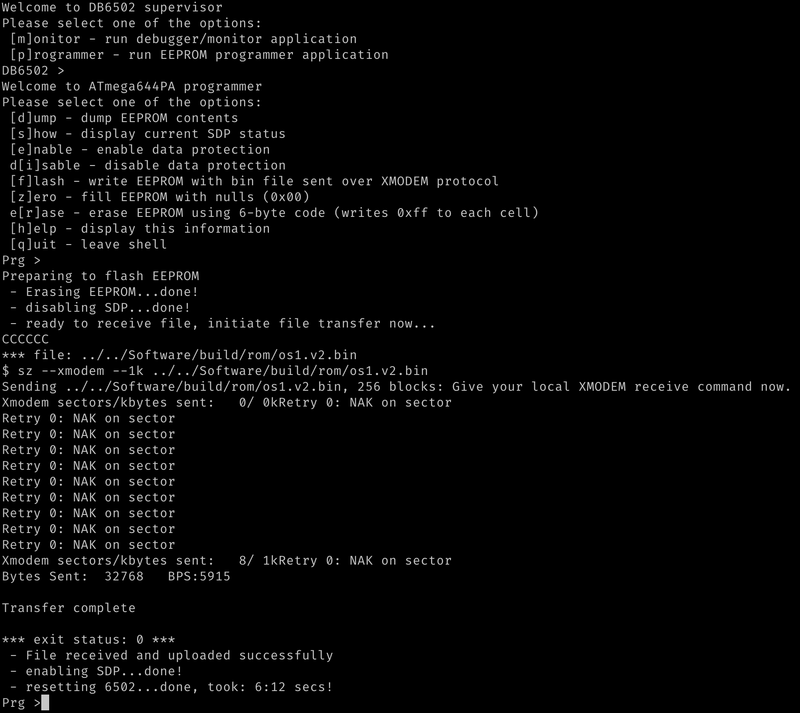

The one above shows how onboard AVR is used to flash OS/1 system image to EEPROM.

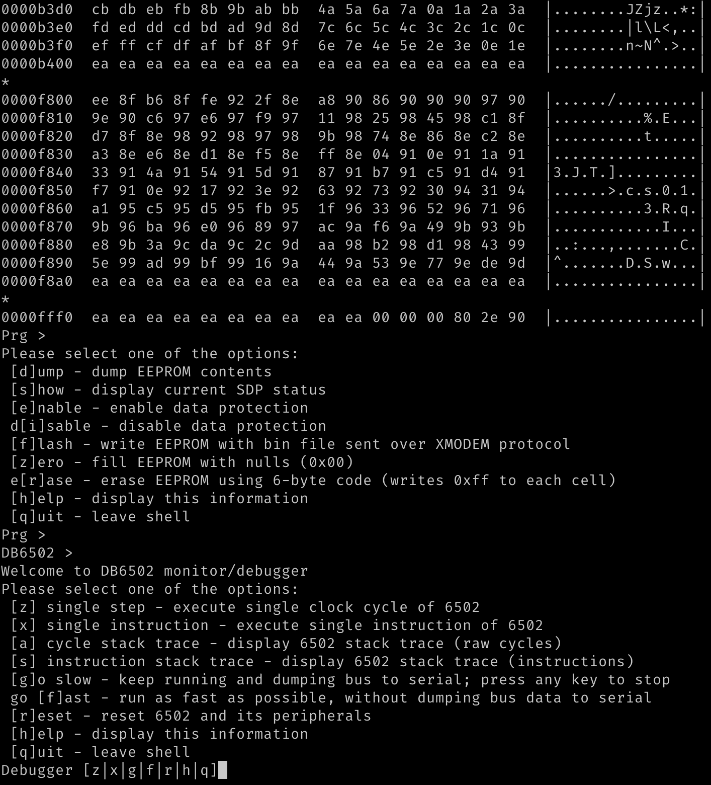

This one - dump EEPROM operation and entering monitor shell.

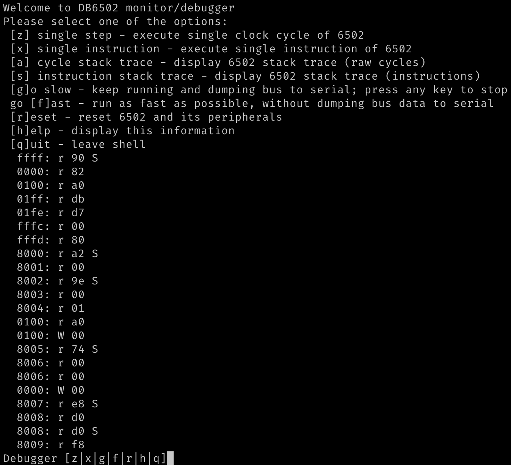

You can single-step the cycles...

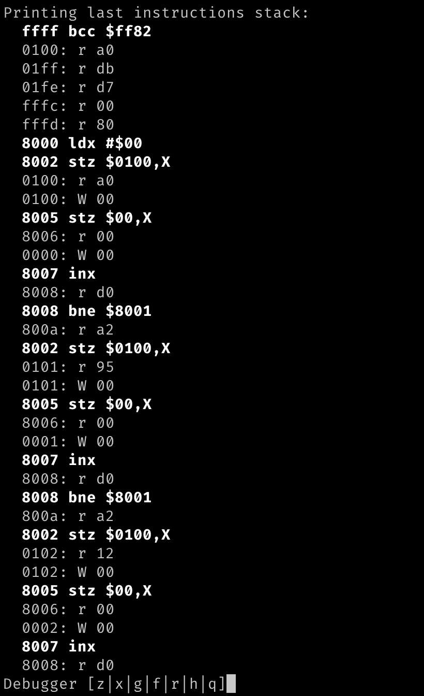

And whole instructions.

Finally, you can run fast to get enough performance to run OS/1 on the board:

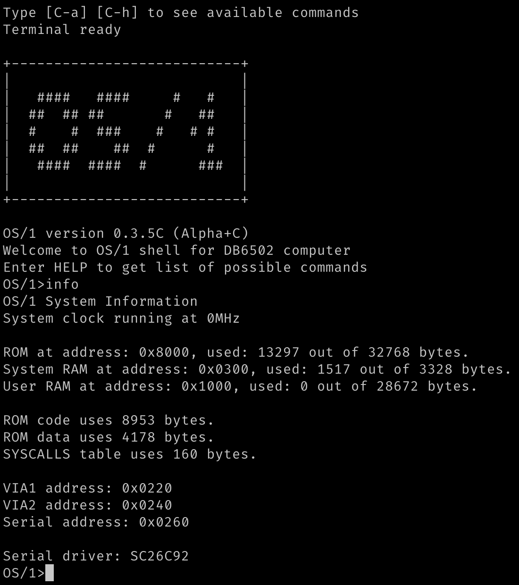

I have also implemented major redesign to OS/1 serial interface architecture, it's using replaceable (at compile time) serial driver modules, and I created one for my next-gen DUART controller, so it works with three different chips now.

So yeah, I've been busy recently, and it all worked pretty fine, with one simple exception.

# Reset circuit explained

So, there are two reset circuits on the board, and the same design will be used in the final version. There is primary **master** reset circuit connected to DS1813 chip that resets everything on the board (with the exception of the UART->USB interfaces, see below). However, I wanted to have another, **secondary** circuit, used to reset only 6502 and its peripherals. The reason to do so is that you might want to use your AVR supervisor session over several 6502 resets. You want to keep your breakpoints for instance.

The solution is pretty simple: both reset signals are active-low, so the **master** reset is connected directly to DS1813 chip (that generates the signal on power-up and when reset button is pressed) and AVR and its peripherals. 6502, however, is connected to **secondary** circuit that is generated as an output of AND gate. The inputs are: **master** reset and signal originating from AVR.

This way we have two ways of resetting the 6502: by the master switch/power-on, or by command from AVR shell.

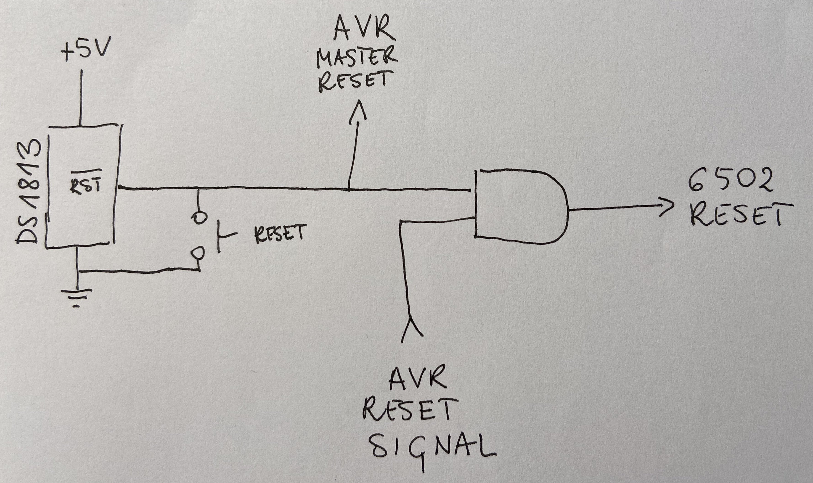

Now, this is pretty simple, right. Could anything possibly go wrong?

Well, I wouldn't be writing about it, if there wasn't.

# The strange case of reset button

So, most of the time it worked, I could reset the 6502 from AVR shell and it would just work. Sometimes, without any apparent reason I had to invoke the reset operation more than once for it to kick in. That was weird, especially that my code for sending the reset signal was following WDC datasheet that requires at least two full clock cycles. I had three.

Still, sometimes what happened was this:

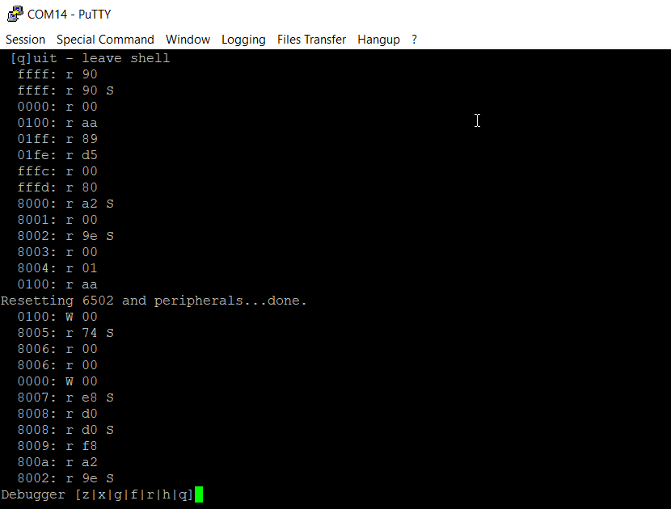

As you can see, reset sequence was performed, but the CPU continued as if nothing happened. In those cases I just had to repeat it couple of times to kick in:

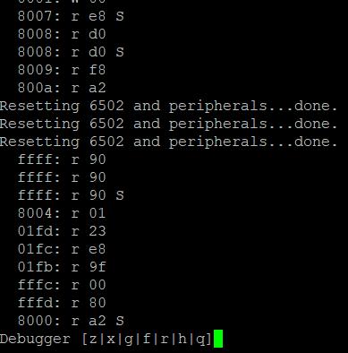

I was ignoring the issue for a while, because it was just a small annoyance, but at certain point I decided to look closer at it. And what I found was eye-opening.

# First investigation attempt

What do you do in cases like this? Get your logic analyser and see what it records. Here is what was captured using my cheap Saleae Logic 8 clone:

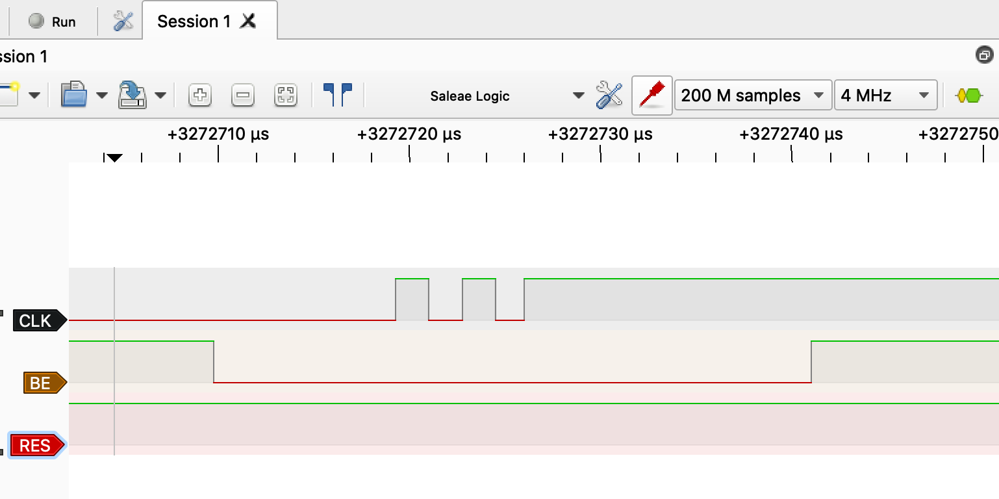

A-ha! Three cycles, bus taken over (it's not really necessary though for reset operation), but RES line was not pulled low. I checked the terminal, and the puzzle got all the weirder:

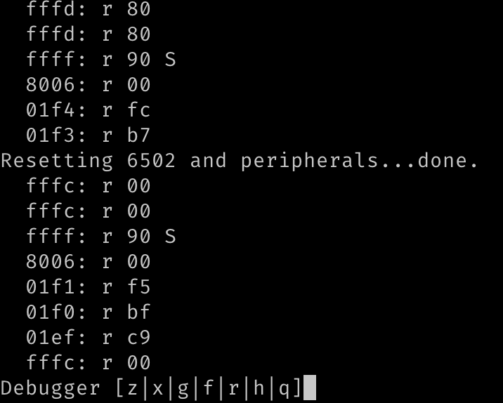

RES line was not pulled low, but the reset operation worked? WHAT THE HELL?

Probably the cheap clone is crap. Weird, but whatever. Let's get the serious stuff: 16 channels, 200MHz. Proper gear.

# Second investigation attempt

What ensued was so strange I actually forgot to take screenshot of it, so what you will see below is my own recreation of the observed result. This is what I saw at much higher frequency logic analyser:

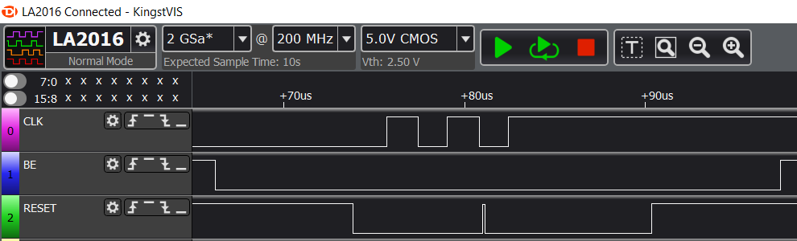

What got my attention here (but I wasn't able to replicate this afterwards), was the single high spike on RES line. It seemed as if the reset operation (triggered just after two cycles that WDC datasheet mentions) somehow drove the line high for very short period of time.

I was stunned. What is going on here?

# Proper investigation attempt

I have to confess - I have finally gave in and got myself brand new shiny scope. Two channels, 1GSa/s, 200MHz Siglent 1202X-E. Oh, how I love my new toy! I got it couple of days after the observation of the above issue and decided it will be the first case I solve with my new gear.

Connected the probes, calibrated them, connected to circuit. Set up single acquisition mode, falling edge trigger on RES line around 1.66V. Connected the thing, run my computer and started trying to capture the signal.

Nothing.

Nothing.

Nothing.

Seriously, there must be something really wrong. I was about to cry, my new toy doesn't work, my reset line misbehaves, by logic analysers can't see the proper signal. 

Changed trigger level to 3V and BOOM:

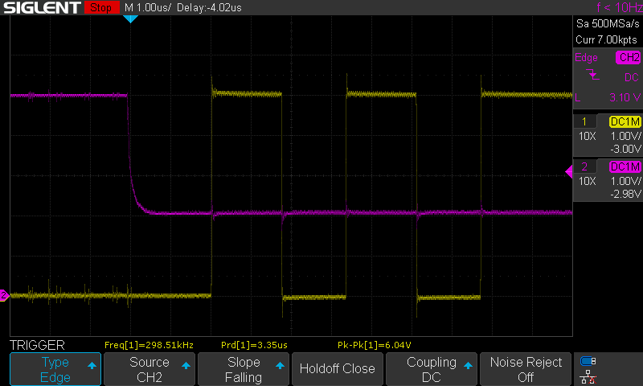

Yellow line is the clock input, pink is the reset signal. Can you guess what happened here?

# It's always the wiring...

I have written this more times on Ben Eater's forum on reddit than I care to remember. Every week there is at least one thread about something not working (or working erratically) and the authors are always convinced it can't be wiring. It can't be error in wiring, because it sometimes/partially/almost always works.

And guess what: it always is wiring.

This particular case: wiring. Obviously. Check this out - wiring of the AND gate connected to reset line:

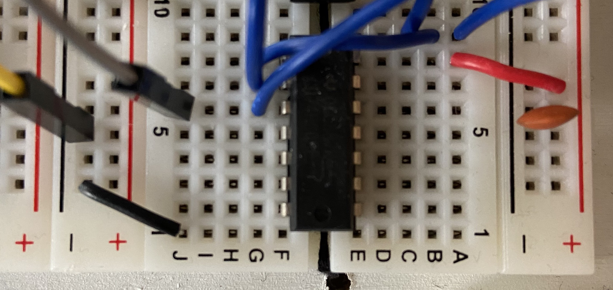

Yes, you are seeing it correctly. Yes, I didn't notice that for over three weeks staring at it every day. I missed it three times when connecting both logic analysers and scope probes.

Wire that is supposed to be connected to GND line on the AND gate chip (pin 7) is off by one breadboard slot, and the chip is not connected to any GND whatsoever.

# Correction and test results

Obviously, when I connected the wire properly, this is what I see on the scope:

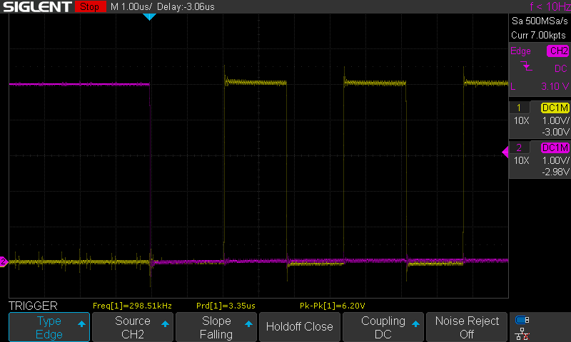

Also, my cheap and dumb logic analyser apparently it's not as dumb as its owner after all:

That being said, there are some key takeaway points here:

1. Your system might work even with very serious design/execution errors,
2. Small glitches are never irrelevant, they are very, very important clues that something bigger might be off,
3. Cheap logic analyser actually seemed to work better than the expensive one,
4. It always is your wiring. Ok, maybe almost always, but still: check your wiring again!

So yeah, it was another great lesson for me. I hope you enjoyed the read and learned a bit yourself too :)