# Why this keeps happening to me?

So, [last time](https://hackaday.io/project/174128-db6502/log/185287-test-driven-development-meets-hardware) I wrote about things that scare me the most: some seemingly random glitches that obscure larger design problems. This is why whenever I see something off I get really anxious - I'm afraid this time it will be too hard to fix, and I got pretty terrified recently!

As usual, I want to share the story, partially because it makes for a nice cautionary tale, and partially because it was pretty interesting investigation that followed, with some magical twist to it.

## Status update

First things first, to set the stage. Recently I made an amazing discovery, but I will cover this in a separate entry. Suffice to say I managed to solve one of the major pains with my first version of the board without any significant modifications to version 2.

As a result I could finally move forward with clock switching design I wrote about previously. After having included all the comments from Reddit, I moved on to hardware implementation: one 74AC74, one 74HC157 and a full-can crystal oscillator.

I was surprised to see how easy that was. With all the schematics prepared in advance and prototype build for my test fixture it took less than 15 minutes.

Booted up OS/1 and all seems fine, the whole machine started at 8MHz, ran just fine until I decided to enter debug mode where it seamlessly switched to 300KHz mode with bus logging and when needed I could single step down to half-clock-cycle precision. Lovely.

Another feature I included was real-time CPU clock frequency measurement, so the below output was captured in a single session, without restarting or powering down the computer:

```
+---------------------------+
|                           |
|   ####   ####     #   #   |
|  ##  ## ##       #   ##   |
|  #    #  ###    #   # #   |
|  ##  ##    ##  #      #   |
|   ####  ####  #      ###  |
|                           |
+---------------------------+

OS/1 version 0.3.5C (Alpha+C)
Welcome to OS/1 shell for DB6502 computer
Enter HELP to get list of possible commands
OS/1>info
OS/1 System Information
System clock running at 0MHz

ROM at address: 0x8000, used: 13420 out of 32768 bytes.
System RAM at address: 0x0300, used: 1517 out of 3328 bytes.
User RAM at address: 0x1000, used: 0 out of 28672 bytes.

ROM code uses 9056 bytes.
ROM data uses 4194 bytes.
SYSCALLS table uses 164 bytes.

VIA1 address: 0x0220
VIA2 address: 0x0240
Serial address: 0x0260

Serial driver: SC26C92
OS/1>info
OS/1 System Information
System clock running at 8MHz

ROM at address: 0x8000, used: 13420 out of 32768 bytes.
System RAM at address: 0x0300, used: 1517 out of 3328 bytes.
User RAM at address: 0x1000, used: 0 out of 28672 bytes.

ROM code uses 9056 bytes.
ROM data uses 4194 bytes.
SYSCALLS table uses 164 bytes.

VIA1 address: 0x0220
VIA2 address: 0x0240
Serial address: 0x0260

Serial driver: SC26C92
OS/1>
```

First time the INFO command was invoked, the computer was running at 300KHz, hence the 0MHz reading. Before second invocation I switched clock in the supervisor session to 8MHz and it was detected properly as you can see above.

Lovely, isn't it?

It seems like more and more features from my dream DB6502 build are getting implemented nicely, I'm proud to report :)

# And then it happened...

So, obviously, I needed to test some more complex programs to see if the system is stable. I mean it's all very nice, but bare operating system doesn't make for a good testing software.

I loaded some simple programs, and they all worked just fine. Tried MicroChess, which is using CPU and memory extensively and this one also worked correctly, no glitches there.

Time for the most difficult one: Microsoft BASIC interpreter. It loaded just fine (well, almost, but that is different story I will cover another time), and I ran it in anticipation. It starts by asking user if this is Cold or Warm boot, and depending on the answer it starts memory size detection routine.

The "memory detection" is really simple mechanism: it starts from defined address and moves on, byte by byte, writing and reading 0x55/0xAA to each address. When the read matches the write, it means that particular address is in RAM. Obviously, ROM is not writeable, so the write doesn't succeed and the value that is read back doesn't match the intended write.

Unfortunately, this hasn't happened. Computer just froze, and after getting into AVR debugger I noticed that it simply ran into 0xDB (STP) opcode at some random ROM location and just hang up. It was now up to me to find how it got there in the first place.

Needless to say, it all worked just fine on the first revision of my computer, so the code as such, was perfectly fine.

## This is why I designed version 2 in the first place!

Well, this is exactly this kind of thing I built my DB6502v2 for, right? To be able to troubleshoot such issues much better. So, I reset the machine, loaded MS BASIC again, toggled to "bus analysis" mode with 300KHz clock and ran the software again, hoping to see where it fails.

Thing is: it didn't. It just happily went through, found out that ROM starts at 0x8000 and moved on to the proper MS BASIC prompt, where everything worked just fine.

F**K.

There is not much use of debug mode if it works differently from the non-debug, right?

I was really upset at this point, and since last couple of days were a bit depressing overall (COVID-19 explosion in Poland, political turmoil around women's rights movement), I was really considering just giving up here. I was afraid this was the point where I was in over my head finally. Depressing.

The main problem with all these cases is that I'm afraid this will be something really, really difficult to find, let alone even consider fixing it. The worst part is something like IC timing violation. I already know you can do it and get away with it: after all, my DB6502 version 1 runs at 8MHz with 150ns ROM. Never had any problems with it, but it also means that you can violate IC timings and not notice that immediately, leading to more and more problems in your build and making them less and less likely to occur in single place. These things scare me the most. I just didn't have that in me to continue at this stage.

Decided to spend some time with my family, take my mind off these things. Let it brew inside, but redirect the focus. Couple of hours later, when I was reading another story about Chase of Paw Patrol rescuing Chicaletta, it struck me. I had some idea what could cause this, and, strangely enough, as it turned out couple of hours later, this intuition was spot on. It did take me quite a while to confirm the suspicion, but it was simple problem afterwards. I will hold on to the hypothesis for now, to let you figure it out on your own.

# Logic analyzer to the rescue!

So, if I can't use the debug mode of my supervisor, maybe I can catch the problem with my logic analyzer then? Sure, it's not as friendly to use, but still, maybe I can get the data out of it?

There is, however, "small" issue here: I need to gather data from quite a long operation, at high frequency (at this point I changed crystal to 1MHz, and confirmed it also failed with it), and my view is quite limited: I have only 16 lines, and I need to observe full data bus (8 lines), clock, R/W, nWE, nOE and some other signals. All I can look at is just three-four address lines, which is not too much.

And, on top of that, how to read this crap? Couple million entries, and all I have is 0 or 1. All I have to do is to find the single one that causes the failure. Good luck :)

I wrote about it some time ago - I got myself pretty cheap (120$) 16-channel 200MHz KINGST LA2016 logic analyzer. Comparable devices from the major brands are several times that. The issue, however, is that PulseView software doesn't seem to like that device, and the official software is pretty limited. Or, so I thought.

For the first time I started digging deeper into the decoding section, as it never seemed that useful. It lists RS232, CAN, LIN, SPI, I2C and that's it. Oh, wait, there is "other analyzers..." menu item I haven't noticed before.

BOOM. Parallel 8080!

Check out this bad boy:

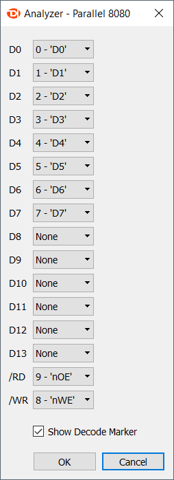

This is literally EXACTLY what I needed. Suddenly it turned out that analysis might be much easier after all!

## The data in question 

So, this is what I have to work with:

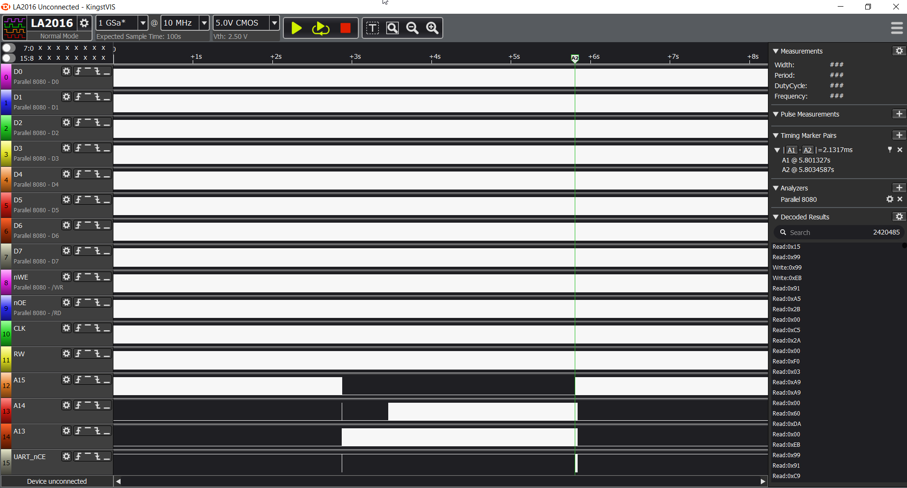

**PLEASE NOTE:** I will start with showing the correct result, captured during execution at 300KHz and move on to incorrect one, captured at 1MHz.

From top-level view you can already see interesting pattern: the middle section (where A15 is low) is probably the memory probing routine. Let's verify by zooming in:

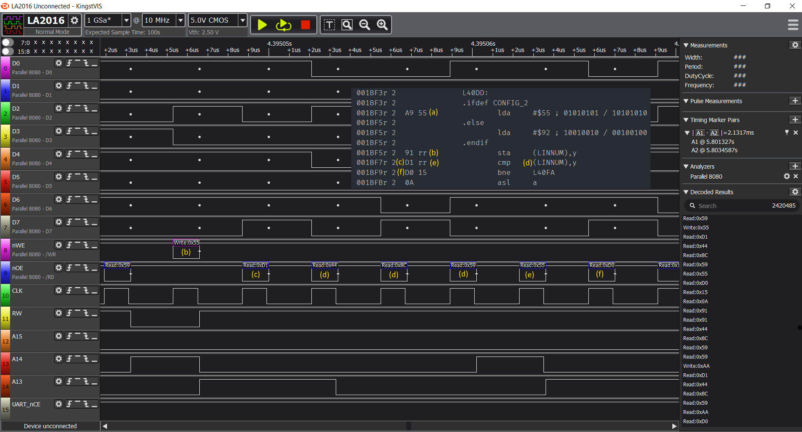

Please, open the image in new tab to follow the description:

- (a) value 0x55 is being written to some memory address (0x598C - will explain below), but we can't see the actual 0x91 (STA) opcode here (b), only the execution result which is write to RAM cycle,
- (c) first operation following the write is read operation from the same address. Since we are using indirect ZP addressing here, and LINNUM is mapped to address 0x0044,
- (d) we are reading target address from location 0x0044 and 0x0045 - and the address is 0x598C),
- (e) we are reading value from address 0x598C which is 0x55 - exactly the same value we wrote there, so this is still RAM.

Next step is to verify what happens at the end of RAM and beginning of ROM:

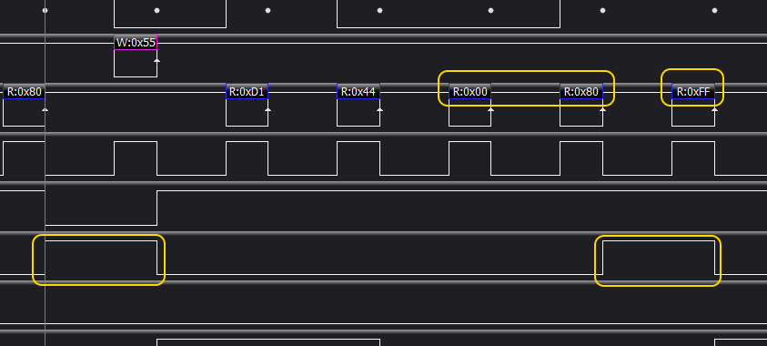

So, comparing to similar RAM cycle above, we can see the two main differences:

- first, the A15 address line is high for the write access, meaning we are now writing to ROM, not RAM,
- second, the value read back from the ROM (at address 0x8000) is not the same as value written to it (0x55), indicating that we have reached non-writable memory here.

OK, we have correct output, let's see the incorrect one.

# Incorrect run capture

First thing that you will notice is that the failed execution looks quite differently:

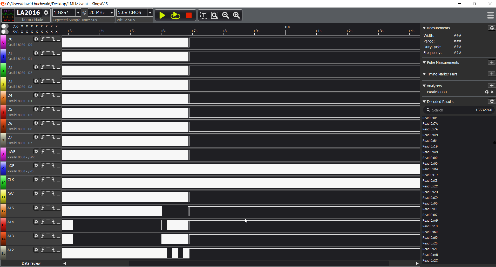

Sure, we have the memory probing section, but what happens immediately after doesn't look very good, and it's not that similar. Let's see what's happening there.

Just at the edge of the "busy" section, we can see that:

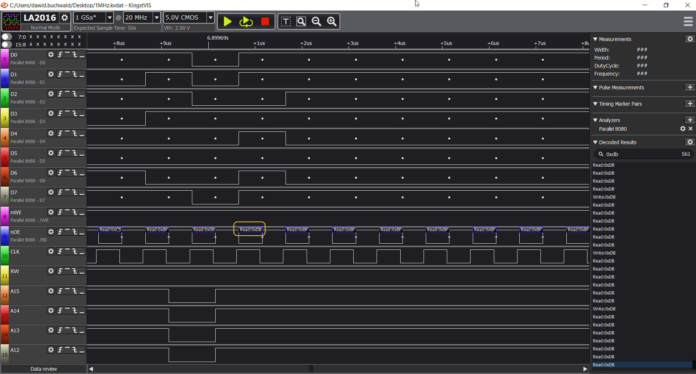

Yeah, STP opcode and nothing but black death afterwards.

Let's rewind back to the memory probing routine:


Seems like it worked its way up to 0x8000, where it detected non-ROM location. Check out the screen and think for a second. **Spoiler alert: upcoming hypothesis!**

# What was it then?

In case you missed it, previous time the value read from 0x8000 was different, although it was the very same ROM.

So, when reading bedtime story for my son I suddenly remembered interesting feature of the ROM chip: when you write to it, you can check for completion of write cycle by reading back from the last written address. As described in datasheet, it will respond with seemingly random values, but in fact it will be sort of "tick-tock" counter:

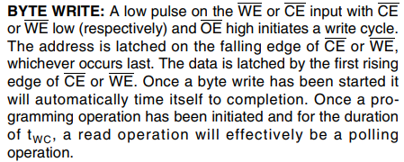

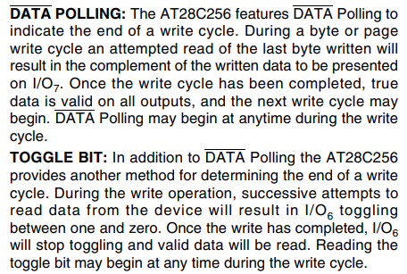

And, since it's ROM memory with enabled Software Data Protection (my AVR uploader enables it every time after flashing for protection against inadvertent writes), the write as such will not happen, obviously, but maybe the ROM is waiting for something?

So, the hypothesis was: everything is working fine, but following the write operation to first ROM address, all the successive reads from it will fail, resulting in corrupted data. 

That explanation seemed perfect, because it addressed all the observations made so far:

- First version of DB6502 had the nWE line of ROM tied high, so the "write" operation to ROM was not really happening, and the ROM didn't initiate write cycle,
- It worked just fine on the slow clock (300KHz), because there was enough time for ROM to complete "write" cycle,
- It failed on 1MHz and faster clock because there was not enough time for the write cycle to complete.

There is, however, significant issue with the hypothesis: even if that happens, we are not reading the same location of ROM as the one we wrote to, so the "data toggling" should not happen. Or, maybe I'm reading the datasheet wrong?

So, let's test this hypothesis then. Let's go back to the correct run analysis:

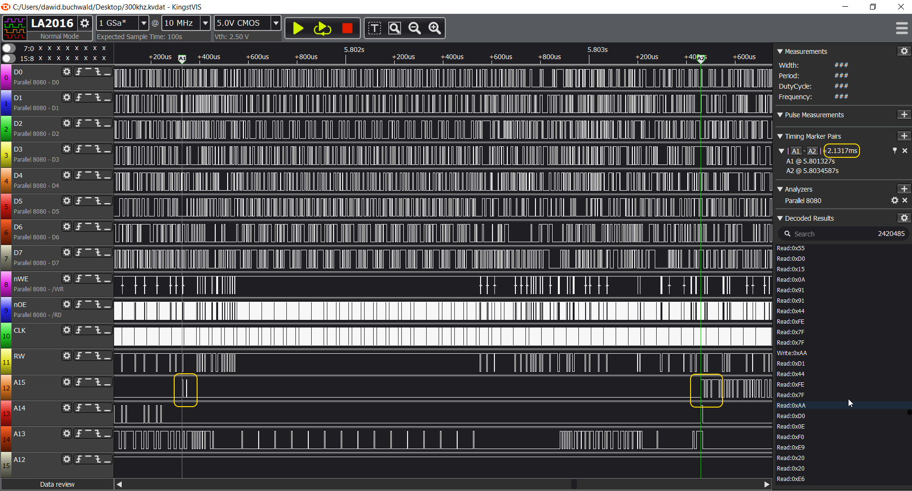

I marked two consecutive accesses to ROM. First one is the failed write, and the next one happens just over 2ms later. Most probably this is MS BASIC calling some OS/1 routine from ROM to display characters on the screen or something.

Let's zoom in on the second access:

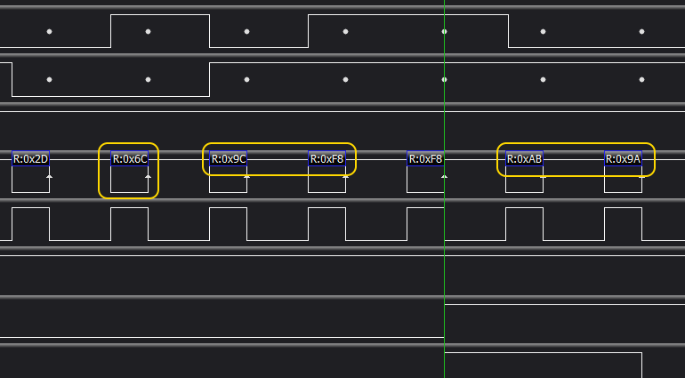

Yeah, exactly. What you can see here is that we have JMP (VECTOR) opcode (0x6C) reading the VECTOR address from ROM address 0xF89C. This is exactly the memory range where OS/1 keeps system routines vectors, and as you can see, it results in a read of address 0x9AAB, which, most likely, is ROM address of some OS/1 function.

Now, let's compare that against the incorrect 1MHz execution capture:

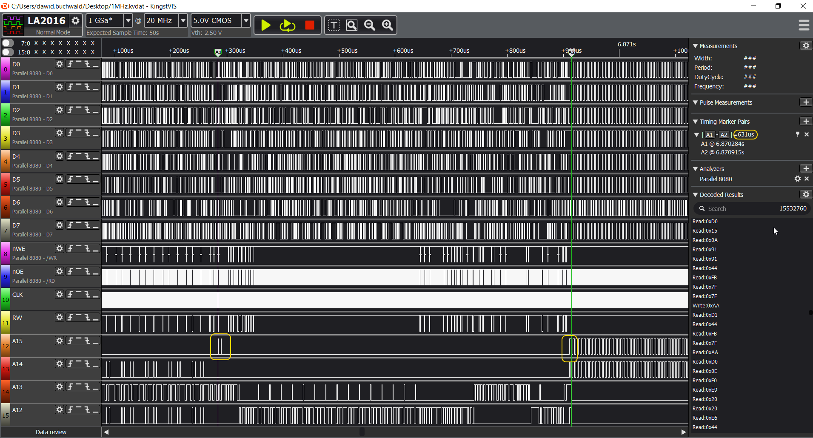

We have the same pattern: write access to 0x8000, some processing in RAM (actually this is where MS BASIC calculates amount of available RAM memory and converts it into floating point decimal value), followed by another ROM access, but considerably faster, after some 631us. 

Please keep in mind that this second access should yield the same result, as it accesses the same address in the same ROM. Let's check then:

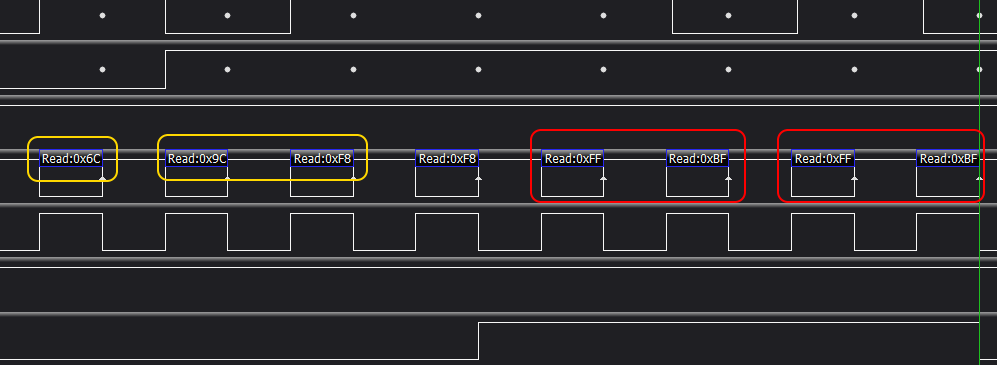

BOOM!

Instead of valid address (0x9AAB) we are getting 0xFF/0xBF, which is exactly the TOGGLE BIT thing that the datasheet talks about:

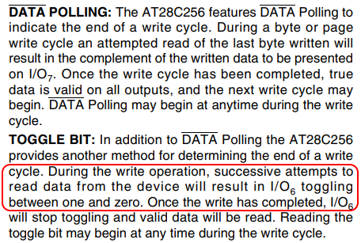

Now, I don't know really how many times I have read this datasheet, but it was many, many times. I had to understand the mechanism correctly to implement super-fast EEPROM flasher in my AVR supervisor software, and I did struggle to get it right.

So, important lesson learned here: taking time off, spending time with family and letting your mind wander can work miracles. And, datasheets contain probably all the information you need to succeed with your build, it's just that we might miss it the first hundred of times reading it :)

Have fun, stay safe and please, let me know what you think in the comments below!