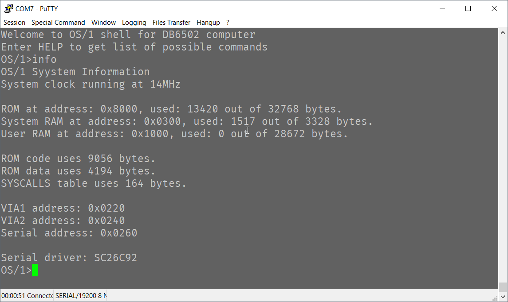
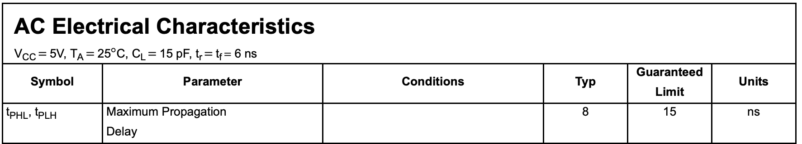
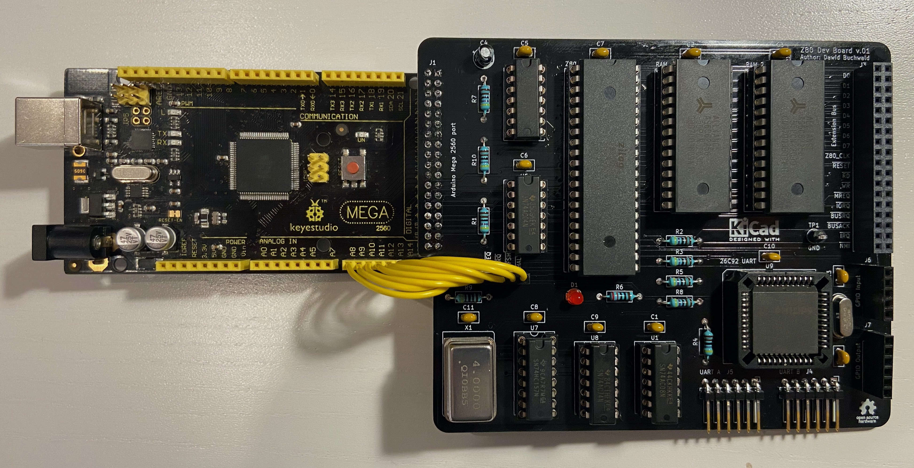

# Long overdue update...

This update is long overdue - and apologies for that - but I have been really busy recently. Between family issues, failed parallel cooperative project, end-of-year workload increase and quite complex project challenge I found myself stuck, overwhelmed and demotivated to write.

Luckily things are looking much better now, and hopefully I can write more regularly now, because I do have quite a lot to share. It all started with simple challenge: run 65C02 (and the whole DB6502v2 build) at 14MHz. Simple idea, isn't it?

After all, this is the maximum CPU speed for which WDC 65C02 is rated for, according to official datasheet. Since I have already had it running at 8MHz in my first revision, it didn't seem like something very difficult to implement. Certainly not something impossible, but still, at the time of writing this words, I can't say that I have reached the goal fully. Sure, I did capture this nice screenshot (proving at least that it's partially possible):

As you can see, measured and reported CPU speed is 14MHz and indeed it was running with crystal oscillator at 14MHz at the time. Was it stable? Well, one would say that any **Syystem** reporting its status like that is not very stable... Obviously, it's not a typo in the source code, it's a serial interface glitch resulting in double write.

So yeah, I have tried, but haven't succeeded yet. There are some other issues to handle, but I will write more about them as I describe the journey, as there is plenty to talk about. It will probably take a couple of project logs to go through it all. And to be fair, I might not even be able to get it to run reliably at that speed...

You might be wondering where's the problem - you just plug in faster oscillator and that's that, right? Well, not exactly.

## How hard can it be?

Famous last words.

Unfortunately, as we all learn when pushing the limits of our unconscious incompetence, it usually is harder than it seems. Sometimes it might seem like making one more step should not be harder than those previously made, but life can surprise us in all possible yet unexpected ways.

As I wrote in previous logs couple of times, this adventure of electronic discovery has been full of surprises and weird glitches that could have been perfectly well explained if only investigated closely enough. Sometimes these glitches are infuriating, making even the best theoretical circuits fail in unpredictable ways, and sometimes they seem like miracles that I took for granted.

Let's look at the three main problems that I have encountered during my journey.

## Problem 1: timing

When you look at datasheets of various components, you will notice that they have pretty strict limitations in their timing. 28C256 EEPROM in DIP package (used in Ben's build as well as mine) is rated for 150ns access time. I wrote about it some time ago, when I was surprised I got it to work at 8MHz - and right now I understand much better what happened back then, but the general idea is that when your clock speed increases more and more challenges emerge.

Let's consider address decoding for instance: when you are operating at 1MHz your full clock cycle takes 1000ns, and [Ben's simple address decoder](https://eater.net/schematics/6502.png) uses only two NAND gates to enable RAM and VIA chips. Each of these NAND gates will take up to 15ns to stabilise output at 5V and room temperature (as per [datasheet](https://eater.net/datasheets/74hc00.pdf)):

It might seem like a really short time (30ns max vs. 1000ns cycle time), but when you consider that at 14MHz each clock cycle takes only 71ns, it suddenly becomes major concern. Each single nanosecond counts and matters.

So yeah, not only RAM access time is an issue here, everything can cause problem.

Funny thing is that even the "fast" SRAM used in Ben's build (62256) is not fast enough for anything above 9MHz with its access time of 55ns - and it took me a while to figure that one out as well...

To summarise: first main problem is how fast everything happens at 14MHz, and how to manage this speed.

## Problem 2: documentation

To be fair, this might be my issue only, but I found the [official 65C02 documentation](https://www.westerndesigncenter.com/wdc/documentation/w65c02s.pdf) quite difficult to understand. I mean it does describe how to handle slow peripherals (like ROM or serial controller), but it took me a while to decode this message:

 

And, as it turns out, this was just the beginning - there are many small details here that need careful consideration. Again, not a problem for moderate CPU speed, but at very tight timing it does matter how you do it.

There are also other issues related to it, and I will tackle them as I describe the details.

## Problem 3: CPU families and interfaces

This is something I've been meaning to write about for a long time, practically from the day I left the safe and cozy world of 65XX family of peripherals. Sure, one could argue that even the ROM/RAM chips used in Ben's build are not fully 65XX compatible, but using chips like the 26C92 UART controller (especially at higher clock speed) becomes interesting challenge on its own.

I mentioned another parallel project I've been working on, and it has been really interesting for one more reason: I used Z80 CPU for it and I strongly recommend you take a look at this one some day. There is no shortage of projects similar to BE6502, but based on Zilog CPU, and it's really interesting to compare different chip philosophies. Noticing these differences first-hand can really deepen your understanding of computer system architecture.

And while it's not really relevant to what I'm writing here about, as a side note: I will probably revive my other project one day, for now I have very convenient Z80 RAM-only, Arduino Mega compatible development board with dual channel serial interface:

I will write more about this one day, but for now it's just a nice reminder of what can be done in short amount of time and not that much effort.

Bottom line: while it doesn't matter much at lower clock speeds, translation from 65XX bus to 8080 bus can present interesting challenge and cause completely different set of issues.

## Summary

As I mentioned at the beginning of this post - I have spent many hours trying to get DB6502v2 run correctly at 14MHz, and while I still haven't succeeded, this journey was well worth it, as it forced me to question my knowledge and learn new things. I will discuss each of these problems in details in separate project log entries, so stay tuned - more good stuff is coming. I promise!