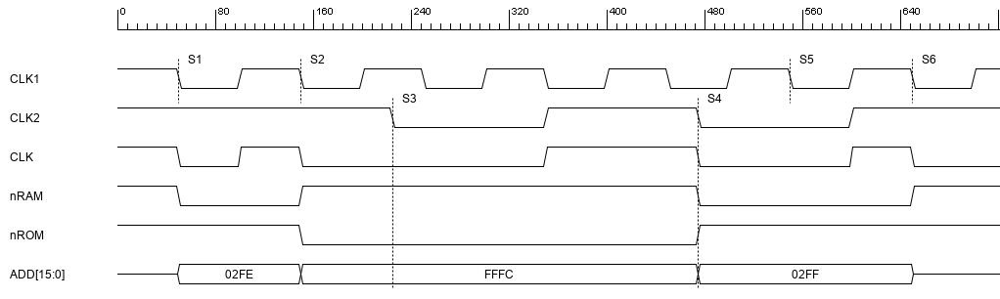
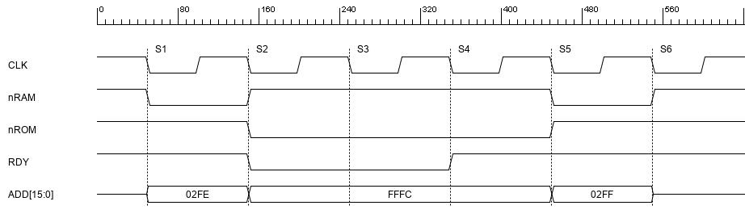
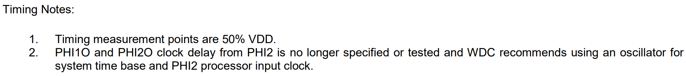
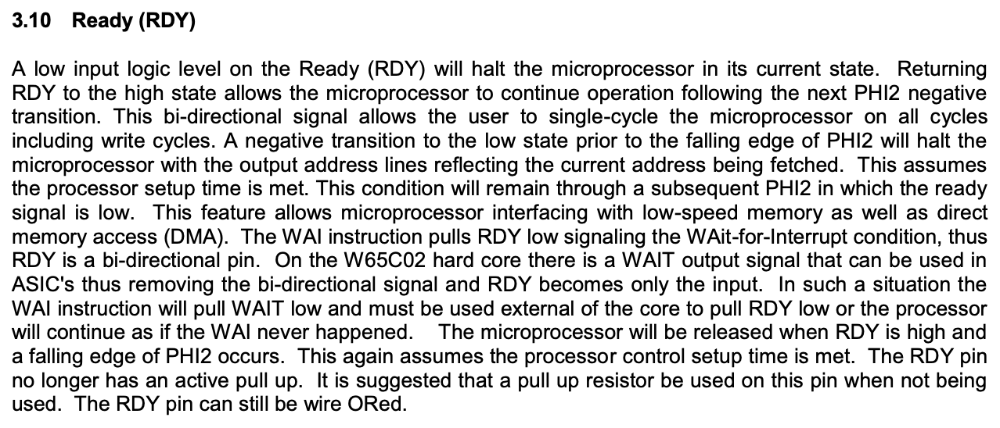
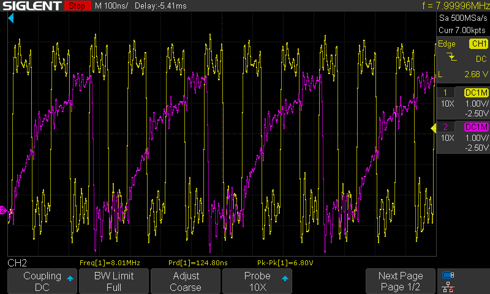
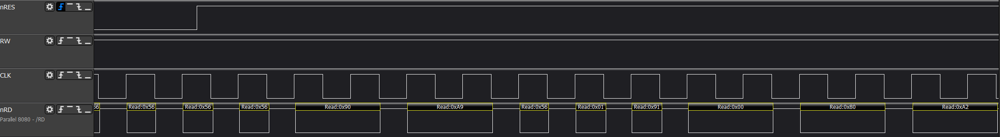

# Hold your horses

Last time I wrote about three problems that one has to solve when trying to run 65C02 CPU at 14MHz. Obviously, how severe each of these is depends on the details of your build, so each case will be different. Let's start with comparison of two main methods and see how they can help you out with faster clock speeds.

One of the first issues you can think of (when looking at faster clock speeds) is the access time requirement for each of the components. When I started this investigation, I noticed that DIP package ROM chips were rated for 150ns access time - way too slow for anything above 4MHz.

Now you might wonder - I wrote in the past about my first build running at 8MHz - and you would be right, this was a mystery to me as well, and I will explain it later on. For now let's assume that access time is half of your clock cycle, and at 4MHz that would translate to 125ns - close enough for 150ns EEPROM to work properly at room temperature and stable 5V power supply.

So yeah, what are the options here?

The fastest 32KB one I could find was SOIC/TSOP/PLCC package 70ns access time AT28HC256 chip. You can go a little faster with AT28HC64 - it's 55ns, but only 8KB. If you want to compare these, you have to consider additional address decoding logic that will add to that, resulting in similar access time.

Still, even at 55ns you can't go much faster than 10MHz (half of clock cycle is 50ns), so what can you do about that?

## Clock stretching vs. wait states

There are two ways to address this issue: one is not running your clock faster than the peripheral can handle, and this is called clock stretching; the other one assumes clock rate stays the same, but each CPU operation takes more than one clock cycle to execute. Hopefully the following diagrams should clarify the difference.

### Clock stretching

Here is an example of clock stretching method:

We have two clocks: CLK1 running at 10MHz and CLK2 running at 4MHz. CLK is the actual clock fed to the CPU, and the switch always happens at low clock. Switch is triggered by address decoding logic circuit, specifically nRAM and nROM signals. Let's look at the sequence:

- At stage S1 it is assumed that previous access was also to RAM (so CLK1 is still being used). RAM is selected and CLK is fed from CLK1 source,
- At stage S2 full clock cycle has been executed (access to address 02FE), and following S2 ROM is being selected (CPU indicated it wants to access address FFFC), so CLK2 is to be selected. Since clocks must be toggled on target negative transition, there is a wait period until stage S3 when desired clock (CLK2) is going from high to low. In reality this is already part of the CPU cycle with access to FFFC,
- At stage S3 CLK is toggled to use CLK2 as source, and slow clock cycle is executed with access to FFFC address,
- At stage S4 slow clock cycle is completed, and CPU moves on to next cycle where RAM access is required. As previously, clock source can't be toggled until target clock negative transition (S5), but CPU already accesses RAM at 02FF,
- At stage S5 RAM access at address 02FF is performed with fast clock (CLK1) being CPU clock source,
- At stage S5 RAM access is completed.

As you can see, clock switching is not a trivial task, and if you are looking for a great document on how to implement it correctly, you will find it [here](https://www.eetimes.com/techniques-to-make-clock-switching-glitch-free/).

### Wait states

This is identical scenario, but implemented using wait states:

As you can see, there is just one clock here, CLK, running at 10MHz. I assumed that access time must be comparable to the clock stretching scenario, so the access time for ROM must be at least 250ns (full 4MHz cycle length), but please note: this assumption is actually silly, when you dig deeper into details. For now I just wanted to illustrate the mechanism.

So, the following things happen:

- At stage S1 CPU requests data from RAM (indicated by nRAM signal being low). Wait state generator circuit (responsible for determining how many wait states per device are required) will decide that there are no wait states required and memory can be accessed immediately, so the RDY signal is high,
- At stage S2 first CPU cycle is completed, and ROM access is requested. At this point wait states circuit determines that two wait cycles are required, and none has been executed so far, so the RDY signal is pulled low, resulting in CPU being held in current state and waiting,
- At stage S3 first wait state is completed, but one more is required, so RDY line is kept low for one more cycle, holding CPU in current state,
- At stage S4 second wait state is completed and this satisfied wait state generator requirements for ROM access, so the RDY line is pulled high. CPU executes the cycle as usual, but the previous two states allowed ROM to complete internal access operation,
- At stage S5 RAM access is requested, no wait state needed, so access is done in single clock cycle,
- At stage S6 RAM access is completed.

As you can see, wait states approach is a bit simpler, at least in theory.

## How was it solved in the past?

So much theory, what about practice? 

Actually the problem you are looking at is not new. Sure, we do have much faster chips nowadays, and, what's even more important, they are also much cheaper than they used to be, but problems rarely change over the course of history. When you check [original Apple I manual](https://ia801905.us.archive.org/4/items/Apple-1_Operation_Manual_1976_Apple_a/Apple-1_Operation_Manual_1976_Apple_a.pdf), you will find there information about handling slow ROM access time (top left of page 12):

This wait state circuit explains clearly what needs to be done in case of slow ROM, but it fails to explains all the details of it - how it works, how it will affect the CPU and so on. It also uses PHI1 clock which, according to 65C02 datasheet, should not be used:

How does the wait state generator works? At each negative clock transition (PHI1) 7474 chip (D-type flip-flop) will "remember" previous wait state. When accessing RAM, it doesn't matter (ROM CS line will be low, so the output from the 7400 NAND gate will be high, and such value fed into RDY input). When accessing ROM (ROM CS line will be high) and in previous cycle RDY was high the 7400 NAND gate will output low value and cause CPU to wait. In next cycle ROM CS line will still be high (it will not change, since CPU is waiting), but the output of 7474 will be low, resulting in high output from 7400 NAND gate.

Very simple, elegant solution, isn't it? Unfortunately, it can't be directly applied to 65C02 build.

## Wait states explained

So, based on Apple I documentation we know that the slow peripheral issues can be addressed with RDY pin of 65C02 CPU. How to use it though? Official datasheet provides quite lengthy explanation:

I don't know about you, but I had to read it number of times and still it didn't make much sense. It has been clearly written by somebody who had quite complex context in his or her head at the time of writing, so let's try to take it apart and explain what these mean:

> A low input logic level on the Ready (RDY) will halt the microprocessor in its current state.

OK, so low level on RDY will stop the CPU. How will it happen though? Will it be immediate, or will it happen at specific point in CPU cycle? As you probably know, there is a stage in CPU cycle when address bus is stabilizing at the beginning of the cycle - what happens if I pull RDY low then? Will it hold current (unstable) address or will it wait for it to stabilise and hold then? If you look at timing diagram, you will notice that it might have different effects depending on the point in time when the low pull happens - and the above description does very little to explain that.

> Returning RDY to the high state allows the microprocessor to continue operation following the next PHI2 negative transition. 

Ah, this is a bit more specific - returning to high state will not resume CPU operation immediately. At least we know from this part, that high level on RDY pin at any point in clock cycle will not have any effect until the very end.

> This bi-directional signal allows the user to single-cycle the microprocessor on all cycles including write cycles. 

This is my favorite part: three important bits of information mixed in one cryptic sentence that relies on broad context. What it means?

1. This signal is bi-directional. This means that you can't assume this pin will **always** be input, and as a result, you can't **always** drive it unless you want to burn your CPU. There are some limitations - and they will be explained later,
2. This signal has been used to single-cycle CPU in the past. Why? In his videos Ben doesn't use it, and single cycling works, right? Well, yeah, but the version used in the past (the NMOS one) didn't have static core. This means that it required constant clock operation to maintain its internal state. If you took NMOS 6502 version and ran it as Ben does it with infinite clock stretching, it would probably lose track of its registers. This is why **in the past** RDY was used to single cycle 6502,
3. *(...) all cycles including write cycles.* - why is that even mentioned? Well, you probably know that the original NMOS 6502 version used the RDY pin only for **read** operation, right? Oh, you didn't? Yeah, neither did I, so I couldn't understand why this is being brought up here. The point is important when you look at older implementations - some of the old computers used clock stretching instead of wait states to drive slow peripherals, and this was the reason: NMOS version didn't allow for wait states during write operation, so clock stretching was the only option.

Sorry if it seems like I rant about the documentation, but I am. I understand that sometimes it's hard to forget all the context we have in our head, but seriously...

> A negative transition to the low state prior to the falling edge of PHI2 will halt the microprocessor with the output address lines reflecting the current address being fetched. This assumes the processor setup time is met. This condition will remain through a subsequent PHI2 in which the ready signal is low. 

Ah, so the low input on RDY (meaning *"No, I'm not ready yet!"*) before the falling clock edge will halt the CPU with address lines set. Isn't that the same thing as in the first sentence? I don't know, I really don't.

The point here, however, is different: it means that if we keep the RDY signal low over the negative transition of the clock, the next cycle will keep the address (and data - in case of write operation) lines intact. It will be as if the following clock cycle was extension of the current one, and it will keep like this for as long as the RDY line remains low.

The part about CPU setup time you can find looking back at the diagram (**tPCS** at the bottom):

And how long is it? It should be no less than 10ns (assuming you are running 6502 at 5V):

So, we got another important clue here: the latest you can set the RDY low during clock cycle is 10ns prior to falling clock edge. Good!

> This feature allows microprocessor interfacing with low-speed memory as well as direct memory access (DMA).

Ok, so it says that we can use it for interfacing with slow peripherals and it can be used for DMA. Slow peripherals - that's obvious, this is what we are discussing here, but how it translates to DMA?

Not that it's relevant here, but it makes sense to explain this here. RDY on its own is useless in DMA context. There is, however, another line that makes sense here: Bus Enable (BE). As it turns out, BE pin disables the bus control on 6502, but it doesn't affect CPU operation. If you pull BE down, 6502 will be disconnected from the bus, but from CPU perspective it will seem as if the bus was simply floating. It will still execute instructions, but they will be pretty random. This, obviously, doesn't make sense, so in order to execute DMA operation, one has to pull both RDY and BE low. BE to be able to drive the busses, and RDY to prevent CPU from going crazy in the meantime.

>  The WAI instruction pulls RDY low signaling the WAit-for-Interrupt condition, thus RDY is a bi-directional pin.

A-ha! So this is how RDY pin can become output pin! You might be wondering why it matters, but it does: if, for whatever reason, your 6502 encounters WAI instruction (even if it's not in your code, it might be in your data or in uninitialized memory, and in case of stack corruption data can get randomly executed), RDY pin will be driven low, basically shorting it to GND. If at the same time you are driving the pin high from your circuit (shorting it to +5V effectively), you end up having short between 5V and GND. This will result in excessive current flowing through the pin (and CPU) and might burn it. You don't want that, obviously. 

Since you can't prevent WAI instruction from being executed, you have to prepare for that. There are basically two options here: use open-collector gate and pull-up resistor (open-collector gate will output only low signal or high impedance) or use series resistor between your circuit and the RDY pin. Both approaches are acceptable, but they have their own problems. I will discuss these below.

> On the W65C02 hard core there is a WAIT output signal that can be used in ASIC's thus removing the bi-directional signal and RDY becomes only the input. In such a situation the WAI instruction will pull WAIT low and must be used external of the core to pull RDY low or the processor will continue as if the WAI never happened. 

Now, I don't know what *hard core* model is, but I guess this is something different than DIP/QFP/PLCC package, because neither of these has the two additional lines. As a result this part is irrelevant.

> The microprocessor will be released when RDY is high and a falling edge of PHI2 occurs. This again assumes the processor control setup time is met.

Is that about the hard core model or what? I have no idea. It seems like a repetition from before. I don't know.

>  The RDY pin no longer has an active pull up. It is suggested that a pull up resistor be used on this pin when not being used. The RDY pin can still be wire ORed.

Ok, so there is no internal pull-up on the RDY pin, so external one is needed when it's not used, just as in basic BE6502 build.

For the wire-OR of RDY pin, it's pretty obvious - as long as you use open-collector gates to provide RDY input signal, you can just wire-OR them, as any other open-collector signal.

## Intuition vs. reality

So, after reading the datasheet you might be wondering when in the cycle should you toggle RDY signal low if your wait state generator circuit decides to put CPU on hold. When I was thinking about it initially I went with my intuition: RDY line should be pulled low during low clock phase (when CLK line is low).

This assumption was based on intuitive understanding of low/high clock cycle significance. The way I figured it worked was that low phase was the "preparation" and high phase was "execution". While this is mostly correct, it doesn't translate to RDY pin operation properly, and my intuition that RDY has to be pulled low or high during low CLK phase was just wrong.

Luckily I found [this discussion on 6502.org](http://forum.6502.org/viewtopic.php?p=38470#p38470) - it shows interesting circuit, where RDY is asserted following rising CLK edge, so it definitely can be done later, even during high clock phase. Sure, it can't be done too late (see the note about Processor Setup Time **tPCS** above), but as long as it happens more than 10ns before the end of high clock phase, you will be fine.

Does it mean that you can decide high/low late during high clock phase then? Nope, not that easy...

## Open collector issue

When you consider the implications of using open collector gate, you have to keep in mind interesting characteristic: while high to low transition is pretty instant (just a few ns fall time), the reverse transition is tricky and it depends on the value of pull-up resistor used.

If you use anything in KOhm range, your rise time might be very, very long, like a 100ns. This is what I got with default 4K7 resistor I used:

Yellow line is the CLK line, and the pink is RDY line. As you can see, it took two full clock cycles (250ns) to rise to 5V. This means that wherever I was planning to use single wait state, I had two unintentionally...

On the other hand - use something very strong, like 50 Ohm and you might end up having problems with low signal being too high. It will probably take a few tries to figure out resistor value that will fit your scenario.

The other option (series resistor) is also discussed in the thread I linked above. Garth Wilson suggests to put pretty strong resistor (like 2K2) with 22pF capacitor in parallel. I haven't tested this approach, but I might have to. If I do, I will update this entry with the result.

## Wait states summary

It might seem as the wait state approach is also pretty complex - but it's not in reality. It just takes a while to digest all this information and a bit of trial and error to figure out the implementation on your own. 

The good thing is that it can be implemented at any clock speed (even slow one), and it's really easy to troubleshoot using basic logic analyzer. This is sample reset sequence on my DB6502 build running at 2MHz with single wait state circuit for ROM access:

As you can see, there are three short RAM accesses, followed by two slow ROM accesses, then three RAM accesses and finally read of starting address from FFFC (8000). First instruction is also loaded, and it's opcode A2.

This also hints at another issue I will discuss in more detail later on - read/write signals stretching and bus interface translation.