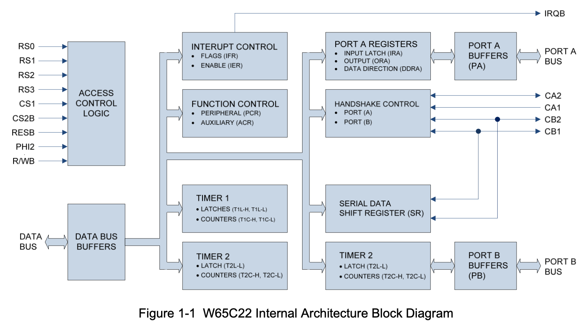
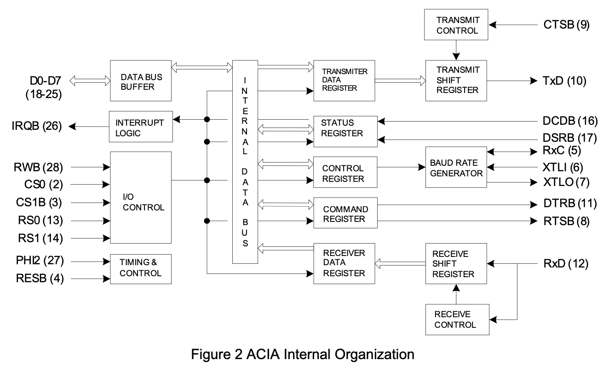
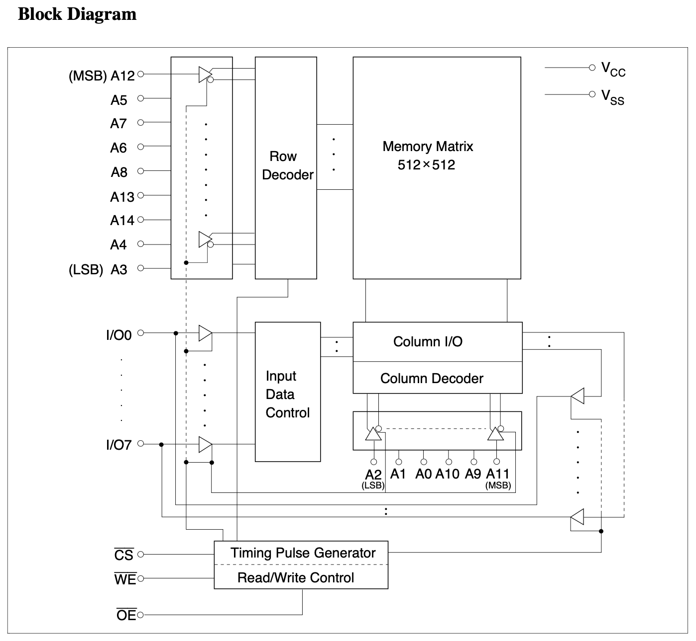
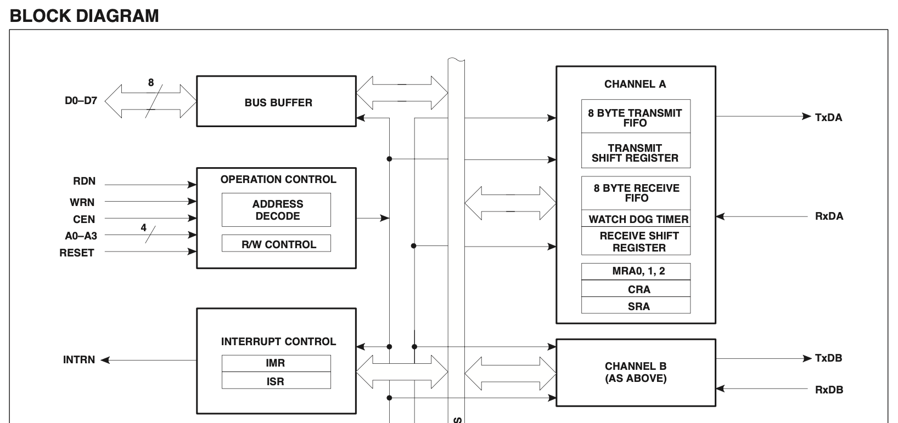
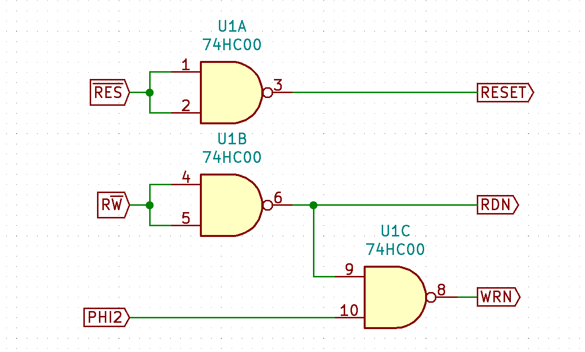
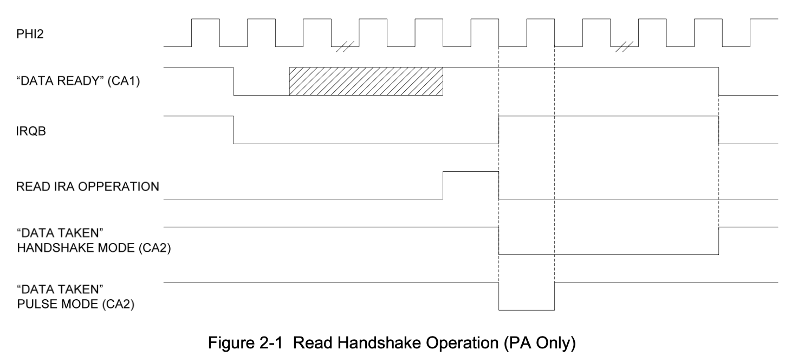
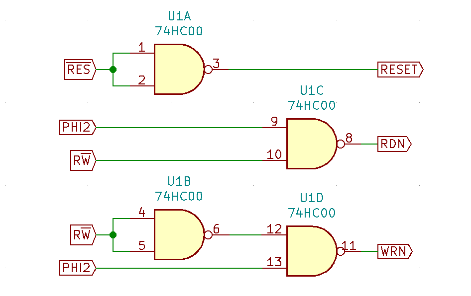

# It all stays in the family...

One interesting thing that Ben doesn't seem to elaborate on in his videos, is the interesting issue of CPU families and resulting chip (in)compatibility. I came across this issue when started using SC26C92 Dual UART chip, but only much later, when tried pushing 6502 to 14MHz limit I noticed some significant issues.

Let's start with the beginning, though. If you followed Ben's project closely, you might have noticed important difference between IC interfaces. If not, you will notice shortly...

Conveniently, it's very easy to hook up 6522 chip to 6502 CPU bus. No wonder - these belong to the same "family" of CPU and peripherals, and they use the following signals to synchronise operation:

- CS - Chip Select signal used to activate the chip using address decoding logic,
- R/W - single Read/Write signal to indicate whether current operation is read or write,
- PHI2 - common clock source to be shared between CPU and peripherals,
- D0..D7 - data bus,
- RS0..RS3 - register select usually mapped to A0..A3 lines,
- RES - active low Reset signal,
- IRQ - active low IRQ signal.



If you check the ACIA chip (6551), you will notice it has the same set of control signals (with fewer registers, but the idea is the same):



Now, if you look at the ROM/RAM chips, these are a bit different:



As you can see, some details are similar (like the low active Chip Select signal), but part of the interface is a bit different. Instead of single Read/Write signal, there are two separate lines: low active Output Enable and low active Write Enable. There is no PHI2 signal, and as a result, to prevent accidental writes, in [Ben's video about RAM timing](https://www.youtube.com/watch?v=i_wrxBdXTgM) there is necessity to ensure that write operation is performed only during high clock phase.

If you haven't played with any other CPU of the era (I haven't at the time), you might just accept the solution and just move on without thinking too much about it. This is exactly what I did, and only after playing with higher frequencies (and, specifically, wait states) I had to revisit my understanding of the subject. But I'm getting ahead of myself...

# Interfacing to SC26C92

*Side note: all the issues I ran into when trying to connect to this chip are the reason I started this blog in the first place - I wanted this documented somewhere. Probably will need to write more details about the initialisation and such details. Some day, I guess...*

When you read this specific chip documentation you will find it uses interface similar to the one used in ROM/RAM:

 

As you can see, there are standard A0..A3 register select lines, D0..D7 data bus, low active IRQ output line. The first important difference is the RESET signal, which is high active, but this translation is easy - single inverter or NAND gate will do. Chip Enable (other name for Chip Select) is predictably low active, and there are two signals to control read/write operation: low active RD (identical to low active OE) and low active WR.

Now, it might seem that connecting to this chip is pretty simple, and you should do it in a similar way Ben connected RAM:



This way we ensure that RESET signal is RESB inverted and RDN is low only when R/W is high (indicating read operation), while WRN is low only when clock is high.

Unfortunately, there is an issue here: early during clock cycle, while address lines are still being stabilised, you might get random access to the UART chip (your address decoder might react on the unstable address and accidentally pull UART CEN line low for just a couple nanoseconds). At the same time RDN might be low, resulting in read operation being executed. 

Sure, the operation would not be valid - it would be at most 10ns long, which is way below the minimum pulse length, but this is actually not a good thing. It might cause issues with chip operation stability or worse.

How can anything be worse than the chip unstability? Actuall, as I have learned, certain operations can be executed, at least partially, even with very short random read pulses.

## What about Ben's build then?

You might be wondering why this hasn't occurred in Ben's build, and you would be right. It might actually occur, but it doesn't matter. Even if RAM or ROM chip is enabled for a short random pulse during low clock phase, all it will do (in worst case scenario) is actually read data at random memory location, put it shortly on a data bus while nobody (as in: CPU) is listening and that's that.

Basically - any read operation from RAM/ROM can't change system state.

Sure, random read from the VIA chip would cause issues, because read from certain registers can change chip state. Reading from PORTA register (marked here as IRA - Input Register A) can clear IRQ flag and change state of handshake lines:



This, however, can't happen, due to CPU family compatibility between 6502 and 6522 chips. VIA will ignore any kind of operation performed during low clock cycle - and this is exactly why it requires PHI2 input.

## Fixing the problem

The fix, as you might expect, is actually pretty simple: you have to gate RDN signal with high clock input as well, like so:

 

This is much better. Sure, the CEN signal might still go low during low clock cycle, but RDN signal will be high at that time, preventing accidental reads. Is that all? Obviously not...

# Wait states impact

Now, this is really funny how I didn't think of that and wasn't able to guess what's going on. When I started playing with wait states, my first solution was based on the example from Apple I manual, but instead of using it only for ROM, I added it for all the components: RAM, ROM, VIA and UART. I have also used slow clock (something like 4MHz or so), just to be able to see the results with my logic analyser better.

Everything seemed to work except for some random glitches. Instead of proper system prompt like so:

```

```

