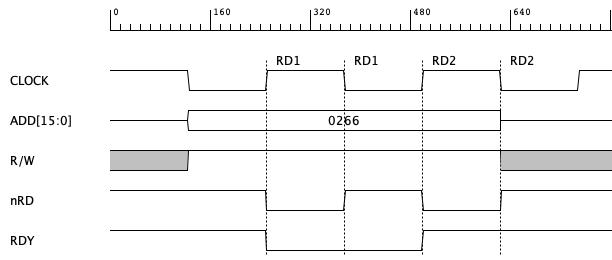
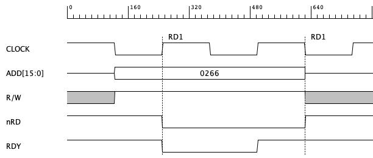
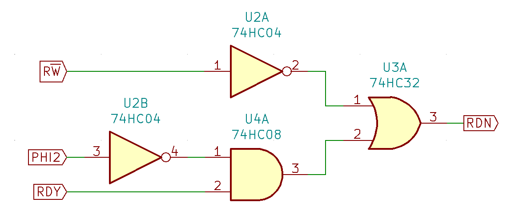

# It all stays in the family...

One interesting thing that Ben doesn't seem to elaborate on in his videos, is the interesting issue of CPU families and resulting chip (in)compatibility. I came across this issue when started using SC26C92 Dual UART chip, but only much later, when tried pushing 6502 to 14MHz limit I noticed some resulting issues.

Let's start with the beginning, though. If you followed Ben's project closely, you might have noticed important difference between IC interfaces. If not, you will notice shortly...

Conveniently, it's very easy to hook up 6522 chip to 6502 CPU bus. No wonder - these belong to the same "family" of CPU and peripherals, and they use the following signals to synchronise operation:

- CS - Chip Select signal used to activate the chip using address decoding logic,
- R/W - single Read/Write signal to indicate whether current operation is read or write,
- PHI2 - common clock source to be shared between CPU and peripherals,
- D0..D7 - data bus,
- RS0..RS3 - register select usually mapped to A0..A3 lines,
- RES - active low Reset signal,
- IRQ - active low IRQ signal.


If you check the ACIA chip (6551), you will notice it has the same set of control signals (with fewer registers, but the idea is the same):


Now, if you look at the ROM/RAM chips, these are a bit different:


As you can see, some details are similar (like the low active Chip Select signal), but part of the interface is a bit different. Instead of single Read/Write signal, there are two separate lines: low active Output Enable and low active Write Enable. There is no PHI2 signal, and as a result, to prevent accidental writes, in [Ben's video about RAM timing](https://www.youtube.com/watch?v=i_wrxBdXTgM) there is necessity to ensure that write operation is performed only during high clock phase.

If you haven't played with any other CPU of the era (I haven't at the time), you might just accept the solution and just move on without thinking too much about it. This is exactly what I did, and only after playing with higher frequencies (and, specifically, wait states) I had to revisit my understanding of the subject. But I'm getting ahead of myself...

# Interfacing to SC26C92

*Side note: all the issues I ran into when trying to connect to this chip are the reason I started this blog in the first place - I wanted this documented somewhere. Probably will need to write more details about the initialisation and such details. Some day, I guess...*

When you read this specific chip documentation you will find it uses interface similar to the one used in ROM/RAM:

 

As you can see, there are standard A0..A3 register select lines, D0..D7 data bus, low active IRQ output line. The first important difference is the RESET signal, which is high active, but this translation is easy - single inverter or NAND gate will do. Chip Enable (other name for Chip Select) is predictably low active, and there are two signals to control read/write operation: low active RD (identical to low active OE) and low active WR.

Now, it might seem that connecting to this chip is pretty simple, and you should do it in a similar way Ben connected RAM:


This way we ensure that RESET signal is RESB inverted and RDN is low only when R/W is high (indicating read operation), while WRN is low only when clock is high.

Unfortunately, there is an issue here: early during clock cycle, while address lines are still being stabilised, you might get random access to the UART chip (your address decoder might react on the unstable address and accidentally pull UART CEN line low for just a couple nanoseconds). At the same time RDN might be low, resulting in read operation being executed. 

Sure, the operation would not be valid - it would be at most 10ns long, which is way below the minimum pulse length, but this is actually not a good thing. It might cause issues with chip operation stability or worse.

How can anything be worse than the chip instability? Actually, as I have learned, certain operations can be executed, at least partially, even with very short random read pulses.

## What about Ben's build then?

You might be wondering why this hasn't occurred in Ben's build, and you would be right. It might actually occur, but it doesn't matter. Even if RAM or ROM chip is enabled for a short random pulse during low clock phase, all it will do (in worst case scenario) is actually read data at random memory location, put it shortly on a data bus while nobody (as in: CPU) is listening and that's that.

Basically - any read operation from RAM/ROM can't change system state.

Sure, random read from the VIA chip would cause issues, because read from certain registers can change chip state. Reading from PORTA register (marked here as IRA - Input Register A) can clear IRQ flag and change state of handshake lines:


This, however, can't happen, due to CPU family compatibility between 6502 and 6522 chips. VIA will ignore any kind of operation performed during low clock cycle - and this is exactly why it requires PHI2 input.

## Fixing the problem

The fix, as you might expect, is actually pretty simple: you have to gate RDN signal with high clock input as well, like so:

 

This is much better. Sure, the CEN signal might still go low during low clock cycle, but RDN signal will be high at that time, preventing accidental reads. Is that all? Obviously not...

# Wait states impact

Now, this is really funny how I didn't think of that and wasn't able to guess what's going on. When I started playing with wait states, my first solution was based on the example from Apple I manual, but instead of using it only for ROM, I added it for all the components: RAM, ROM, VIA and UART. I have also used slow clock (something like 4MHz or so), just to be able to see the results with my logic analyser better.

Everything seemed to work except for some random glitches. Instead of proper system prompt like so:

```
OS/1 version 0.3.5C (Alpha+C)
Welcome to OS/1 shell for DB6502 computer
Enter HELP to get list of possible commands
```

I would get something like that:

```
OOSS//11 version 0.3.5C (Alpha+C)
Welcome to OS/1 shell for DB6502 computer
Enter HELP to get list of possible commands
```

At first I didn't even notice the issue, but it also occurred in shell - each character typed in the serial terminal would be displayed twice.

When printing longer strings from 6502 it would duplicate each of the first 4 characters in the string and print all the following just once. At the same time, when typing into the shell, each character would be printed twice, without the 4 character limit.

Can you guess what the problem was?

If you take another look at the diagram above (where I gated RD/WR signals with high clock phase), you will notice that when wait states are added, each read/write operation is performed twice, like so:



OK, you might as, but why it happened only for first 4 characters? The answer is simple: SC26C92 contains 8 char transmit FIFO buffer, and the first 4 characters filled it up when being written twice. Afterwards, whenever single character was transmitted, UART raised interrupt causing two more duplicates of next character being written - first one stored in FIFO and second discarded as queue overflow.

Obviously, when typing on the keyboard, data was sent slowly and no queue overflow ever happened, resulting in double writes for each and every character.

Now that I explain it like that it seems really simple and easy to understand, but it was really strange and scary at first sight...

## Another fix then...

So, how to fix this issue? Basically, for wait state cycles, instead of the above diagram, you want something like that:



You need your RD/WR signals stretched whenever wait state is in operation. Or, speaking in terms of "negative logic" (for a lack of better term), you want your RD/WR signals to go high only during the first low clock phase of any operation. During each of the consecutive low clock phase of the same operation (due to introduction of wait cycles) RD or WR signal should remain low.

So, the logic gets more complex:



And please note: there might be cases where you want to disable the wait state processing altogether (like when flashing the EEPROM from Arduino) or keep the wait state for longer, effectively overriding the RDY line - this would add to the complexity of the signal logic.

However, it's not just complexity that becomes problem here, it's the timing that gets in a way, but I will write more on that next time.

I was actually lucky with that part - my logic for nOE and nWR signals was encoded in the address decoding PLD. Thanks to that I could change it easily, without having to redesign the PCB, and it was immediately applied to ROM and RAM chips as well, even though these have already been placed on prototype board.

**So, another lesson learned: if possible, keep your potentially mutable logic in programmable chips, or enable sourcing them from off the board with jumper headers.**

Now, coming back to the CPU families, as you might be wondering how does it work with Z80 for instance - and this part is really good. Z80 will not pull nRD or nWR signals low while the address is unstable, and would pull them high prior to changing address lines. It will also keep the signals low for the whole time during wait state operation. Much more convenient, but at the expense of lower per-cycle CPU efficiency. Basically, similar operations take noticeably more clock cycles on Z80 than on 6502.

I guess you can't have everything, can you?

# Summary

So, does it mean you should give up on Z80-compatible peripherals? No, of course not, especially that you have to work with the memory chips (both RAM and ROM) that use this different interface. You just have to understand the consequences, accept the limitations it imposes on your project and plan accordingly. You can consider running at slower speeds (so that no wait states are required) for instance, or using clock stretching instead. Each decision will have it's own pros and cons, and you just have to consider them carefully.

What you should do, however, and what I strongly encourage you to do is to play around with different architectures, chip families and solutions. Ben Eater's projects are great place to start, but they also provide certain guardrails that will ensure your adventure stays safe and comfortable, when the actual fun starts when you leave the comfort zone. For me introduction of wait states and different UART controller was turning point in the project - for the first time it really challenged my understanding of the architecture and forced me to reconsider what I did and what I didn't know.