# Another long overdue update

Unfortunately, recently I haven't been able to work on my project as much as I would like to, and the progress is much slower than I was used to. That being said, taking some time off can give you new perspective and lets you reconsider your assumptions, goals and plans. So, not all is lost...

At the moment I decided it's time for another PCB exercise - struggling with 14MHz experiments I kept asking myself whether the problems might be caused by poor connections on breadboard. I know, it seems far fetched and probably is not true, but still - the PCB version I'm using right now was supposed to be temporary and replaced down the line by next iteration while I sort out some of the design questions. I have, actually, so I should probably stick to the original plan.

Sure, making PCBs is not cheap and there is certain delay between order being placed and the board arriving, but given how slow my progress has been recently this is something I can live with. On the upside, I want to use this opportunity to test some new ideas, including some fixes to original design. Stay tuned, I should write about it soon.

For now - there was one issue I didn't want to keep open, and since I was about to make a PCB I needed to decide how to solve it. The issue was nothing new, it's someting I mentioned previously: RDY pin on WDC65C02 is a bidirectional pin, so it requires careful handling to avoid damage to CPU.

## Problem statement

As I wrote in the "Wait states explained" blog entry, the main issue with RDY pin on 65C02 is that it can work in both input and output modes. Most of the time you will be using only the input mode, supplying information to CPU about wait cycles (if that's not clear, please read the previous entry on the subject), and it's tempting to connect your wait states computation logic circuit output directly to the RDY pin. There is serious risk associated with this approach - if, for one reason or another, CPU executes WAI instruction, RDY pin will change mode to output and line will be pulled low (shorted to GND). At the same time your wait state circuit might be outputting high signal on the same line (shorting to VCC) and you will cause short between VCC and GND, resulting in high current being passed via the CPU. If you're lucky it will cause only high energy consumption, but if not, you might burn your CPU.

Sure, there are some standard approaches to the problem, and I will investigate them below. The thing is that the above section is not all. You also need to remember about another thing: if you intend to use wait cycles it probably means you are planning to make your CPU run at higher frequency, giving you less time to spare for any of the solutions to work. 

This is why I wanted to compare each of the approaches and discuss pros and cons of each. I hope it will help you choose the approach that is suitable to your build.

## Experiment description

So, based on the problem statement above, the question I want to answer is: how do these approaches perform in real scenario given the following below constraints:

- Protect the build from the WAI instruction issue? Does it limit the current passed through CPU in such case?
- What is the impact of particular solution on the system timing? How long it takes to toggle between "not ready" to "ready" mode and vice versa?
- Does it present any other issues?

Now, the most proper way to do it would be to test it against the actual 65C02 CPU, and I might actually do it in future, but at the moment I needed much simpler setup. I just wanted to test what is the fastest, energy efficient way of delivering RDY signal to receiver and compare some of the ideas I saw on 6502.org forums.

### Test setup

As described in the paragraph above, this is what I needed: oscillating high/low CMOS signal exiting output of one gate being fed into input of another gate. This would resemble closely target situation where the producer of the signal is your wait state circuitry and the consumer is the CPU. The goal: measure time between output on one end and input on the other.

I built this circuit with clock oscillator (4MHz) and single 74AC04 hex inverter IC. First gate (inverting the alternating clock signal) simulates output of wait state circuitry while the last gate will pretend to be CPU reading the signal. This is how the schematic looks like:

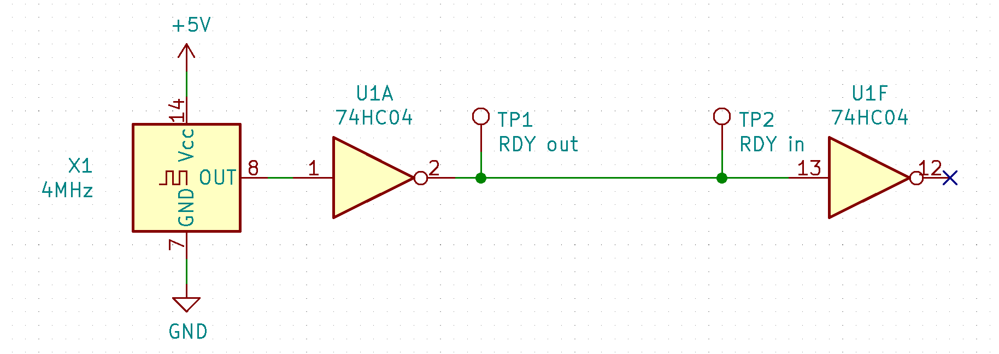

Now, each tested solution will be placed between test points TP1 and TP2 and measured. Let's start with simple measurements.

Clock output:

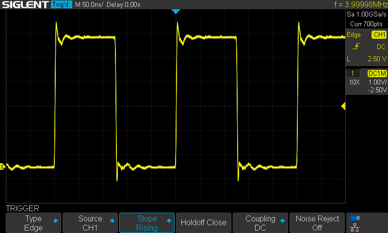

Clock output (yellow) against the inverted signal at TP1 (purple):

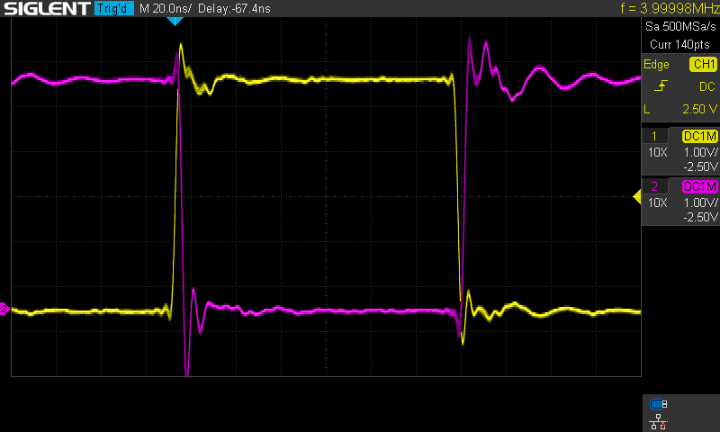

I have also used this opportunity to test the propagation delay of the 74AC04 gate (input low to high and high to low, respectively):

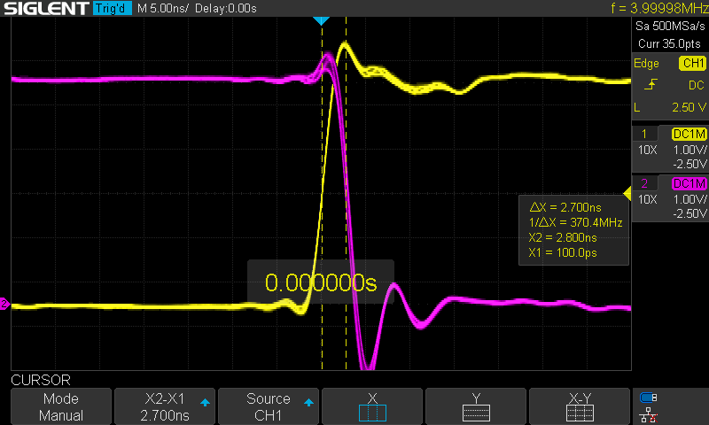

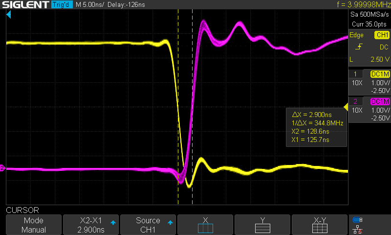

As you can see, in this (admittably, perfectly simple!) scenario tpd is below 3ns. Very nice!

### Variant 1: the simplest possible

Well, doing nothing at all is also an option. Not acceptable, due to no current limitation in WAI scenario, but still something to measure.

This is how the setup looks like on the breadboard:

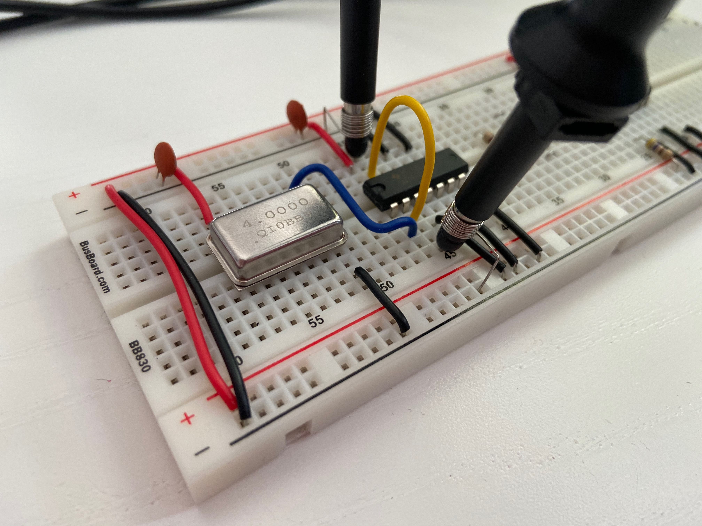

Obviously, the delay between TP1 and TP2 is well below anything my scope can measure:

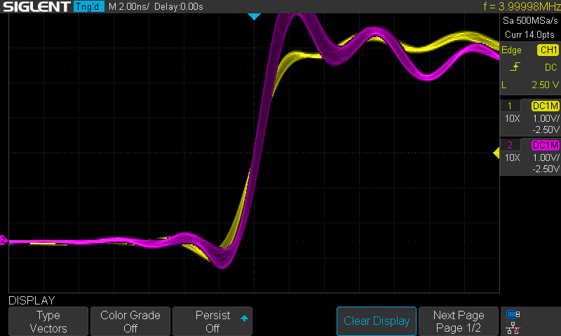

As you can see, TP1 and TP2 are almost perfectly lined up - there is no delay in signal propagation. Still, the fact that this would burn our CPU doesn't make it viable solution.

### Variant 2: open-collector buffer and pull-up

This is the variant I used in my build recently - RDY signal is fed into the CPU via open collector buffer (7407) followed by pull-up resistor:

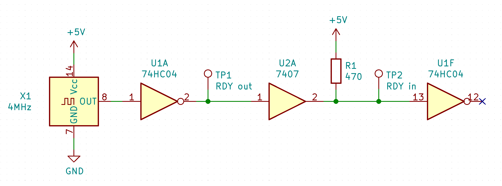

This means that output of the wait state circuitry is never directly "high", it's either "low" or "none" (high impedance). The way it works is that as long as RDY line on 65C02 CPU is operating in input mode, it will be driven either by the buffer output (in "low" case) or by the pull-up resistor (in "high" case). High output will always go through resistor, and when RDY line turns to output mode and pulls the line low, this resistor will limit current passing through.

This is how it looks on the breadboard:

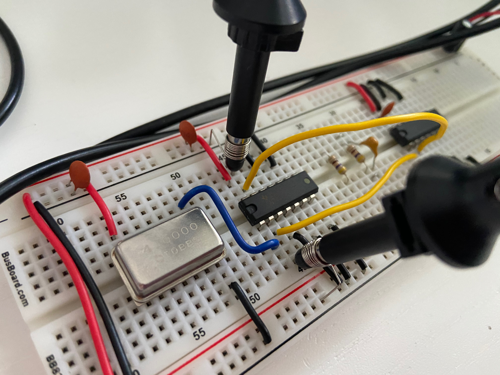

Actually, the pull-up resistor is obscured by one of the probes, sorry...

This is the resulting signal:

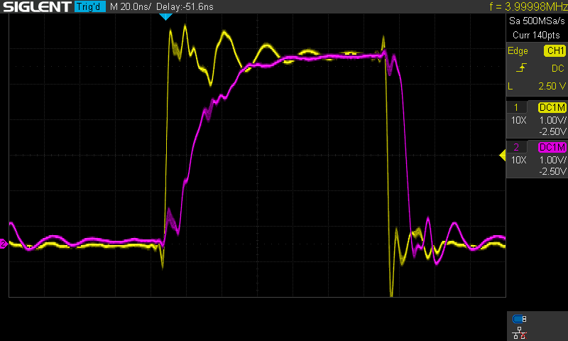

As you can see, signal is falling very fast, but it takes time to start doing so:

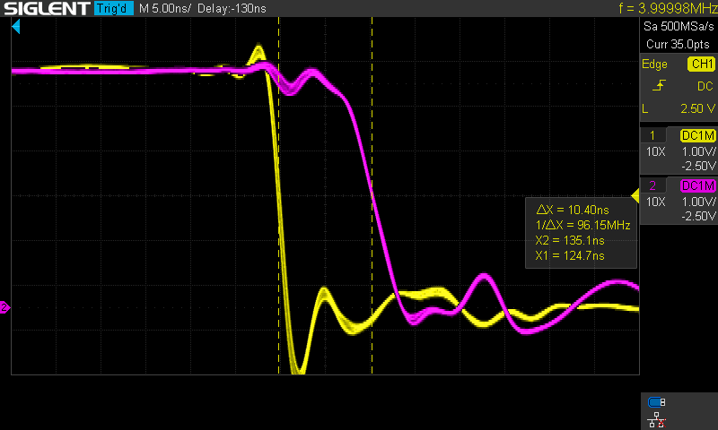

As you can see here, it takes over 10ns to propagate low signal via the buffer. It's even worse when you check the rising time delay:

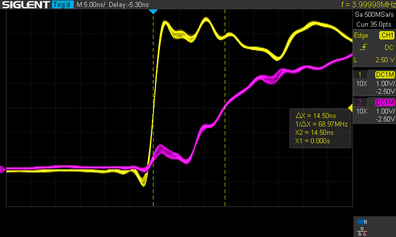

Here, it measures at almost 15ns, but in reality I should be measuring time between leaving low signal range and reaching high - and this time is much longer, almost 30ns. When you consider 14MHz clock cycle of 70ns you can already see that's a lot!

You can alsways try to use smaller resistor, and this is how it looks with 220 Ohm one:

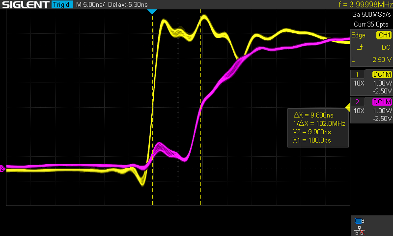

As you can see, rise time looks better at just below 10ns.

### Variant 3: series resistor

This one seems too simple to work, but in fact, it's pretty effective. When you consider the open collector variant above from the perspective of the WAI instruction, it's important to realize that the worst case scenario is when you have RDY pin driven low by CPU. You are dropping 5V via 470 Ohm resistor (assuming this one is used), producing current of about 10mA. Sure, if you want to shorten the rise time, you can use smaller resistor at the expense of much higher current being delivered to the CPU. The point is: the amount of current is limited only by the resistor (and, of course, your power supply).

This variant is simpler: it uses series resistor instead of combination of open-collector buffer and pull-up:

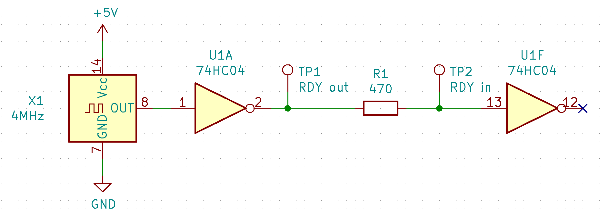

Now, as simple as it looks, it's actually pretty effective. During normal operation, where RDY line is in input mode, it will slightly delay signal propagation, and it will do it "symmetrically", so the impact on rise/fall time will be similar. When in output mode, it will have to drop the current as in the previous variant, with one difference: current will be limited by the output gate. Still, for some gates it might be more than 20mA, so you have to be careful. This is how the build looks like:

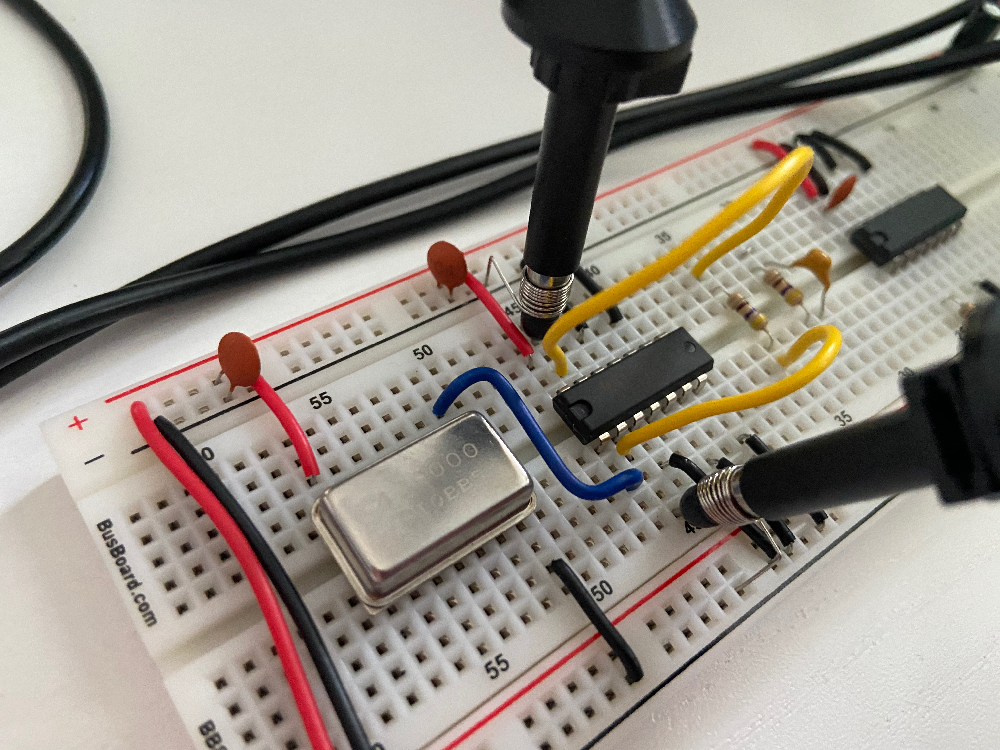

So, with the simplicity being obvious upside, what is the impact on timing?

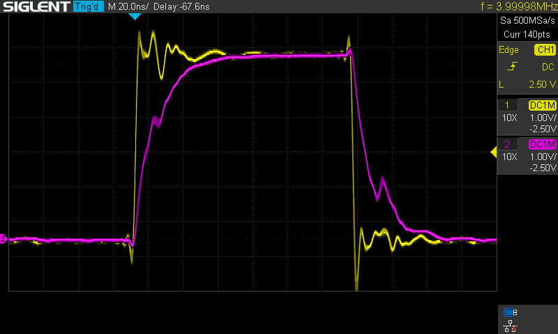

As you can see, rise/fall is now slightly delayed:

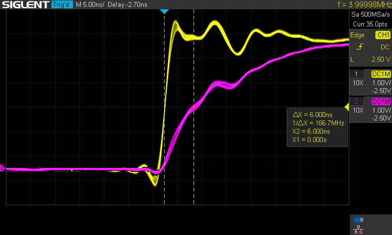

Rise time increases to about 9-10ns realistically (here it is measured at 2.5V), which is pretty acceptable. Same goes for fall time:

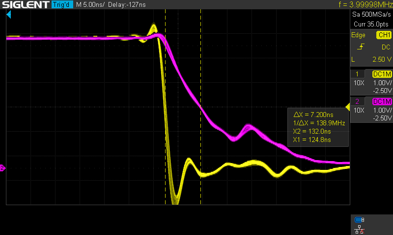

Again, you probably have to consider a bit longer period, but this is still close to the propagation delay of open-collector buffer.

### Variant 4: series resistor with parallel capacitor

This is solution suggested by Garth Wilson [here](http://forum.6502.org/viewtopic.php?p=40980#p40980). I have never really understood how is this supposed to work (have I mentioned that I'm like a total beginner in electronics?), so I wanted to give it a try. See what it does and how. I'm so glad I did!

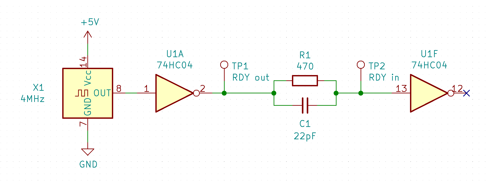

Again, build is very simple:

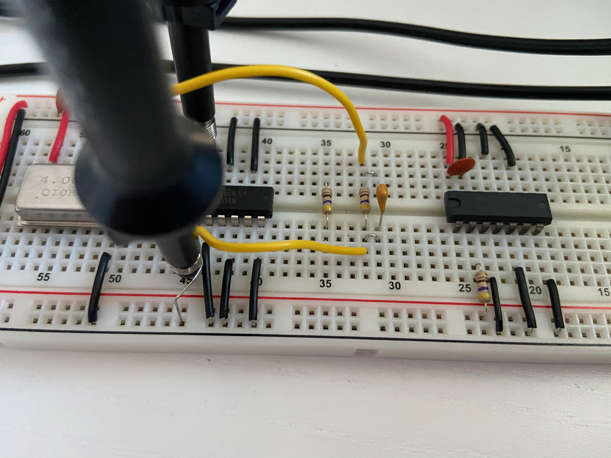

So, how does that work? Let's see it in action first:

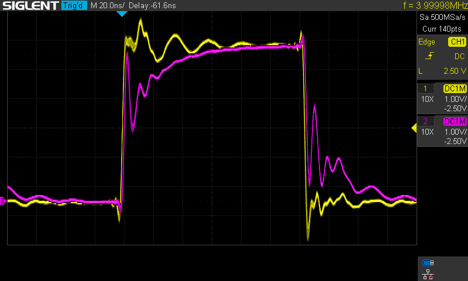

Looks pretty good, doesn't it? Well, there is some ringing here, but I will try to address it. For now, let's see the rise and fall up close:

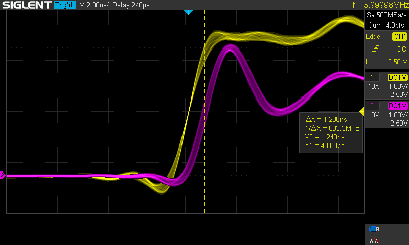

And the fall looks very similar:

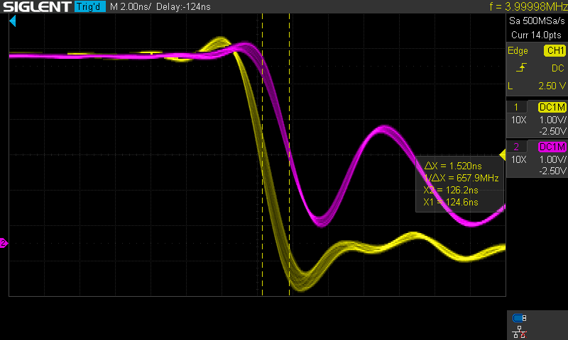

What bothered me a bit was the ringing, so I tried some other options. I replaced 22pF capacitor with 47pF one:

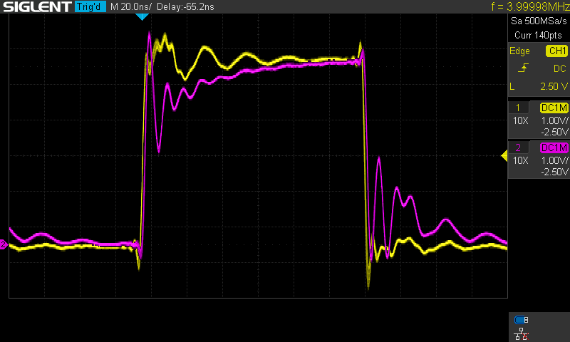

As you can see, it didn't improve that much. 220pF maybe?

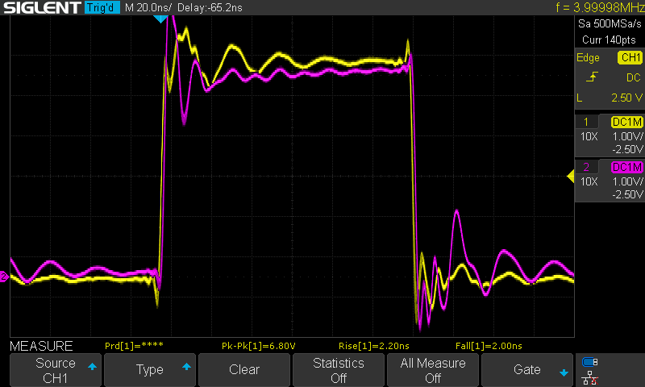

That's much better. 

What is also important - you can replace the 470Ohm resistor by something significantly stronger, like 1kOhm:

This protects your circuit much better from high current and all the results of it.

Oh, and in the end I have also tested it against 12MHz clock to see how it works:

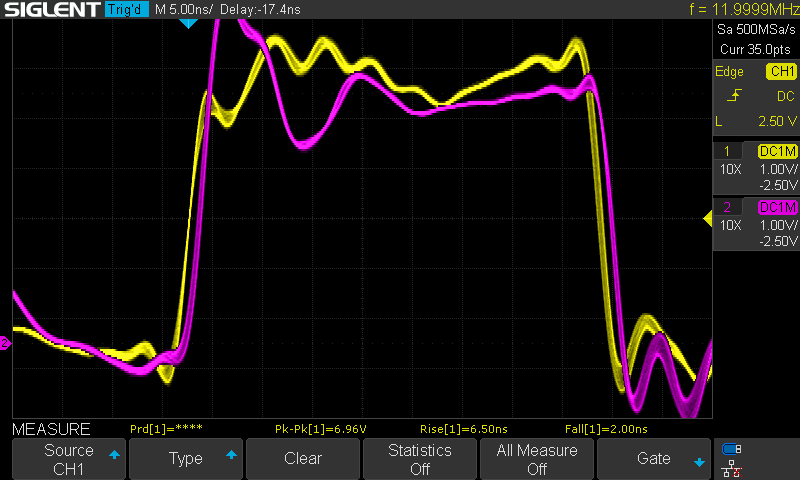

Looks like we have a winner! 

## Conclusion

Obviously, this is not the end. I still haven't tested it against real-world scenario with CPU in place. Chances are that the approach needs to be refined. For one, I don't understand why Garth suggested 22pF, where in my scenario it looked like 220pF (ten times more) is performing much better. I guess I will have to build it with the actual CPU and find out myself...

The main takeaway here is that this kind of experiments in very limited environment can help you see for yourself how things work and test out any ideas you might have. Apparently there is always more than one way to do things and trying various options can help you make the right decision.