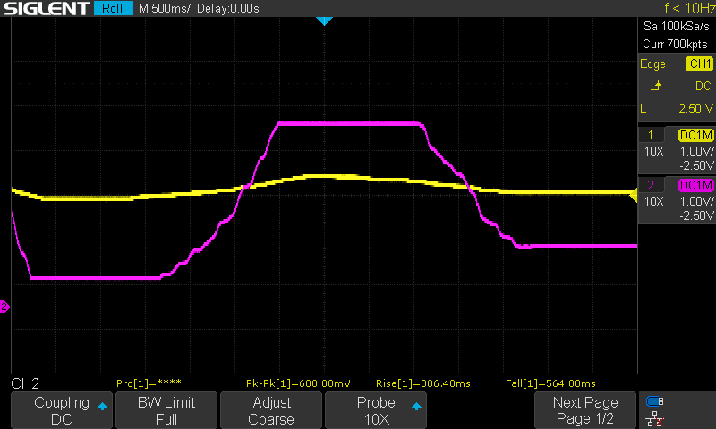

# Every day is a school day

I believe I have said it before, but here goes again: one of the things I don't like about all these EE tutorials out there is that most of them are written by people who are actually pretty experienced. They don't remember what was hard to grasp at the beginning and keep using terms that are not that clear for people like myself that are new to the field. The same goes for most books, every single datasheet (for a good reason, really), and majority of videos.

Then there is this split between analog and digital electronics. I've been working way more with the latter, and it all seemed so easy. Sure, there were terms like "input capacitance" or "output impedance" that didn't mean anything to me, but hey, as long as you connect these chips like LEGO pieces, it doesn't seem to matter.

Time went by, and this ignorance was like an itch - something you can forget if you try hard, or have too much of a good time, but it comes back whenever things get rough. As it turns out, there are other people out there having the same problem (pretty decent understanding of digital, but much less of analog electronics), and sometimes they provide excellent inspiration. [This great video by George Foot](https://youtu.be/DyxhS2SbpGM) reminded me how badly I need to work on my understanding of the simplest circuits. If you haven't seen it yet, please do, it is really amazing: simple, clear explanation of complex concepts, made by someone who still remembers the difficult beginnings.

I decided to build the circuit myself, trying to understand each part of it the best I can. Since OpAmp is critical part of the circuit, I started there and it was amazing journey so far. So, however it's not related to my DB6502 project, I decided to write about it, because it's definitely something interesting to share.

## Fun with OpAmps

OpAmps are virtually everywhere. People that know diode polarity without checking the datasheet probably know everything about them and think that simple two rules explain it all. For everyone. 

I tried watching several videos and reading multiple articles, but they all seemed rather convoluted. One way or another, I decided to give it a try and build some basic circuits myself. I will document all the mistakes I made here, because I want to illustrate the learning process and show how insignificant exercise as this one can help you build very strong understanding and intuition about basic rules about electric circuits. Let's get making then!

## Simple comparator circuit

To follow along with my exercises, you will need the following:

- Two 47K resistors,
- Three 10K resistors,
- One 1K resistor,
- One 10K potentiometer,
- LM358P OpAmp chip,
- 100nF decoupling capacitor,
- 1uF decoupling capacitor,
- Breadboard + jumper wires,
- Multimeter (or better yet, oscilloscope).

It all starts simple - two voltage dividers, one of them being adjustable with the potentiometer:

With 5,35V power supply I'm using V2 is around 2,65V and V1 can alternate between 2,40V and 2,92V. I chose the values of the R1, R3 and RV1 resistors to make sure that V1 range is pretty small, around 500mV. After all, we are going to **amplify** that signal, right?

So, let's go ahead and test the output when turning the potentiometer. I use scope in slow "roll" mode to ensure that slow changes introduced that way are clearly visible on screen. Channel one (yellow) is connected to TP1 above and channel two (pink) to TP2.

As you can see, channel 1 oscillates just a little bit below and above the channel 2 - just as I wanted it to.

To use OpAmp as comparator we need to create something called open loop. In general, the way to use OpAmp is to feed back some of the output signal back into one of its inputs; this is called closed loop configuration, and it allows us to control the gain, or signal amplification factor. Sounds complicated? It did to me, so let's start without feedback loop, with something much simpler.

In the open loop configuration gain is virtually infinite, causing OpAmp to behave as a simple voltage comparator. To build this circuit we just need to feed both of our voltages into LM358 inputs and see what comes out on the output:

Channel 1 (yellow) is connected to "inverting" OpAmp input (the one with minus sign), and channel 2 (pink) to output of the OpAmp. This is what scope shows in this configuration as I change the pot setting manually:

As you can see here, when V1 (yellow) is below the V2 value, the output is "high", as if the OpAmp was trying to tell us that the input condition (voltage at "+" input is higher than the voltage at "-" input) is true. As soon as V1 rises above the V2, output changes to the other extreme (GND in that case). This was what I expected and I was happy to see the result.

## Voltage follower circuit

Most of OpAmp tutorials out there start with inverting or non-inverting circuits with the feedback added in complicated way. Again, I don't want to go there just yet, but I did find something simpler as next step: the voltage follower circuit. It's also pretty simple:

This circuit illustrates the most useful function of operational amplifiers - their output will be always a function of difference between input voltages. In comparator (open loop) configuration, these values were always "high" or "low", because even small change in input voltages translated to huge differences in output.

When you close the loop, however, this feature can be very useful. Look at the above schematic and image what happens if at certain point in time the non-inverting ("+") input is higher than the inverting one ("-"). Output will start rising towards high signal (like in the comparator example). At the same time, whatever comes out of output, is fed back into inverting input, so this one will start rising too. This will keep happening until output (and inverting input at the same time) catches up with the voltage on non-inverting input. Obviously, all this "catching up" will happen very, very fast, so from our perspective it will seem like the output simply matches non-inverting input all the time, hence the voltage follower. This is how it looks on the scope:

You can't see the yellow channel here, because it's equal to the pink one, obviously.

Simple, isn't it? Well, yes, but to me it seemed absolutely useless - I mean why waste two components (OpAmp and accompanying decoupling capacitor) just to get whatever you already have? No worries, we'll get to that!

## Non-inverting amplifier circuit

Actually, the voltage follower circuit is a special (and seemingly useless) variant of the non-inverting amplifier circuit, with two resistors (described below) equal to 0 and infinity respectively. Compare this schematic with the one above:

There are two differences here:

1. Previously, R5 was equal to 0 (no resistor at all), now it's equal to 10K,
2. Previously, R6 was equal to infinity (no connection at all), now it's equal to 1K.

So, what does it do? In general, for the non-inverting amplifier, there is this equation stating that the amplification factor is equal to 1 + R5/R6. You can look it up, there is some simple math behind this, and it's pretty easy to remember. 

Please note: sometimes R6 is connected to GND, and the circuit behaves in similar manner, but the "reference voltage" is then 0V instead of the 2,5V (achieved using R2/R4 voltage divider between +5V and GND) here. In my case I wanted to achieve amplification of the difference between the middle point (2,5V) and signal coming out of RV1 - hence the setup.

Going back to voltage follower case: the amplification factor is 1, because 1 + 0/infinity is just 1. Amplification factor of 1 means the input is just copied to output. Note also that in that case the "reference voltage" (so the point used to calculate amplified output voltage against) is irrelevant - you can calculate the output voltage as difference between 5V and non-inverting input and you end up with the same result as if you calculated it as difference between 0V and non-inverting input.

Look at the equation again. I expected amplification factor of 11, so any change of 0,1V on RV1 output measured at TP3 (compared against 2,5V reference voltage measured at TP1) should result in about 1,1V change on output measured on TP2. Let's see if it worked:

Channel 1 (yellow) is connected to TP3 and represents RV1 output. Channel 2 (pink) is connected to TP2 and represents OpAmp output.

Hmmm, this doesn't seem to work. Yeah, there is some amplification here, but it doesn't seem to be correct, I can't see the signal amplified 11 times. Two, maybe three times at best, but not more. I was sure there was something wrong with my schematic, but couldn't put my finger on it. Ah, probably the OpAmp chip is broken, that must be it!

Then I came up with the idea to see if my reference voltage is correct - and this was interesting:

Channel 2 (pink) is still connected to TP2 (OpAmp output), but channel 1 (yellow) is now connected to TP1 (R2/R4 voltage divider output). This is weird, why is my reference voltage changing? Definitely broken OpAmp!

## Inverting amplifier circuit

Ok, so now that I know my OpAmp is broken, maybe I could get at least the inverting amplifier circuit to work? Let me try that:

When you look for this schematic online, you will find out that the amplification factor should be -1 * R5/R6. In this specific case output signal should be inverted around 2,5V axis, and be 10 times amplified. So, does it work?

Channel 1 (yellow) is connected to TP3 and channel 2 (pink) is connected to TP2:

 

What is wrong again? Yeah, there is some amplification going on, but again, something is wrong with the input signal. When I zoomed in on the signal (200mV/div instead of 1V/div) you can see the amplification, but why is the input signal so "weak"? It used to oscillate between 2,40V and 2,92V but now it seems like it's more like 2,49-2,51V or so:

The good news is that the amplification factor seems around the expected value, but it's all weird.

## Input/output impedance

When I used to read terms like "low output impedance" or "high input impedance" I was like "whatever". It sounded like something I would have to understand one day, but it never made much sense to me.

It does now, because thanks to this amazing experiment, I have now internalized understanding of both terms, and their importance. It's not only that I understand it, it's that now I **feel** how important that is.

Another thing I understood was why it always seemed like people tossed around these terms as if they were something obvious, trivial, not worthy of detailed explanation - because they are indeed, but only after you do understand them.

So, what does it have to do with my broken OpAmp chip?

Well, for one, it's not really broken. Obviously. However, the problem is that in both cases (inverting and non-inverting amplifier) one of the input signals got distorted due to input/output impedance. Let's illustrate that using non-inverting case:

For this circuit to work as expected we would have to ensure that voltage measured at TP1 is constantly 2,5V and whatever happens on OpAmp output can't change it. However, in this case, this is not true. Let's imagine (for simplicity sake) that OpAmp output is 5V. We end up with this simplified circuit:

All the components that are not involved have been removed - OpAmp output (5V) is fed into one end of R5. What we get at TP1 is sort of voltage divider with 10K resistor to GND and circuit of two paraller resistors (10K from R2 and 11K from R5 and R6 in series) of total resistance 5K2 to 5V. Resulting voltage is about 3,28V - it's a huge difference from the assumed, initial voltage of 2,5V.

Now, let's do the math again, but with R2 and R3 replaced by 10 Ohm resistors. It's a completely different story - total resistance of R2 in parallel with series R5 and R6 gives total resistance of 9,99 Ohm. TP1 voltage will be 2,501V - hardly changed.

What does it have to do with input or output impedance? That's just it.

You can treat R2/R4 voltage divider as output driver, but one with high output impedance. This means that it will be vulnerable to being "overruled" by any connected circuitry. This is why you want your outputs to have low impedance - so that they will not be affected by any other circuitry connected to it.

The same goes for inputs - you want these to be high impedance to ensure that reading the input doesn't change the level of actual voltage, which would have happened if R6+R5 was significantly smaller resistor.

This was my "eureka" moment, when I understood what's the story about input/output impedance, and this is when I realized what I needed to do to fix my "broken" OpAmp. Sure, I could use stronger resistors (like the aforementioned 10 Ohm ones), but this would only result in excessive current going through the circuit: 5V over 20 Ohm gives 0,25A. This is way too high for voltage divider, and would probably burn most of the typical resistors (0,25A * 2,5V = 625mW, which might be too much even for 1W resistors). There is, however, good solution to the problem: using the most "useless" circuit described above. 

See, the main point of the voltage follower circuit is that it acts like a buffer with very high input impedance and very low output impedance. It will convert high impedance output of R2/R4 voltage divider into low impedance one, preventing reference voltage changes.

## Non-inverting amplifier circuit - fixed

This is how the schematic looks after I fixed it:

First, let's see how stable is V2 when changing value of RV1. Channel 1 (yellow) is connected to TP3 and channel 2 (pink) to TP1:

That looks much better, V2 voltage is now stable when V1 changes. Output also looks much better - channel 1 is TP3 and channel 2 is TP2 (output):

Now, this is much better, isn't it? 

## Inverting amplifier circuit - fixed

Just to make sure I don't leave any stones unturned - this is how the correct version of the inverting amplifier circuit looks like:

And the output also looks much better:

Signal is nicely inverted and amplified - exactly as expected.

## Conclusion

Sometimes going back to the basics, even if it feels strange, can help you identify and bridge gaps in your understanding. Looking at things from different perspective can have profound impact on your thought process, so even if it feels like detour, always remember to enjoy the road. You might end up learning something new!

And who knows, maybe one day I will understand what input capacitance is? Looking forward to that day!

As for the DB6502 project - I'm working on new PCB layout, trying to reduce fabrication cost while still keeping it "beginner friendly". I have some nice things to share on the subject, so stay tuned!