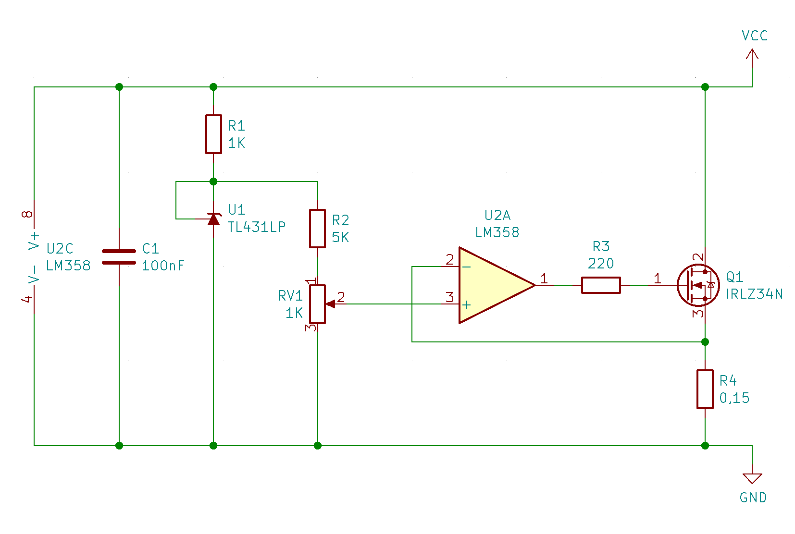
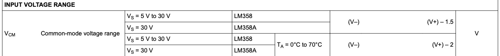
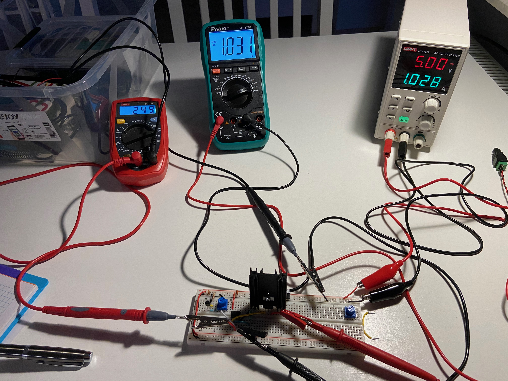
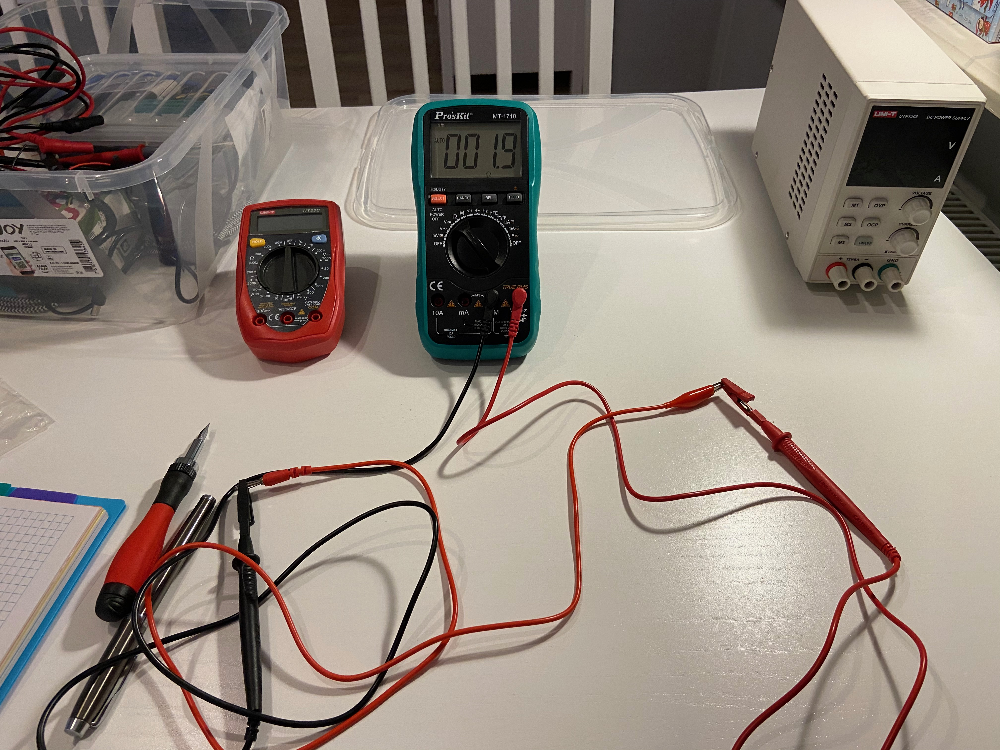
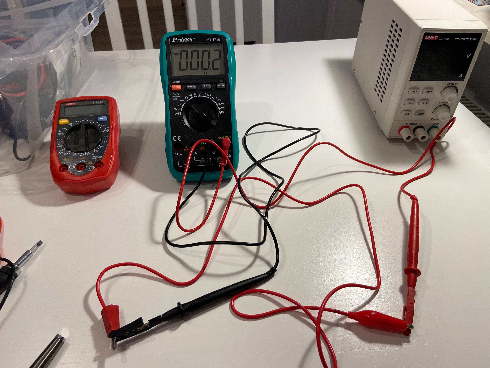
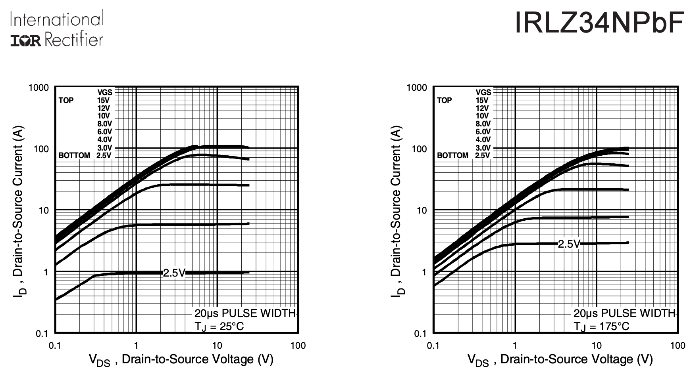

# Breaking the Law

Last time I wrote about my experiments with common operational amplifier, but obviously, there was certain context to that, and I found the topic worthy of another post. Again, the inspiration came from this [amazing video by George Foot](https://youtu.be/DyxhS2SbpGM), and this time I would like to tell you a story of building simple adjustable active load circuit, and how it allowed me to break Ohm's Law. Twice!

Let's start at the beginning: adjustable active load is a circuit/device that allows you to simulate certain (and configurable) load on your system. It is critical for testing any kind of power circuits, but the greatest value of it is in the learning opportunity. Also, please note: if you are to test any kind of commercial product design, you should probably buy professional grade device for several hundred dollars.

However, should you decide to build your own, you get to use different components and while troubleshooting any issues you come across, you get to understand them much better. It was fun, it was full of surprises and discoveries. Strongly recommended!

On basic level such a load circuit will consume certain amount of current and convert it into energy, probably heat. If the idea were to use constant, defined voltage and constant, defined current, you could just use power resistor - and that would be it. Want 500mA at 5V? Using Ohm's law you calculate the resistance as 10 Ohm. Power dissipation will be 2,5W so make sure your resistor can handle that.

Things get more complicated when you want your load adjustable (in terms of current passing through) and working with different voltages. This is where single resistor will not suffice. I used the [this blog entry](https://charlesouweland.wordpress.com/2020/01/30/diy-active-load/) as inspiration, and the schematic was as follows:

Let's explain how this circuit is supposed to work:

1. Load input is the VCC/GND, and most of the current will flow through Q1 MOSFET and R4 shunt resistor,
2. R1 resistor is used to limit current passing through U1 reference voltage chip, and C1 is standard decoupling capacitor for the U1 chip, 
3. U1 is very important for the operation of the circuit - it will provide constant voltage of 2,5V at connection with R2 resistor,
4. RV1 and R2 form adjustable voltage divider, and the resulting voltage will be in range 0 mV to 417 mV. The resulting voltage is fed into non-inverting input of the OpAmp,
5. The magic happens at inverting input of OpAmp - based on Ohm's Law, voltage delivered there will depend only on current passing through Q1 and R4, regardless of the load voltage. If the current is 1A, R4 will drop exactly 150mV, and this value is fed into the inverting input of OpAmp,
6. Remaining voltage (Vsupply - R4 drop) will be dropped by MOSFET working as a variable resistor (bear with me, please) and dissipated as heat.

Now, what happens if the non-inverting input is higher than the 150mV measured on OpAmp inverting input? It will increase output voltage delivered to Q1 MOSFET gate and as a result, the MOSFET will pass more current through. This will keep happening until voltage drop on R4 is equal to the non-inverting input of OpAmp. Beautiful usage of the feedback loop!

What is also great - none of the input parameters to OpAmp depends on the input voltage. R4 voltage drop is calculated against ground, and RV1 output is always measured against the 2,5V reference voltage provided by U1 chip. Lovely, isn't it?

## Theory and practice - in practice

The beautiful simplicity of this circuit could be matched only by its utter and complete failure to work. I built it on breadboard, provided 5,35V power from standard 2A charger and started testing. Yeah, it would work pretty well almost halfway through, but at around 600mA it wouldn't get higher anymore. I replaced the MOSFET, tried different variants of R2 biasing resistor. 660mA was the limit and that was that. Sure, I could live with the 600mA limitation, but I wanted to understand where it came from, especially that on paper it looked as if it should be able to pull full 2A of current.

I checked power rails of the circuit (just where it enters drain of Q1 mosfet) and the measurement was disappointing: 3,45V. Clearly my power source wasn't able to put up with the load. For a long time I wanted to buy myself proper lab supply, and that was excellent excuse to finally get one.

Few days later the thing arrived (I got Uni-T UTP1306, because it's very small and almost always completely silent) and I started testing again. Nice equal 5V, current limit set to 2A, let's go.

670mA maximum. Not a freaking miliamp more! What is going on?!

You wouldn't believe the crazy theories that went through my head. The best was that it was the MOSFET's fault: it would keep "pulsing" (opening and closing), and while open it would let only 2A to pass through (power supply limit), but since it was "oscillating", it would "average out" to the observed 670mA. While the theory was really tempting, there was one observational problem with it - when I raised current limit in power supply to 6A the "averaged" current wouldn't increase, not by an miliamp. That sort of contradicted the idea.

## Proper measurements

When everything else fails it's time to troubleshoot the circuit. Like it "properly measure" instead of guessing the underlying reason. This is what I measured:

| Id       | 50mA   | 100mA  | 250mA | 500mA | 613mA | 630mA |
| -------- | ------ | ------ | ----- | ----- | ----- | ----- |
| Vinv     | 12mV   | 25mV   | 62mV  | 124mV | 154mV | 157mV |
| Vnon-inv | 13mV   | 26mV   | 63mV  | 125mV | 155mV | 234mV |
| Vgs      | 1,897V | 1,983V | 2,13V | 2,32V | 2,39V | 2,40V |

- Id - current passing through Q1 drain-source,
- Vinv - voltage at the inverting input of OpAmp,
- Vnon-inv - voltage at the non-inverting input of OpAmp,
- Vgs - voltage at the Q1 gate (OpAmp output).

As you can see, there is something weird going on at around 2/3 of the pot (I was using 10K biasing R2 resistor at the time I took these measurements) - up until then the inverting input of OpAmp follows the non-inverting one, as expected, but at around 155mV it just stops, and the Vgs doesn't rise anymore.

I was really, really confused. Sure, I remembered that there is certain limit in operational amplifiers as to the minimum and maximum voltage they can output, relatively to their supply. LM358 that I used, can go almost all the way down to V- input (0V in my case), but it goes up to only V+ -1,5V:

With 5V supply, I would expect the output to be capable of going up to 3.5V at least, so what's the problem here?

Actually, there's more than one.

## Revise your assumptions!

Now, I assumed that there was indeed 5V power supply on my breadboard rails. Imagine my surprise when I finally measured it:

| Id       | 50mA   | 100mA  | 250mA | 500mA | 613mA | 630mA |
| -------- | ------ | ------ | ----- | ----- | ----- | ----- |
| Vsupply  | 4,89V  | 4,78V  | 4,46V | 3,92V | 3,67V | 3,64V |
| Vinv     | 12mV   | 25mV   | 62mV  | 124mV | 154mV | 157mV |
| Vnon-inv | 13mV   | 26mV   | 63mV  | 125mV | 155mV | 234mV |
| Vgs      | 1,897V | 1,983V | 2,13V | 2,32V | 2,39V | 2,40V |

So, this explains it - the circuit can't pass more current, because I have reached my OpAmp output limit, and the MOSFET can't open anymore. Still, how comes the drop is so large, even when using proper power supply?

I was sitting there, staring at my setup and wondering what the hell is wrong... And why the bloody thing claims to output 5V when it clearly outputs only just slightly above 3,64V?

It was like one of these moments, when your brain has already noticed, but can't put a name on it. You can see the picture is wrong, you just don't know what it is... until you do. I realized that these cables hooked up to the power supply look a bit different. The ones I took from the box had these little holes in them, but these are just plain banana-alligator clip cables.

No. This can't be it. No. NO!

Yeah, this is exactly what happened - instead of using the original power supply cables, accidentally I used some cheap crap that I just pulled out of the "box with the cables". Does it matter? Well, yes, apparently it does. At 630mA it takes only about 2,15 Ohms of resistance on the cables to get the 1,36V drop between power supply and the breadboard... I replaced the cables by the original ones, and all started working just fine - full 0..1A range with 10K R2 biasing resistor, just like that:

I have also measured resistance of the two cables with my meter:

As you can see, the crap cable measures at 1,9Ohm, while the good one at 0,2Ohm - ten times less:

You might be wondering how comes it happened also with the old power supply - as it turns out, the previous setup used some cheap breadboard jumper wires with ARK connector (it's visible on the right side of "it works" picture above), and the connection was equally bad, resulting in similar voltage drop. When I replaced it with proper wire soldered to pin headers connected via the same ARK connector it turned out that my original power supply was just as good - it was capable of driving up to 2A of current via the load circuit.

There you go, I just got myself proper power supply only because I had crappy wires connected to the old one. Still, I'm happy I got it, I can use it for other experiments as well!

## Breaking Ohm's Law

I promised you breaking Ohm's Law, so where is it? Well, let's look at the revised measurements, with proper power supply cables this time:

| Id       | 50mA   | 100mA  | 250mA | 500mA | 750mA | 998mA |
| -------- | ------ | ------ | ----- | ----- | ----- | ----- |
| Vsupply  | 4,99V  | 4,98V  | 4,96V | 4,91V | 4,87V | 4,83V |
| Vinv     | 12mV   | 25mV   | 62mV  | 125mV | 187mV | 249mV |
| Vnon-inv | 13mV   | 26mV   | 62mV  | 126mV | 188mV | 249mV |
| Vgs      | 1,882V | 1,976V | 2,13V | 2,34V | 2,52V | 2,59V |

Well, the thing that bothered me when I looked at these figures was the inverting OpAmp input voltage. At 1A it measures as 249mV, but my resistor is only 0,15Ohm. Based on Ohm's Law you would expect only 150mV, so what is going on here?

Again I had some strange ideas about MOSFETs and fairy dust, unicorns and rainbows. Reality, though, was much simpler. Took me actually quite a while to figure that one out, and even though I had plenty of clues all along. See, as it turns out, I was measuring the voltage drop wrong. I mean, sure it was connected to the right junctions in the circuit, but not at the right spot on the breadboard.

I should have measured the drop closely (or preferably - directly connecting) to the R4 wires. What I did wrong, is that I connected the "GND" probe of my multimeter closely to the beginning of the power rail, where the power cables were plugged in. As it turns out, all the rails in breadboard have their own resistance, and while very low (I calculated it at about 0,02Ohm) it is sufficient to drop around 40mV along the length of the breadboard when passing 2A of current.

Again - important lesson learned here: distributing power on breadboard is not easy, and making any kind of assumptions about the voltages at different spots can lead to serious trouble. Also: it does take a while to develop proper intuition about voltage at slightly higher currents - everything that is negligible at 10mA range can become important factor just two orders of magnitude more.

That being said, I'm sad to report that, at least this time, the good old Ohm's Law wasn't broken. Maybe next time!

## Bonus discovery - MOSFET characteristics

There is one more thing worth noting here, and I haven't mentioned it before. R3 resistor of 220 Ohms. I added it, because I read somewhere that it could reduce ringing between OpAmp and MOSFET. To be fair, when investigated on the scope, it doesn't seem to do anything, but it doesn't harm the circuit either and who knows? Maybe I'm measuring it wrong? The good thing about it is that I found this [amazing article about common MOSFET misconceptions](https://www.baldengineer.com/7-mosfet-myths-and-misconceptions-addressed.html).

Remember when I said at the beginning, that in this circuit MOSFET is being used as variable resistor? This is how I imagined the circuit: the more voltage you provide at the gate (measured against source, so Vgs), the lower the resistance of the MOSFET. This means that in this circuit, if I increase power rail voltage, it should increase the current passing through the Q1 and R4, resulting in increase in inverting input voltage increase (dropped on R4) which will lead to "closing" the MOSFET (or increasing its resistance) to maintain constant current flow, right?

Let's measure this then.

| Itotal  | 502 mA   | 503 mA    | 504 mA    | 506 mA    | 335 mA    |
| ------- | -------- | --------- | --------- | --------- | --------- |
| Vsupply | 5,00 V   | 5,50 V    | 6,00 V    | 8,00 V    | 5,00 V    |
| Vds     | 4,80 V   | 5,30 V    | 5,80 V    | 7,80 V    | 4,86 V    |
| Vgs     | 2,083 V  | 2,077 V   | 2,073 V   | 2,056 V   | 2,052 V   |
| Rds     | 9,56 Ohm | 10,53 Ohm | 11,50 Ohm | 15,41 Ohm | 13,69 Ohm |

First of all, the great news is that the circuit is almost perfectly stable - when I set the current to 500mA at 5,00V it kept the value up until 8,00V with only 4mA difference, and the difference was probably caused only by increased current passing through R1 (3V/1K = 3mA). Please note: I measured current used by the whole circuit, not just the Id (passing through Q1 and R4 only).

However, when you look at the calculated Q1 resistance (Rds = Vds/Itotal), you can see something weird. Resistance changes quite a lot, regardless of rather small changes to Vgs. What is also weird is that when you look at the last measurement (where I adjusted current to match the previous Vgs value), the resistance seems to differ quite a lot even though the Vgs voltage is almost identical.

Is this old German playing tricks on us again? Nope, it's pretty well explained in the article I just linked. See, when you look at the datasheet, you will notice that MOSFET resistance isn't just function of Vgs, but it depends on Vds as well. For certain Vgs values Rds will remain constant for small Vds range, but above it, MOSFET will no longer maintain constant resistance. Instead, for given Vgs it will act as constant current source:

As you can see, for Vgs equal 2,5V MOSFET resistance will stay constant with Vds up to 0,3V, but after about 0,6V it will rise proportionally to Vds, providing almost constant 1A current. If you increase Vgs it will increase the current passing, but for given Vgs value the resistance will rise proportionally to the Vds voltage. Sure, these lines are not perfectly flat, they also change with temperature, and the whole device was heating up quite a lot during my experiment (to around 66 degrees Celsius) - this caused the observed changes in Vgs.

Bottom line is: you have to remember that there are two ranges in which MOSFETs operate and both of those have their own important characteristics. Take them into account unless you want to think you just broke Ohm's Law.

And most of all: If you haven't yet, play with simple circuits as these. Digital electronics, Arduino and 6502-based computers are fun, but there is a lot to be learned from simple analog devices. Remember that at the end of the day your super-modern CPU is actually analog device that has more to it than it seems at first look.