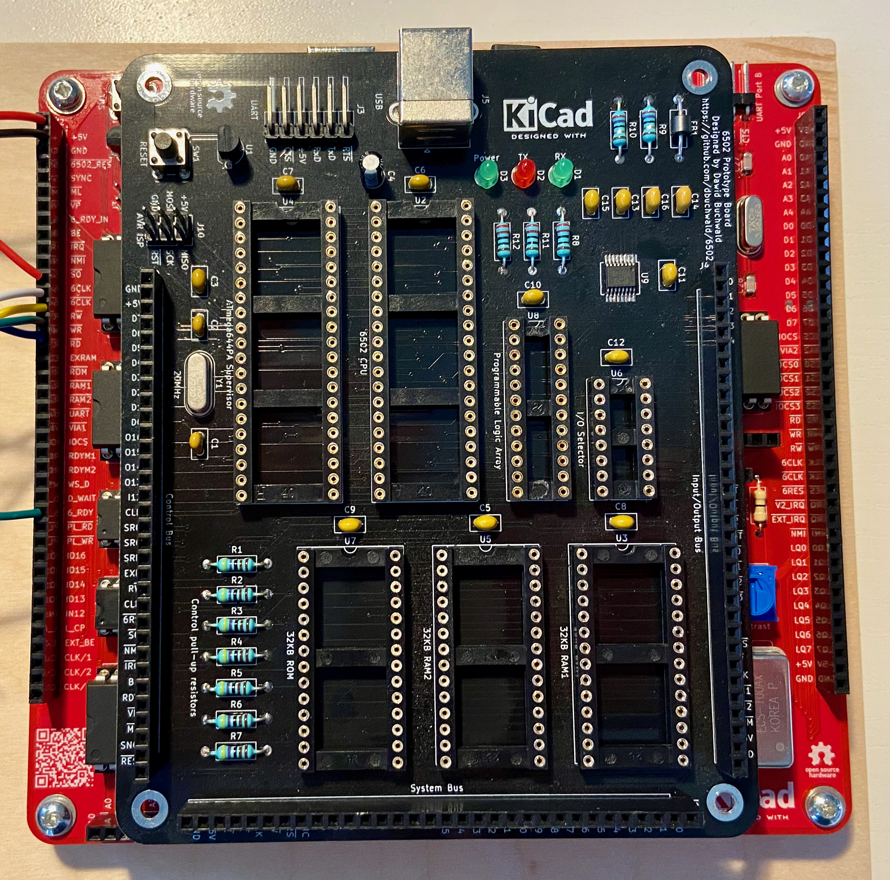

# Making PCB on a budget

Experimenting with digital electronics can be a lot of fun, but as each other hobby, it can cost you a small fortune. Especially at the beginning you will make mistakes and buy useless gear, but as the time goes by you will learn to choose wisely. What does it mean? Different thing for each one of us, as we work in different environments, are in different financial and social situations. My work is mostly limited by space (no dedicated area to work, sharing workbench between different hobbies and projects) and time (being parent of four year old, I can't really plan ahead a lot and have to be able to start/stop work on short notice). My solution to these limitations: using multiple PCB revisions instead of breadboards. Sure, it takes time to design them, but all you need is a laptop and you can work on the design everywhere around the house. Completed project is very durable, all you need to do is to grab it from the drawer, plug it in and resume hacking - no need to spend couple of hours looking for loose wires.

But then there is the cost factor: making PCB is not cheap, especially when you order one project at a time - shipping cost from China can be prohibitive. Another thing is at the beginning you tend to make your boards larger than they need to be, just because of lack of experience.

Don't worry, you will get better at it, and while you do, I want to share some tips/hints I have learned recently.

## Tip 1: verify your assumptions!

I wouldn't surprise you if I said that using smaller, SMD packages can help you save some money - after all, the cost of PCB nowadays is mostly defined by the size of the board and most of the space is taken up by your ICs. That being said, there are other factors I was surprised to learn about. 

Let's start with simple comparison. Below you will find two revisions of the same Z80 development board - first one (on the right) was made with thru-hole components only, the second uses surface mount to some extent (only the simplest packages - SOIC and 1206, and not for all parts). What is also important, the second board is significantly improved - it has added I/O decoder and all the SC26C92 GPIO input pins use pull-down resistors now for stability. Still, the second revision is considerably smaller:

For quite a while I would stick to DIP packages for a very simple reason: chips are expensive, and you have to recycle them. I would design my boards with tooled DIP sockets in mind, and only after several iterations I realized how wrong my assumptions were. Let's look at the costs, shall we?

### Variant 1: DIP package

First, you need the chip for about [3,01 PLN](https://pl.farnell.com/texas-instruments/sn74ac74n/logic-dual-pos-edg-trg-d-f-f-14dip/dp/3006361?st=74ac74), but also a socket, which costs [1,79 PLN](https://pl.farnell.com/multicomp/2227mc-14-03-10-f1/socket-ic-dil-0-3-14way/dp/1103845?st=dip-14). That's not all, you also have to consider the real estate that the package uses.

### Variant 2: SOIC package

Second option is to go with the SOIC package - at [2,20 PLN](https://pl.farnell.com/texas-instruments/sn74ac74d/ic-dual-flip-flop-smd-74ac74/dp/3119994?st=74ac74) it's considerably cheaper than the DIP counterpart. Actually, it costs only slightly more than the DIP socket itself. When you consider the extra saving from smaller PCB size required, it might get even cheaper.

### Variant 3: TSSOP package

This one is even cheaper - only [2,04 PLN](https://pl.farnell.com/texas-instruments/sn74ac74pw/ic-sm-logic-74ac-flip-flop/dp/1607721), and it uses very little space on the PCB, but TSSOP can be too hard for other people to solder by hand. I will elaborate below why it matters for the cost of your own fabrication.

One could argue that you can get cheaper socket, and it's true. There are non-tooled sockets for [0,50 PLN](https://sklep.avt.pl/podstawka-14-pin.html), but the point is still valid: sometimes using 0,50 USD socket to be able to recycle 0,60 USD chip is not that smart, and SOIC package makes for great introduction to SMD soldering.

Sure, there are other cases - EEPROM, SRAM or CPU cost significantly more than the socket they use, and in these cases savings on PCB real estate do not justify the expense unless you plan to desolder the chips afterwards.

Bottom line: before you start planning the layout of your board, shop for parts a while - it might turn out that small changes will have significant impact on the final cost. It's also much easier to change footprints at the beginning...

## Tip 2: no, seriously, look for alternatives

One of the things that I wish I had known a while ago was that 71256 SRAM chips are a thing. They are not only significantly faster (up to 12ns in DIP package), smaller (narrow DIP-28), but also cheaper at [13,69 PLN](https://pl.mouser.com/ProductDetail/Renesas-IDT/71256SA12TPG?qs=O0BhuZj9WkwnUZ0aAufqkw%3D%3D) compared to [14,48 PLN](https://pl.mouser.com/ProductDetail/Alliance-Memory/AS6C62256-55PCN?qs=LD2UibpCYJqgbIupMJnGTQ%3D%3D) from Ben's build. Their size also matters when you use them on breadboard - they leave you much more room for all the mixed address/data lines wires.

So yeah, learn to use this search engines and spend some time reading about your options - your PCB can get significantly smaller and more flexible with some simple chip substitutions.

Compare sizes of DB6502 protoboards v1 and v2:

As you can see, the second revision is just slightly larger, but it has many, many more chips and ports - it has VIA, SC26C92, debug/supervisory circuitry, etc. All of this is achieved with smaller footprints, chip replacements (like the memory) and moving some parts to the back side of PCB. Amazing what you can do with simple changes like these!

## Tip 3: pull-ups and pull-downs

Another thing I never noticed really, were resistor arrays, and these things are just perfect for multiple pull-downs/pull-ups you might need at your board inputs. In my first DB6502 prototyping board I placed seven 4K7 pull-up resistors on a board. In my second revision I replaced them with single resistor network for only [1,38 PLN](https://pl.farnell.com/multicomp/mcrnla09g0472b0e/resistor-network-4-7k-2-1-8w/dp/1973140). It uses fraction of the board real estate and is really easy to use. Definitely recommended!

This is how neat they look on finished board:

And this is comparison of real estate used (old board with individual resistors, and resistor network placed in the ROM socket above):

## Tip 4: Don't forget the other side

One of the things that will fit great on the backside of your board are decoupling capacitors, especially if you use 1206 SMD package. They are really easy to solder, and let you use space on the front side of your board better. Bonus: you can place them really close to VCC input of your DIP chips, improving the quality of your build.

You can also try and put some of your SOIC package chips on the back of the board, but the routing can get tricky. I didn't dare that yet.

Another thing that fits great on the reverse side of your PCB is the QR code with a link to your project - very convenient!

## Tip 5: Make your design flexible

This will increase the size of your board a bit and might make it a bit harder to design, but then again - the worst thing is to have to design, order and pay for new revision when you change your mind. Think about what is set in stone and what is negotiable.

One of the silly things I did in my first PCB ever (the DB6502) was to put two VIA chips on it and wire the first one to LCD/keyboard/blink ports. Waste of space (which costs money), extra chips (more money) and added complexity. In my latest revision I use only one VIA chip connected to two ports - one preconfigured for LCD and another one simply exposing raw VIA I/O pins. You can choose which interface you prefer to use, and if you want, you can always hook up second VIA chip using the extension port on the side of the board.

Add jumpers where you want let people decide how to configure the board - it will make their life easier, and they will be more likely to reuse your design. While not obvious, this is also important cost factor for your future projects!

I will write more on that in next entry (where I will summarize lessons learned from the second revision of the DB6502 prototype board), but as it turned out, these jumpers can also save you from design errors!

## Tip 6: Don't pay for your PCBs at all

This might sound silly, but you don't really have to pay for your PCBs. I take advantage of the PCBWay project sharing program - you can share your designs on their website and each time somebody orders from them board designed by you, you will get small commission to be used for future purchases. Sure, it's not a lot of money, but it does add up and this way you can learn to make better designs and start thinking about what other people can use and benefit from. It's pretty much free proving ground for product design.

There are, however, some factors you need to take into account:

- Using very small packages can discourage people from building your design, so balance your options. Sure, your board would get cheaper if you used only TSSOP package, but if you intend to share - reconsider this choice, or find another way to make the board beginner-friendly. I use only one chip in this package (FT230XS), but I always provide alternative solution - direct UART breakout pins that allow you to skip this particular IC altogether,
- Using parts from your drawer might not be the best option. Sure, you have them for free, but are you sure other people will be able to obtain them? Make sure to check that the components you intend to use are available from at least one online retailer and marked as suitable for new projects. And make sure the parts you want to use actually exist - in one of my first designs I used capacitor variant that nobody ever produced :) It was, obviously, typo in my bill of materials, but it sent people on a goose chase...
- Be careful with the footprints. One would think that these are standard and should not vary a lot, but in fact I had to throw away batch of first VGA breakout boards, because I ignored seemingly insignificant discrepancy between the connector datasheet and KiCAD footprint. As it turns out, [there is a bug in KiCAD](https://github.com/KiCad/kicad-footprints/issues/1396) and all VGA port footprints are based on designs that are no longer available anywhere. The funny thing is that I do have (and follow) rigorous process of footprint matching - I print the PCB layout on paper and put my parts (purchased prior to PCB order) on the printout to confirm match, but with the VGA connector the printout didn't seem to match very well the part. I was sure it was the process fault (not making holes in paper precisely enough), but when the PCBs arrived it turned out I had to bend VGA connector pins to make them fit. Ouch. Obviously never shared this design,
- When shopping for parts keep track of all orders and links to parts that you got - it will make your BOM easier to make and it will ensure that you correctly match links with parts that you have actually used. Better yet, when designing PCB for sharing buy separate batch of parts just for this specific purpose, to ensure that there are no discrepancies,
- No design is too simple or too small for sharing. Worst case scenario - nobody will use it, and you will learn something,
- Document your design - the more you write about your design, explain the application and the problem you are solving, the more likely people will be to give it a try and share their comments with you. Community feedback is invaluable for beginners!

## Summary

Maybe it's a thing of me being beginner, or maybe it's just the conditions I'm living in, but seriously - designing your own PCBs makes the whole electronic project a lot more exciting. It makes you feel instantly more "pro", and even that feeling alone is worth the effort. At the same time you can contribute to larger community and learn from it. It doesn't have to be expensive and it will teach you a lot about keeping track of your project, managing changes and resolving issues should they arise. What are your tips and tricks for cheaper PCB design? Please let me know in the comments below!

