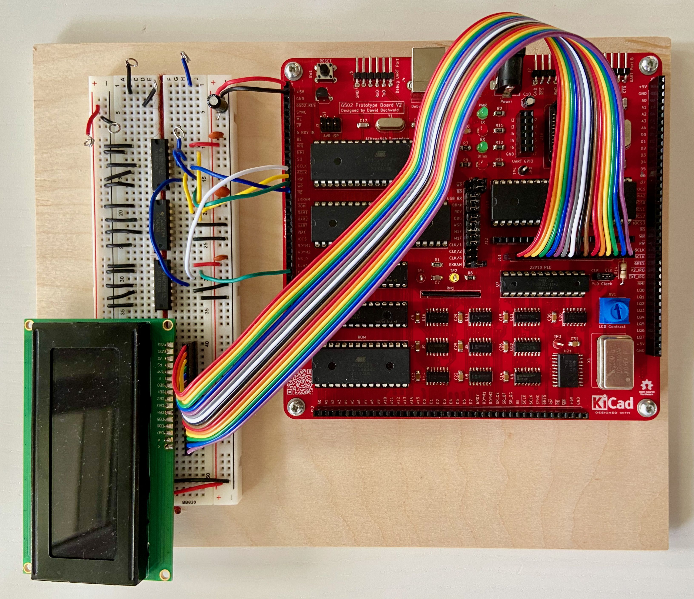
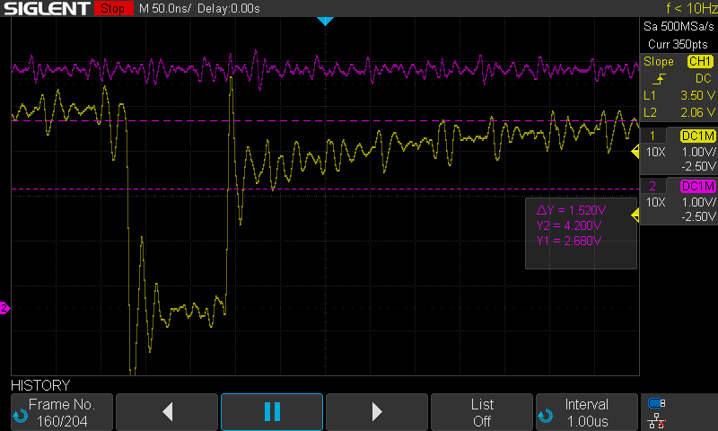
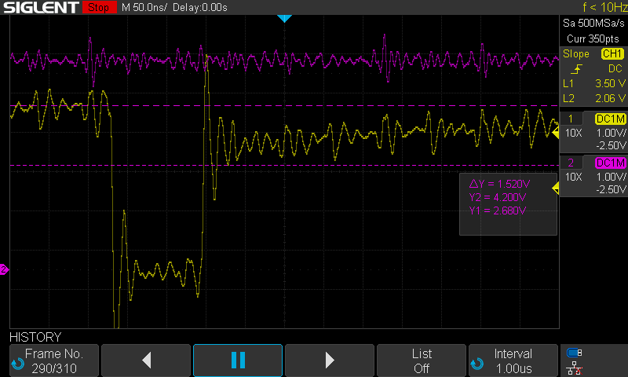
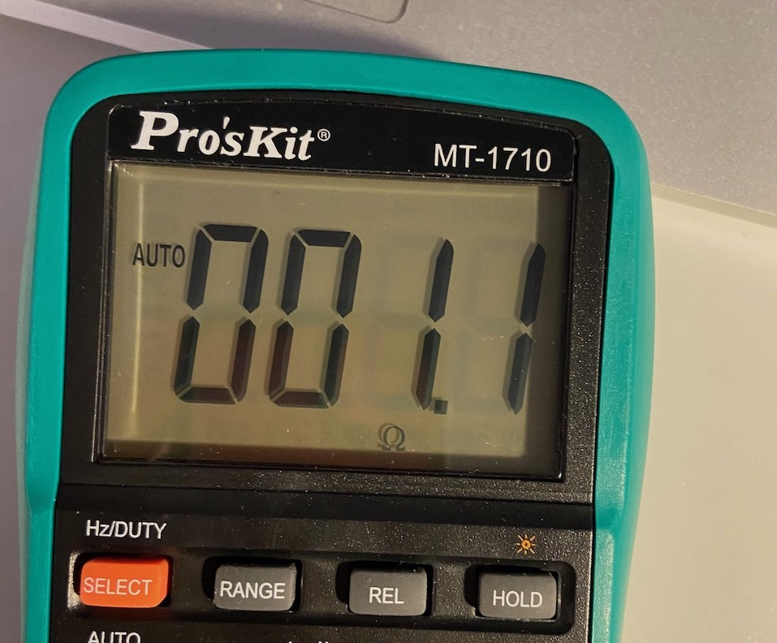
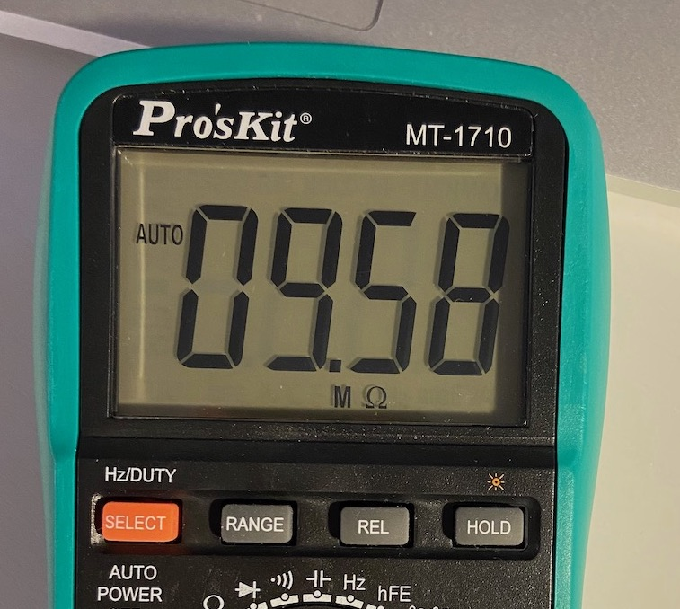
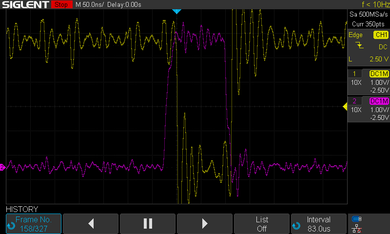

# Every day is a school day

Recently I wrote about making PCB prototyping cheaper. Today I wanted to write about things I have learned from latest PCB prototype of DB6502 build. Let me start with the update first.

## DB6502 PCB prototype update

The good news is that I haven't made any major mistakes in my latest design. Unlike the previous prototype, this one didn't require any extra wires nor cutting existing traces. AVRISP port is also oriented properly this time!

Does that mean everything is fine and dandy? Sadly, no. Latest prototype does serve its purpose nicely - I can proceed with testing some of my ideas and verify some assumptions. I can learn and improve, but the board, unfortunately doesn't always work "standalone", without extra chips added to the breadboard next to it. The main achievement here is that I planned for such "failure" and made the board configurable - thanks to this flexibility I was able to spot and fix the problems that were blocking the development of the previous revision.

Let's talk about the problems and lessons learned then.

## Problem 1: nRD/nWR signal stretching

In one of the previous entries I wrote about impact of introduction of wait states on 6502->8080 bus mapping. Basically, one of the issues with 6502 CPU is that it uses different encoding of read/write signals than the 8080 and derivatives. It might seem irrelevant for 6502 based build, but unfortunately, both your memory chips (RAM and ROM) and the SC26C92 UART interface are designed for 8080 bus. Instead of single r/W signal from 6502, you have nRD/nWR inputs on 8080-compatible devices.

Ben Eater uses simplest possible trick - ensures that nWR can be low only during high CPU cycle. While that works fine at slow speeds (and is generally accepted solution for most homebrew 6502 builds), it can cause issues when introducing wait states, because it causes write operations to happen twice (or more, depending on number of wait states).

In my previous PCB revision I have already implemented Ben's algorithm in my PLD: nRD and nWR were calculated there, based on r/W signal and clock input. It was very elegant solution and it worked beautifully due to simplicity of the calculation. Unfortunately, when I added wait states to the equation things got messy, and calculation got just a little bit longer.

What you have to take into account is that your nWR/nRD signals must rise no more than 10ns after falling edge of your clock. According to 6502 datasheet this is how long the data/address lines are stable. If you wait longer, your address/data lines might start changing, resulting in bus corruption.

See tDHW above, and this is the actual figure:

The problem with nRD/nWR stretching is that the logic behind it is pretty complex in my case - five signals are included in computation: r/W, CLK, RDY, WS_DEBUG and WS_DISABLE. In general, the logic for the computation is the following (in order of priority):

1. If WS_DEBUG is high, then we are in "debugger-forced" wait state, so nRD or nWR should be low (depending on the value of r/W),
2. If WS_DISABLE is high, then wait state computation should not be performed, and nRD/nWR should be calculated only using r/W and CLK (as in Ben's build),
3. If RDY is high and CLK is low, it means that we have just completed full CPU cycle, so both nRD and nWR should be high,
4. If RDY is low or CLK is high, then nRD/nWR should be calculated using r/W signal.

Rules 3 and 4 can be illustrated using the following diagram:

There is a problem, however - we still have two more signals to go (WS_DEBUG and WS_DISABLE) to include in the computation, and remember, we need the result to be calculated in less than 10ns relative to falling clock edge. Even if we use AC gates, propagation delay is going to be too long. Inverter will take up to 7ns:

Then there is the AND gate (74AC08) with 7.5ns propagation delay:

Last but not least - OR gate (74AC32) with 7.5ns propagation delay:

It all sums up to 22ns pessimistically, and two signals are still missing (WS_DEBUG and WS_DISABLE). I just gave this up and never looked back - why bother with 22ns incomplete solution when you have 15ns guaranteed?

As it turns out, you can actually get this to work much faster, you just need to be smart about it. First trick is to make time instead of spending it on inverting the clock. Instead of the above schematic, do the following:

See, with this setup, instead of waiting for PHI2 (clock) signal to be inverted, you start with the inverted signal, and start your computation several nanoseconds before the clock falling signal. If you compute the propagation delay now, it looks much, much better: AND + OR gates still take 15ns pessimistically, but the clock inverter signal propagation delay can be subtracted from (instead of added to) this number. Unfortunately, we can't take the pessimistic number here, we need to assume the optimistic one, being just 1,5ns. This leaves us with 13,5ns which is better than the PLD - and in reality, with the values closer to typical, you end up with your nRD/nWR signal rising before the 10ns limit. If you want to be super-safe, you can always invert the signal twice more.

There is just one problem left - WS_DISABLE and WS_DEBUG signals. I puzzled it for quite a while before I realised how dumb that was. Both of these are already included in the schematic, in the RDY signal. When WS_DISABLE is high, so is RDY; when WS_DEBUG is high, RDY is low. Yes, it is that simple.

Sure, if they change in the middle of the cycle, they will only apply at the next calculation point for RDY. So what? They are only debug signals, not intended for high frequency clock operation.

### Lesson learned for PCB design

You might be wondering what does all that timing nonsense have to do with PCB design. As a matter of fact - it does quite a lot. In my first revision of the DB6502 prototype board I didn't use the clock-inversion hack and I was forced to use the slower variant.  Furthermore, I have never imagined having problems with my nRD/nWR translation in PLD, so in the first board revision these have been "hardwired" to the board. Suspecting that they might cause issues down the line, I designed newer prototype with jumpers for common signals, and with simple jumper removal I disconnected PLD signals from all the other chips. In the picture below you can see the jumpers (on the right side), where the PLD nRD and nWR are disconnected; on the left side there are lines where these signals are being fed back into the board:

Next I built the improved translation logic on a breadboard and connected the signals to dedicated headers on the side of the board and voila! I had new, improved version to test - mixing the durability of PCB with flexibility of the breadboard and jumper cables.

Does it mean that you should put jumpers on each and every signal? Well, obviously not. Some things, like address/data bus will not change. Some will be simple and tested, no need to modify them. You should try to anticipate weak spots in your design (and everything related to CPU/peripheral timing is probably going to be one) and plan for failure by making it easier to introduce plan B. Don't overdo it, you can always cut and patch, but doing so might be hard on complicated boards.

## Problem 2: Simple issue with blink LED

The worst problems you will ever encounter will usually start with simple LED not working, or working erratically. If humanity fails to colonize other worlds, it will most definitely start with some abnormal reading on a smallest instrument in the space shuttle, and it will happen because somebody will notice, shrug and ignore the warning. Rest of human kind will perish in massive explosion hours or days later.

Not that I'm comparing building homebrew 8-bit computer to space race or something. Or maybe I am?

Anyway, this one started in the most innocent way possible. I fixed the nRD/nWR signal translation logic with external chips, inserted 8MHz clock and started testing system with single wait state for ROM access. OS/1 booted as usual, blinking the onboard LED twice to indicate start and stop of init sequence, loaded and ran MS BASIC just fine. So far so good. I was really glad.

Then I typed in OS/1 terminal "BLINK ON". Nothing. "BLINK OFF". Still nothing.

I launched system monitor to see the current state of DDR register in VIA PORTB (where the LED is connected) and it was incorrect. I expected 0x0f, but there was 0x0e there. Software bug probably? Then I had this feeling that I have already tested it at lower frequency, and it was fine. Changed system clock to 4MHz, tested again. Works as a charm, no problem. Changed back to 8MHz and it fails. I mean: everything seems to work correctly, except for this bloody blink LED.

So the software bug manifests itself only at higher CPU frequencies? And do I care, really? It's just a blink LED. I can add another operation to overwrite incorrect VIA register at the end of load sequence or shell boot, and it will go away, right?

This time I decided to investigate further and what I found was... amazing!

Before I take you on this fascinating journey, I need to explain something very, very important: in my testing I was using the VIA chip (and I/O in general) heavily, it's not like I was just blinking led. The same VIA port was used for communication with the onboard LCD, and it worked just fine. The same goes for the UART, which was being used for both asynchronous, interrupt-driven serial communication and as timing reference (for delays and CPU speed calculation). So, it wasn't just simple blink on/off, there was this whole I/O subsystem that was, it is very important, functioning correctly, except for one register and one bit in one situation only.

### Problem 2a: VIA_CS signal quality

I tried to investigate the issue using my logic analyser, but failed. For some reason connecting it to the system bus interfered with UART operation and without proper shell I couldn't test it correctly. This is still an open question and one I'm dedicated to answering. What I did notice was that connecting logic analyser to VIA_CS signal caused the UART to fail, so I decided to look closer at this particular signal with a scope.

Took me just a while to see these strange readings (captured at 4MHz clock, yellow signal is VIA_CS, purple is the CLK). First one shows very strange "high" level output of the VIA_CS:

As you can see, the voltage of the high signal is extremely low, probably too low for the chips to read it correctly. It also takes a while to rise to normal levels:

Or here:

So, with the very slow rise time it was actually possible that the whole thing worked at lower frequencies only because the VIA_CS signal had enough time to rise before other peripherals were accessed - which is important, because the other VIA_CS2 signal was connected to general IO_CS line. Bottom line: if any write to UART happened shortly after VIA access, the low VIA_CS could cause VIA to interpret it as write to VIA and result in overwrite of the DDR register.

Now that I have plausible explanation for the invalid value of DDR register, I just need to answer - what makes this level so low? Maybe this is how 74AC138 is supposed to work? 

I decided to test it, and what I did is I placed another 74AC138 next to the PCB on a breadboard and routed the same input signals to it just to see how it behaves with 8MHz clock. I wasn't very surprised to learn that the other chip produces much better signal:

So, what is the difference here? I was almost certain that the cause of the failure is my lousy routing of the +5V line on the PCB:

See that large white cross at the bottom of the board - this is where 74AC138 is located. It's almost a far end of very long power line with plenty of chips along the way to suck the power. I wasn't sure it was this, but seriously, what else could it be? I was sure I will not be able to solve this issue in this revision of the board, but I had backup plan - I could use correct signals routed from the external 74AC138.

### Lesson learned for PCB design

Well, this one is simple - my shitty power distribution was caused by a fact that it was practically one of the last signals I routed on the board. I should have started with it, think about it a bit more and maybe place one more larger capacitor near the bottom of the board. That wouldn't hurt, probably, either.

So, boys and girls - if you don't want to end up with similar issues, make sure you start your routing with deliberate and careful planning of power and ground lines. It will save you a lot of headache down the line!

### Problem 2b: strange noise on VIA_CS line

Solving the previous issue was pretty easy - I could connect VIA_CS signal generated by external 74AC138 to the board and go with that, but when scrolling through history of captures on my scope I noticed something very, very strange. As previously: yellow signal is the VIA_CS, and purple represents the clock line:

It was never supposed to be simple, I know, but seriously - what the hell?

I decided to look at the inputs of 74AC138 chip, hoping to find the one that is responsible for this rapid signal oscillation. It wasn't IO_CS (but there was something off about it too):

Yellow is VIA_CS, purple is IO_CS (active high). As you can see, it's ringing a bit, but VIA_CS doesn't seem correlated to it. Let's try the A7 then:

This time purple is the A7 signal. Nope, not that one either. Then I checked A5 and this was the one:

It's even better visible here:

So, what the hell? It seems like the A5 line is suffering from something strange that causes the line to produce very weak signal. Initially I thought it was the CPU that was driving the line poorly or something like that, but it just didn't seem so likely.

It all seemed like there was something trying to "drive" the A5 line, like the signal was struggling to reach high levels, like it was pulled down. I turned the whole device off, and in desperate attempt measured resistance between A5 and A6 line, and took a picture so I never ever forget:

Yeah, that reads 1,7kOhm. Not a dead short, sure, but enough to pull down the signal just enough, assuming that A6 is low at the time that VIA is being accessed (which it is, due to addressing scheme).

How did it happen? Leftover flux from soldering. Apparently I didn't clean it good enough... After another round of cleaning, the signal got much, much better:

Now the reading is still in megaohm range, while there should be no contact whatsoever, but it's sufficient enough to work correctly. With the VIA_CS signal routed from the external chip I have now perfectly stable blink LED on my board, even at 8MHz.

Even though - the A5 signal seems quite low anyway. No worries, will come back to that.

### Lesson learned for PCB design

Again, this is obvious - boys and girls, it doesn't matter how pretty you are on the inside, if you don't wash your private parts properly. Same goes for PCB :)

It was first time ever that I was affected by this, but I learned my lesson. I actually plan to test few other bits of the board now and clean it few more times just to be safe.

### Problem 2a again: round two

This is when I was almost ready to post this entry online, but I decided to ask someone way more experienced and much smarter than myself to proof-read it and provide feedback.

What I got was pure gold indeed. 

I received comment that my power distribution was not that shitty after all, and most likely it didn't cause the observed issue. Yeah, it wouldn't work for high voltages or high currents, but with the circuit in question I should be fine. My mentor suggested I check the voltage at input of my 74AC138 chip to check if there are any power fluctuations there that would explain this drop in quality of VIA_CS signal. I have tried something similar before, but I wasn't able to focus the scope on the actual problem and the reading was inconclusive. Since the chip in question is in SOIC package, you need to hold your probe in place touching the pin - it's not easy and you can't hold it steady forever.

This time I decided to spend some more time to figure out proper scope trigger setup for problem analysis. I tried runt mode, but it wasn't able to set it up to trigger on the correct signal. Then, after reiterating the problem aloud I realised that I need to catch slow rising slope on VIA_CS signal - and this is what I did set up. Rising slope from 2.3V to 3.5V in more than 50ns.

See, you think buying scope is hard? Sure, it is, after all it's pretty difficult decision to make. The problem is that, contrary to popular belief, owning one doesn't make you instantly smarter and sadly, it doesn't solve any problems on its own. You have to spend considerable amount of time to learn to use the device, speak its language and understand how it works (and when it doesn't). So, when you finally get to the point where you manage to see EXACTLY what you were looking for, the feeling of achievement is overwhelming.

Anyway, when I caught the signal in question, I had my probe touching the nearest decoupling capacitor, and the reading contradicted the initial hypothesis of shitty power distribution: power was pretty solid just next to the chip. Yellow signal is the VIA_CS signal, purple is the +5V side of the cap:

So, if the power was fine just next to the chip, maybe it gets worse down the line? Nope:

This was being measured at the last chip on the long power line - still, the power fluctuates only just a bit.

Finally, I tested the 74AC138 power input (between the cap and the chip) by touching the probe to VCC pin and this is what I got:

What the hell? Power is fine just before entering 74AC138 and it's perfectly good right after it. That doesn't make sense, does it?

I noticed one more thing - the stronger I pushed the pin down, the less events did the scope capture, up to a point where it would not trigger anymore. I tried measuring resistance between the 74AC138 VCC input and the power jack +5V input (obviously with the device powered down), and guess what - this explains it perfectly. When pressing the pin from the top, it reads (as expected):

Now, when touching gently the pin from the side:

So, it wasn't power distribution that was bad on my board. Sure, it could have been better, but still, this was good enough for the purpose. It was simple bad solder joint. After I fixed it with just a dab of extra solder my "software bug" causing blink to fail - stopped occurring. At the same time it fixed my power distribution on the board :)

Seriously though, I need you to let that sink in: 74AC138 chip was being used each time I sent data to LCD and read its status, and the LCD was running fine. It was also used for enabling UART, and the serial communication was working perfectly. The only thing that failed to work, and only under certain conditions was the blink LED. Only one bit of data sent to VIA DDR register failed due to something that would seem catastrophic - failure to connect power to the I/O selector chip correctly.

### Lesson learned for PCB design

When testing the board, don't assume that things working most of the time imply the build or design is correct. Even very serious issues (like disconnecting power from glue logic chip or disconnecting ground from reset controller in log 15) do not have to cause spectacular failures and can haunt you in a form of very rare and mysterious glitches.

And, most of all, test your hypothesis each time. I was really sure it was an error in PCB design that caused issues with power delivery, and I was about to start the process all over. I would waste a lot of time and money on something that took hour to find and five minutes to fix - just because somebody challenged my theory.

### Problem 2b: round two

Remember the strangely low A5 signal during VIA_CS operation? The one that I fixed a bit by cleaning the flux off? This is what I got back then:

It was a bit on the low side, right?

Probably this is where the 74AC138 got the power from (together with the IO_CS signal), because after fixing the power issue this is what I see:

So yeah, I had plenty of clues that I didn't read correctly, but as the title says - every day is a school day!

## Summary

Actually the outcome is very, very optimistic: I did run into three serious issues with my latest board (so far, there are probably more!), but I'm very, very happy that I managed to find them and the underlying cause. It was great exercise, I learned a lot and I feel much more confident in my adventures with electronic design.