# Hunting glitches

Last time I wrote about strange problem caused by bad solder joint. I fixed it, signal got considerably better, but was it end of all problems? Sure it wasn't, and the funny part is that I had to review some of the things I wrote last time, referring to them as "simple", but I'm getting ahead of myself.

## The fun never stops

It's always one thing leading to another. Another simple question, to which there is never simple answer. After fixing the blinking LED issue I moved on to the next thing - strange copy-paste distortion. This was really tricky one, I knew about it for some time now, but I wasn't feeling up to the challenge until recently. 

First: it only happened at higher frequencies. Running at 1-2MHz was bug-free. At 4MHz it was happening occasionally. At 8MHz - almost every time. It also requires SC26C92 and serial communication of 115200 baud minimum.

Second: it required very complex software setup. On one hand it was a good sign, suggesting software bug. On the other, it just made troubleshooting all that more difficult - testing produced plenty of bus data I had to analyse.

Third: it looked like very nasty hardware bug. Something like crosstalk between TX/RX channels or something even worse. Bottomless pit of despair or something similar.

It's no wonder I was intimidated by it. Alas, it was really fascinating!

### Problem statement

Yeah, I know I haven't described the problem just yet. This one is too good to spoil the fun with premature... description. So get this: you have to boot OS/1, load Microsoft BASIC, go to [this page](http://searle.x10host.com/6502/Simple6502.html) to copy sample BASIC code I use to test the stability of the build. The program I'm using is very useful - while small, it is pretty complex as far as 6502 BASIC goes (using trigonometry functions and floating point numbers), and due to addressing scheme of MS BASIC it uses stack and distant RAM pages heavily switching between them - I used it to detect nRD/nWR timing violation. So the program is:

```basic
10 FOR A=0 TO 6.2 STEP 0.2
20 PRINT TAB(40+SIN(A)*20);"*"
30 NEXT A
```

It's important: you must not type it in, but copy from the page and paste into the serial terminal.

What you get in the terminal is this:

```
B( FOR A=0 TO 6.2 STEP 0.2
20 PRINT TAB(40+SIN(A)*20);"*"
30 NEXT A
```

Crap, so the data got distorted during copy/paste, right? Well, this is where it gets interesting:

```
OK
B( FOR A=0 TO 6.2 STEP 0.2
20 PRINT TAB(40+SIN(A)*20);"*"
30 NEXT A
LIST

 10 FOR A=0 TO 6.2 STEP 0.2
 20 PRINT TAB(40+SIN(A)*20);"*"
 30 NEXT A
OK
```

Do I have your attention now?

As you can see - the code got distorted (and sometimes it was much, much worse than that), but when you LIST it, everything is fine. Oh, and in case you are wondering:

```
OK
RUN
                                        *
                                           *
                                               *
                                                   *
                                                      *
                                                        *
                                                          *
                                                           *
                                                           *
                                                           *
                                                          *
                                                        *
                                                     *
                                                  *
                                              *
                                          *
                                      *
                                  *
                               *
                           *
```

It runs well too.

## OS/1 asynchronous I/O

This is where I should probably explain a bit more about the serial I/O implementation. It uses fully asynchronous, interrupt driven buffered mechanism for sending and receiving data. This makes troubleshooting all that more difficult, because the data is moved around the system in a pretty indeterministic way, but the general flow of a single character is the following:

1. Data is received in SC26C92 RX FIFO channel A buffer (8 bytes long), and interrupt line is pulled low (already after first character, but you can change that in DUART config registers),
2. CPU receives the IRQ from DUART and processes all possible scenarios:
3. RX flag is checked - if there are characters in DUART receive buffer, these are being read until the FIFO is empty and copied over to channel A receive buffer of OS/1 in RAM,
4. TX flag is checked - if there is at least one empty slot in DUART TX FIFO buffer, it checks if there are any characters in RAM OS/1 TX buffer (again, the one for channel A). If there are - it will copy one of them to DUART TX FIFO, otherwise it will disable TX interrupt mask until new data to send is written to RAM buffer.

Now, this code is pretty similar to the one I wrote for WDC65C51/R6551, but the main difference is that here I had to abstract the "channel" thing, so there are two RAM RX buffers and two RAM TX buffers. It means more pointer manipulation and all that.

Still, regardless of the complexity, the code seemed to work in most cases, so what could that had been?

### Problem simplified

The good thing was that when I ported MS BASIC, I used the native OS/1 routines for reading/writing serial data, so the same problem should occur also in simpler scenario, and indeed that was the case. I have never copy-pasted OS/1 shell commands, but I tried now, pasting the same string (`1234567890ABCDEFGHIJ`) each time:

```
OS/1>12-45-7890ABCDEFGHIJ
Command not recognized - either wrong keyword or incorrect number of parameters
Enter HELP command to list available commands
OS/1>12E45H7890ABCDEFGHIJ
Command not recognized - either wrong keyword or incorrect number of parameters
Enter HELP command to list available commands
OS/1>12F456J890ABCDEFGHIJ
Command not recognized - either wrong keyword or incorrect number of parameters
Enter HELP command to list available commands
OS/1>1264867A90ABCDEFGHIJ
Command not recognized - either wrong keyword or incorrect number of parameters
Enter HELP command to list available commands
OS/1>12045C7890ABCDEFGHIJ
Command not recognized - either wrong keyword or incorrect number of parameters
Enter HELP command to list available commands
OS/1>127450A890ABCDEFGHIJ
```

### First analysis attempt

I executed the scenario number of times with the logic analyser connected, capturing each bus operation for about 2-3 seconds at 200MHz. It doesn't seem like much, but there was plenty of data to plow through, and analysis is not that simple.

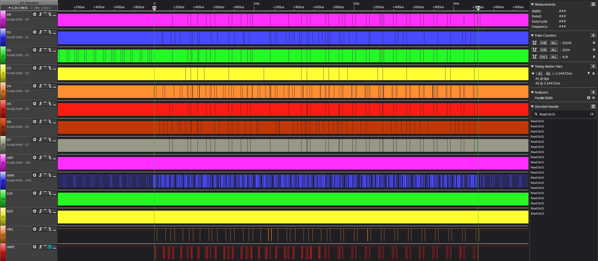

As you can see above, even after shortening the dump to mere 4 miliseconds when everything happens, there were approximately 20000 read operations, over 2000 write operations and roughly 200 accesses to UART during this simple copy/paste operation. The UART count has been reduced due to observed ringing - you will see it in close-ups.

I tried looking for odd-looking data, but this was just stupid. There was nothing really out of order there. I started checking the actual instances of wrong data being sent by searching decoded 8080 bus data for specific values. If you take a look at the last sample (`127450A890ABCDEFGHIJ`)  I first traced the flow of the correct characters (`1` and `2`) and it was exactly as I expected - data is first read from the UART (indicated by the nUART chip select signal), saved to RX buffer, copied over to TX buffer (to echo on the screen) and then copied over to TX FIFO (again, indicated by nUART chip select). You can see individual steps below:

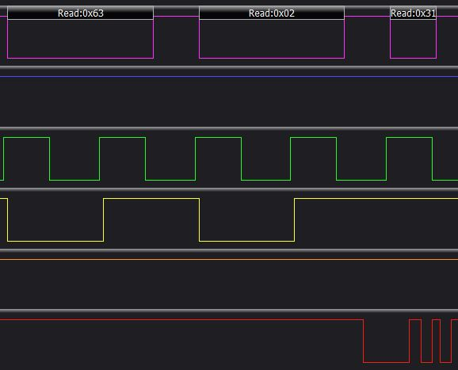

Address 0x0263 represents channel A RX register, and as you can see, value `'1'` (`0x31`) is being read correctly. Next, saving to RX buffer:

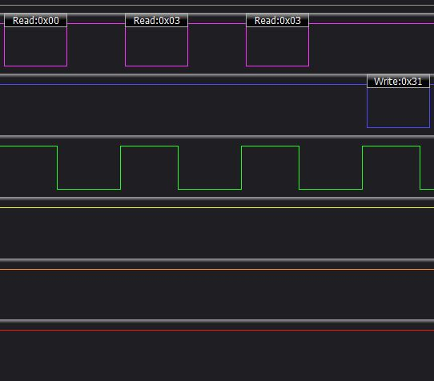

RX buffer for channel A starts at 0x0300 - and this is where the data it is being written to. Next, after being read by the shell routine, it's written back to the TX buffer to echo on screen, and this is the part where it's picked up and written to channel A TX register:

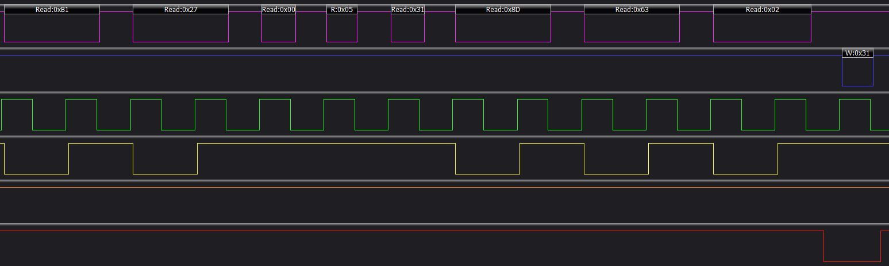

You can see the RAM channel A TX buffer being read (`0xB1 0x27` - `LDA (0x27),Y`), which first reads buffer start address (`0x0500`), adds offset from Y register  and finally reads value `0x31`, which is being written to UART channel A TX register at `0x0263`. 

Please note: SC26C92 has dual-use registers, depending on whether you write to or read from them, hence the same address is used for both TX and RX registers.

Then I looked for `3` being replaced by `7`. I didn't like what I found - there was nothing wrong with the signal and it seemed that the strange character was being read from memory, and this was the part that I couldn't wrap my head around. Loading `3` from UART RX register:

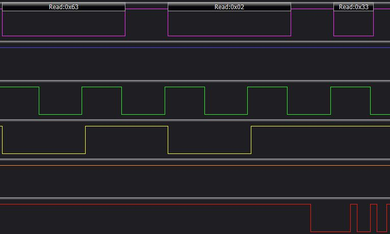

Write to RX buffer:

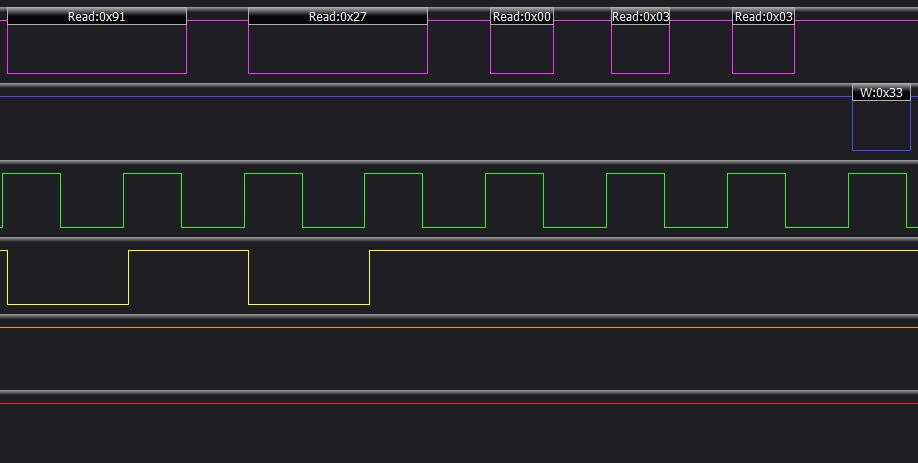

It's all good, and this is what is being processed by OS/1. That being said, it still wrote `7` to the shell, and this value was being read correctly from the buffer:

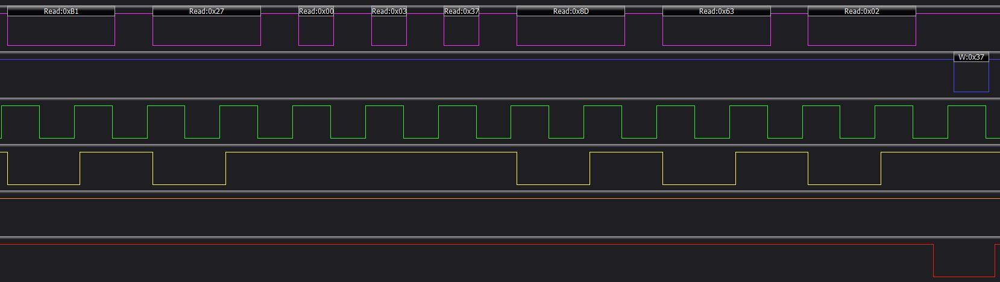

How comes it seems to be stored in memory correctly (and read from it, when you LIST the program), but then it is read incorrectly when echoing? Another timing violation? And if so, how to find it?

Luckily, it was much simpler, and I noticed it when looked closer at the data captured by logic analyser. As it turns out, I was reading from RX RAM buffer when copying data to TX UART FIFO. Notice how pointer stored at `0x27` points now to `0x0300` instead of `0x0500`.

Still, how comes it happened only sometimes, and only at high frequencies? As it turns out, the problem was occurring only with specific order of send/receive operations, and it happened only if the TX FIFO was being serviced during RX interrupts.

## Pattern recognition

Actually, when I said there was nothing special about the captured signals, I was wrong. There was, but I just failed to see this:

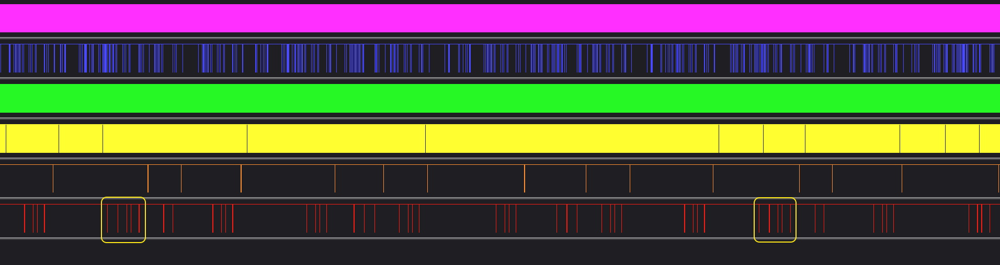

See, the two times when the operation failed, there were 5 UART accesses in a row followed by 2, instead of usual 3 and 4. Three accesses indicate TX IRQ:

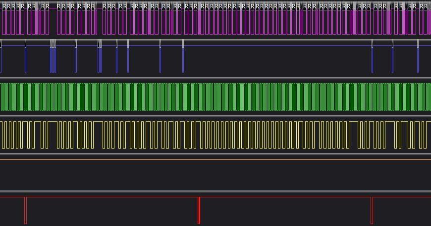

Actually, the first access happens before the IRQ, and this is what triggers it. Typical RX IRQ requires 4 accesses:

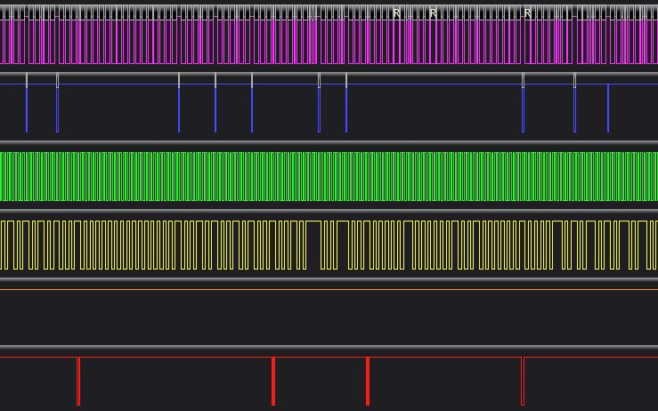

And the culprit - combined RX/TX IRQ was always accessing UART five times:

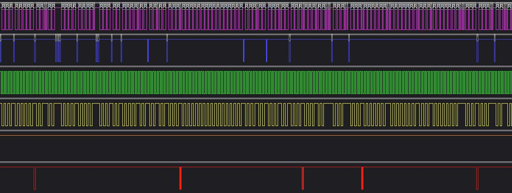

This was happening, because only in these two instances there was something not yet serviced in TX buffer at the time when some data was received, so the sending took place during RX interrupt service - as designed, just poorly implemented, because I forgot to update the pointer...

And, to be fair, after you spend some time looking at these logic analyser dumps, you will get better at reading them even without looking at specific values. Full IRQ cycle looks like this (markers indicate start and end of the handler execution):

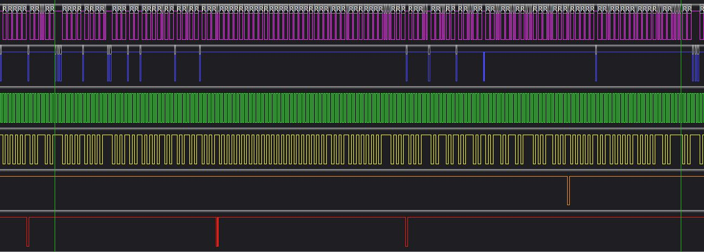

How do I know? When IRQ happens, CPU has to write three values to a stack: current PC and status register. Three bytes. No other operation (that I know of) uses three consecutive memory writes:

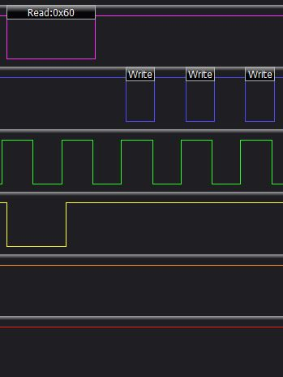

Similarly, returning from interrupt handler is pretty specific, but not unique - it triggers four consecutive memory accesses, but it will not be so distinctive, you can have four NOP operations triggered from memory look the same:

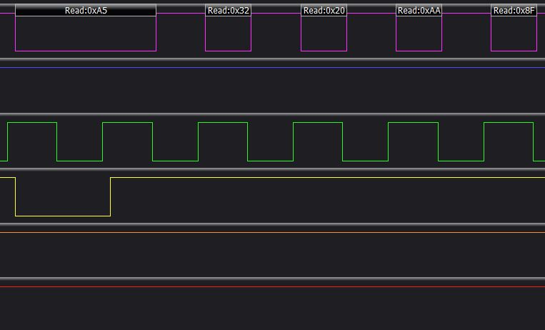

So the point I'm trying to make here is that while intimidating at first, these dumps from logic analyser are super useful. It takes a while to get used to them, but it's worth the effort - it will make your glitch hunting all the more effective.

## Is that it?

It would have been too easy if it just ended here, right? I fixed the code, uploaded it to ROM using my onboard EEPROM programmer and I tested the whole thing again.

Just to see it fail.

Exactly the same way.

Bloody hell.

So I pull out my logic analyser again, capture the same sequence again, and indeed, it's happening the very same way. Actually, it's all too similar. Didn't I just add several new instructions to my IRQ handler? It should be at least a bit different.

Took me a short while to confirm this. Indeed, the ROM contents haven't changed at all. Weird, I was sure the upload worked. What I did find was even more fascinating - but I will write about it next time.

Let me know what you think in the comments below, and I will see you soon with another fascinating glitch!