# Glitches, glitches everywhere

Last time I wrote about simple software bug that caused very scary-looking issue in my serial communication implementation. Before that I also covered problem with 15ns PLD and nRW/nRD stretching. There was another one I haven't even mentioned so far, but it scared the hell out of me: when I started up my latest DB6502 prototype board, the CPU wouldn't just work. Like at all. It was powered and all, but it was not doing anything. Pretty soon I realised that it was the RDY line that was permanently held down, and then I understood - latest revision of the board doesn't use the open collector variant of the RDY circuit, but the parallel RC network for faster operation. All it took was a simple update of the PLD code from this:

```
RDY.OE    = !RDY;
```

to this:

```
RDY.OE    = 'b'1;
```

And now, instead of open collector, I had nice "drive always" RDY output from PLD. After fixing all the simulation errors I got it to work nicely.

Still, it's pretty frightening when you spend months on designing the board, pay for fabrication, spend couple of hours soldering and it just doesn't start at all.

Anyway, what I'm trying to say is that apparently my project is getting to the level of complexity where I have to be very, very careful with each step, because the number of moving parts is growing and making sense of it all can be difficult.

## ROM flashing issue

Back to where I left off last time - I fixed simple OS/1 code issue and it should have worked. It didn't, because when I tried flashing ROM via the onboard AVR programmer it would just fail silently. Even worse - it failed, but claimed to have succeeded.

Now, I've been meaning to write about it for some time now, but haven't gotten around to it yet. See, there are two ways to write to the ROM memory: you can write a byte (or page of 64 consecutive of these at a time) and wait for 10ms, or you can perform write and just wait for the chip to finish. These chips have this nice feature where after performing write operation you can read any address and there will be two bits that you can use to determine if the previous write is complete. It makes the whole process much faster, because in most (if not all cases) you don't have to wait full 10ms.

Thing is - it has actually already caused one issue in the past, so I wasn't surprised to see it happening again.

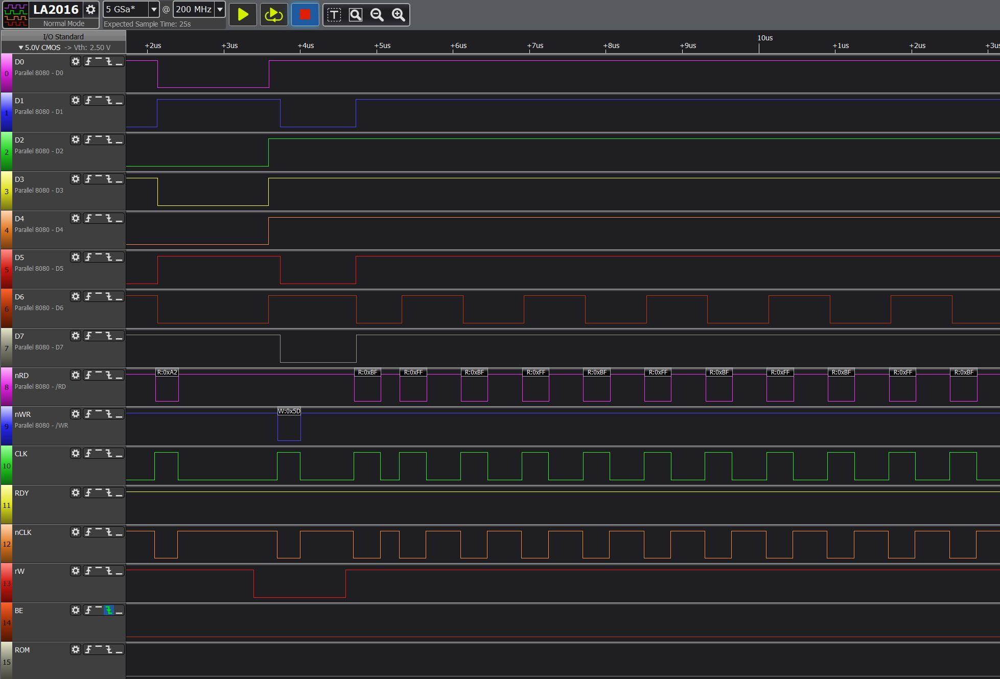

This is how the process starts. In this particular scenario, I'm running simple "check Software Data Protection status" code - it reads first byte in ROM (`0xA2`) and writes the XOR value of it (`0x5D`). It will read the same address after write operation is completed - and if it is the old one, it means that SDP is enabled, obviously. If it changes (so the SDP is disabled), it will overwrite it again with the initial value to preserve original state. 

All the r/W, CLK, BE signals are coming from AVR, the ROM_CS (at the bottom) is calculated by PLD as usual. Actually, RDY is also calculated by PLD and if you look closely, you will notice another problem, but I will deal with this one later.

Anyway, you can see the sequence working as expected: read `0xA2`, write `0x5D`, keep reading the same address until the two consecutive reads yield the same value on bit 6 - this indicates that the write operation is completed. Unfortunately, this is not what happened:

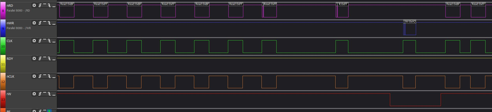

As you can see, there is something odd about the last read operation: the clock signal is clean, but there is something off about the nRD. It looks like the write operation is completed (two reads of `0xFF`), but the next read also results in the same value (`0xFF`), where we expected either `0xA2` or `0x5D`. You have probably guessed by now what happened, so let's confirm with a close-up:

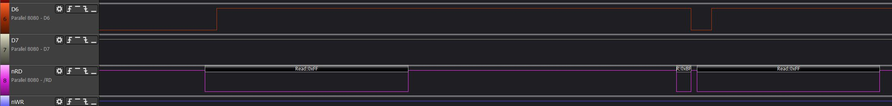

Yep, during single clock cycle there were two read operations performed. Strangely enough, even though these pulses were very short (low pulse measured 25ns, high one 10ns), it was sufficient for the ROM chip to respond as if they were valid. Remember that ROM chip is not connected to CLK line, it only relies on ROM_CS and nRD/nWR signals, and based on those it looked like two very fast, but valid reads. It just responded accordingly.

If you think about it, there is actually very simple "solution" to the problem - read the status three or four times, not just twice. It would have probably worked most of the time, since this ringing on nRD line doesn't happen frequently. That thought terrified me - I wonder how many of actual hardware problems in my devices at home are "solved" this way. It would definitely explain some of the infuriating random failures of these "smart" gadgets.

Obviously, I didn't want that. I need proper solution.

## Schroedinger's Cat

Did I mention how much of an ignorant I am when it comes to analog electronics? I love things nice and simple, with clearly defined signals that can be measured, recorded, quantified and processed. Unfortunately, there are cases like this, when even the process of measuring the signal changes it enough to make the measurement useless. It's like opening the box just to find the cat dead every time...

Just as a reminder, this is the circuit responsible for calculation of the nRD signal:

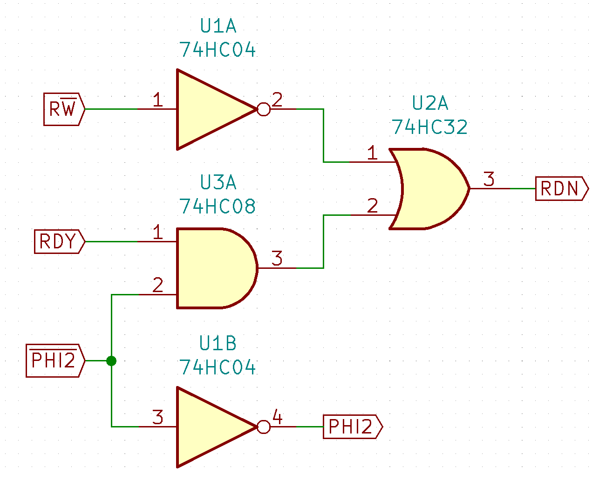

When I measured the nRD (or RDN on the schematic above) signal produced by the redesigned nRD/nWR circuit, it indeed rang like expected:

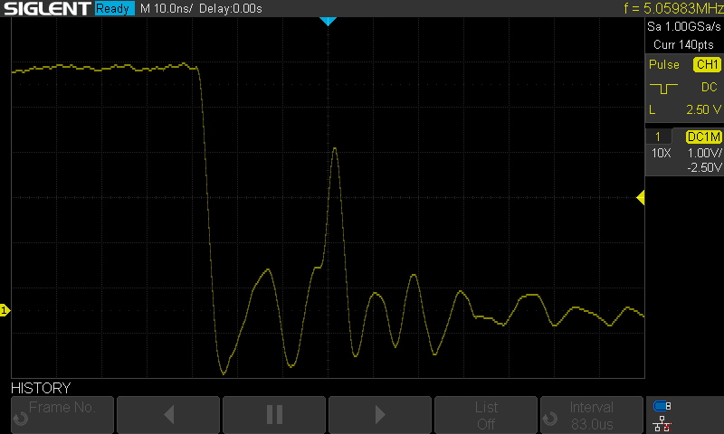

So, it's a start - I have a solid confirmation of what I saw on the logic analyser output. Time to trace back to the offending signal. First, I checked the upper input of the OR gate (pin 1 of U2A in schematic above):

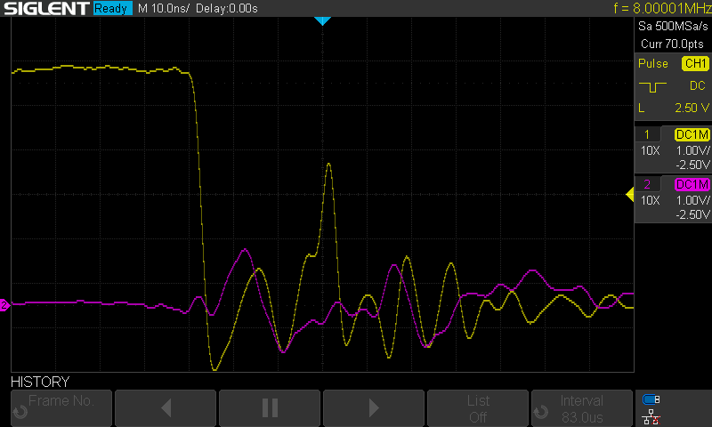

Nope. The signal is ringing a bit, but well below the range where it could cause issues. Checking the other input (pin 2 on U2A) and output of the AND gate then:

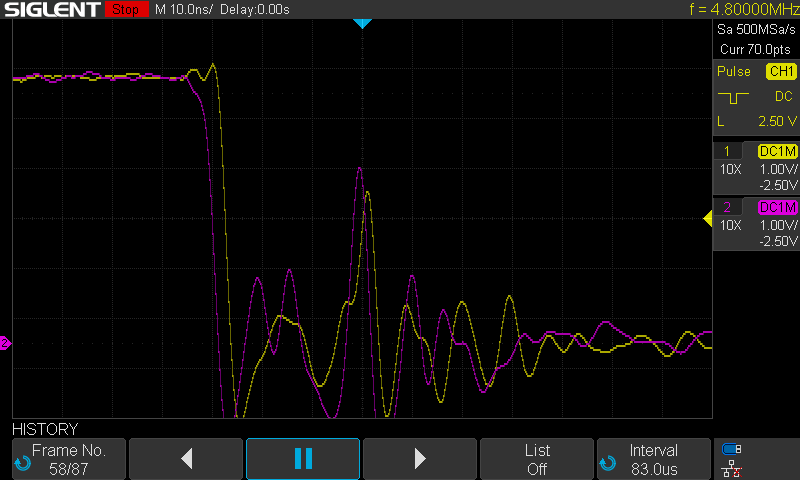

Yeah, that's where the distortion is coming from. So, which of the two inputs of the AND gate is causing the issue? Ready (pin 1 on U3A gate) maybe:

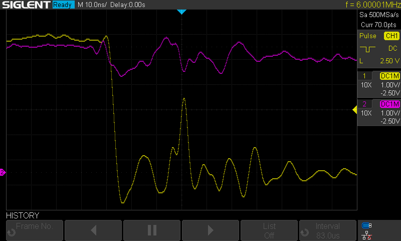

Nope, it's noisy a bit again, but doesn't look that bad. It must be the inverted clock signal then (nCLK), since it's the last signal to check:

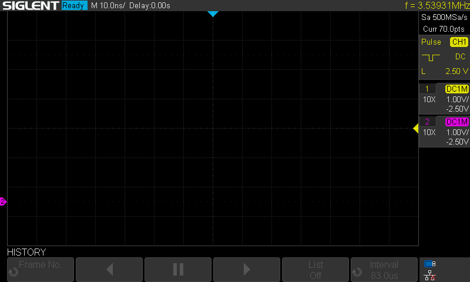

And this is what I really hate. Once I connected my probe to nCLK signal (pin 2 of U3A gate) the issue stopped occurring. Just like that.

Put the probe on nCLK - no issue.

Take the probe away from nCLK - issue is back.

Ha, easy. All I have to do is to is to add oscilloscope to the BOM of my project and expose test points for connecting probe to fix the problem!

Seriously though, I don't know how to properly explain what is going on. After thinking about it for a while I came up with the following explanation: this nCLK signal is actually routed to number of input gates, and since these are CMOS chips, they each work as little capacitors, storing a bit of charge each time the signal is high. After it falls back to low, this charge has to go somewhere, causing the short spike that is sufficient to trigger other input gate, but not being able to overcome probe tip capacitance.

I don't know, maybe it doesn't make sense, please let me know what you think. There is however something valuable to learn here, even if I'm wrong. 

For one, and this is probably obvious to you, but it was an inportant discovery for me. It means that there is a way to measure this kind of freak signals. If they are sufficient to drive input of a gate, then instead of trying to measure them directly (because it clearly doesn't work), measure them going through a gate - this will prevent probe capacitance to alter the signal.

There is, however, another takeaway from this. If probe capacitance is enough to clean the signal, then the "solution" to problem like that can be adding one small capacitor (I used 22pF) between the signal and ground. It worked immediately, nCLK signal got much nicer, it doesn't ring as much anymore.

## Bonus glitch - buy one, get one free

When I was doing the analysis of the signals, I noticed something weird - RDY signal not being as nice and clean as expected. These two images will show it clearly (they are both taken from single scope run, note the frame number at the bottom):

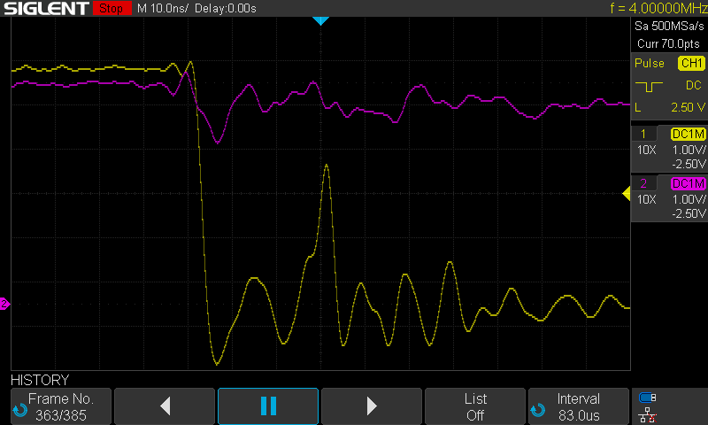

And just a few frames later:

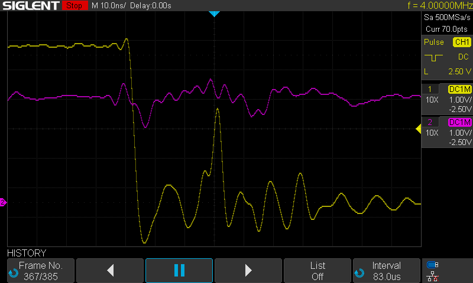

Got me worried for a second, and indeed, it's a design flaw that needs addressing. Luckily, not as severe as it might seem.

And the good thing is I actually tested one of the designed features of my build, just did so unintentionally.

What's going on here? 

Let's start with the good news: this not-that-high RDY signal comes from design feature I described in RDY signal experiments entry. In short, sometimes the RDY input on the 6502 can become output producing low signal, and this is what happened here: wait state circuit is driving the RDY signal high, while CPU is driving the same line low. There is 470Ohm resistor between the two (in parallel with 22pF capacitor) which is acting like a voltage divider, causing the signal to drop a bit on one end and rise a bit on the other, but it works. The only note here is that next time I should use a bit larger value, like 1K, to ensure that the drop and rise are not as strong.

There is bad news, however. See, the reason RDY line was pulled low by 6502 was that it executed WAI instruction, and it executed it during EEPROM flashing. You might be thinking that the CPU should not execute any instructions during programming and you would be quite right.

As it turns out (and I hinted this at the beginning), when playing with PLD setup I have introduced a bug - when both WS_DISABLE (disable wait states entirely) and WS_DEBUG (force RDY signal low) are high, the wait state circuitry in PLD should generate low RDY signal, but it was doing the opposite - it was generating high RDY. Fixing this part would be easy, but it required changing the nRD/nWR stretching logic as well.

See, in previous entry I wrote that the nRD/nWR signal translation is easy - it should stretch indefinitely during low RDY and act normally with RDY being high. WS_DISABLE and WS_DEBUG were supposed to be handled "automatically" (the former driving RDY high and the latter driving it low), but during EEPROM programming this is not the case. You want to disable wait states entirely (because you are using slow, AVR based, clock) and you want to pull the RDY line low, so both signals are high at the same time. This is the schematic I came up with:

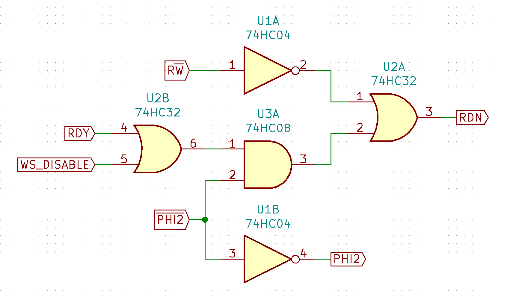

This way, even if RDY signal is driven low by wait state generator, WS_DISABLE will prevent indefinite stretching of nWR/nRD signals. Yeah, sometimes the solution is really simple.

## Conclusion

I'm slowly getting there. I keep running into smaller and bigger obstacles, but the project, overall, is progressing nicely. Solving these issues one by one feels good, and hopefully I can share more optimistic news next time.

Please, let me know what you think, and if you understand what the hell is going on with these ringing signals, I would really appreciate the explanation!