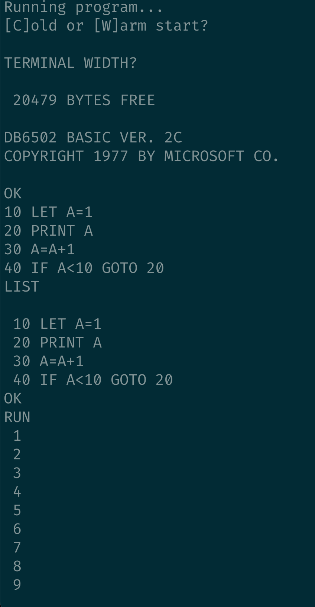
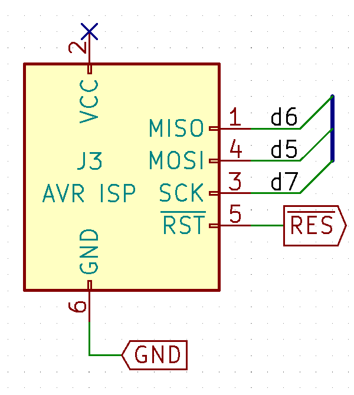
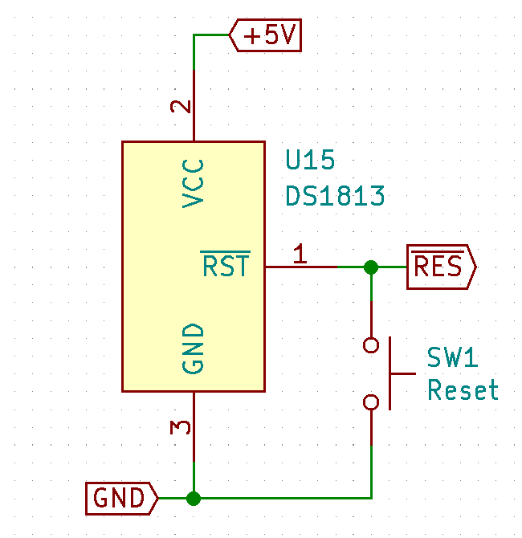
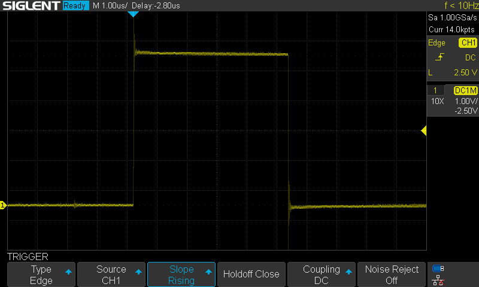

# Good things do happen every now and then

Today I want to start with the latest update - and for a change, this will be very optimistic one. After I shared last entries on Reddit, I got suggestion to try out different PLD chip variant for address decoding, wait state generation and nRD/nWR stretching. Sure, I have used those in the past for my breadboard build, but they never worked very well, causing all the possible random bus issues. I put them in the components box and never looked back.

As it turns out, it pays of to revisit old findings when circumstances change.

I replaced ATF22V10C-15 for an ATF22V10C-10 and strange things started happening. For one, I could finally remove the external circuitry for nRD/nWR stretching and use PLD for this again. Second, it turned out that the PCB build is much more stable, so I started testing various oscillators, and this is where the amazing screenshot came from:


Yes, you are reading this correctly: DB6502 with OS/1 runs perfectly stable at 16MHz on the latest PCB. You can load programs, they all run just fine. MS BASIC works:



It runs MicroChess too, and for a first time it's pretty snappy:


So yeah, that is a small step for computing, but one giant leap for DB6502. After months of struggle I finally reached one of my goals (system clock running at 14MHz), and even went a few more steps further. Feels great, man!

Key takeaway: revisit old assumptions when circumstances change, share to get feedback and use the feedback to improve.

## Setup details

So, how does it work? As I said, all that was required was to replace 15ns PLD by faster, 10ns one. Suddenly all the timing violations disappeared and I could remove the external circuitry for nRD/nWR stretching. Thanks to that fact the PCB is running standalone again.

As for the wait state generator, I'm using no wait states for RAM access, one wait state for I/O operations and two wait states for ROM access (using the 150ns EEPROM variant). It's pretty neat setup, and it pushes all the components to their limits. The only thing that could work faster is the VIA chip - it's capable of running at full 14MHz speed, but since it's part of I/O range, it gets one wait state automatically.

There are also other things on the board I haven't tested fully yet, and the biggest one is memory banking. I have tested all the involved components, but to test drive it properly (and according to original design) I need to change the OS/1 code, memory mapping and other things, so it will not happen overnight. Still, based on what I have seen so far it should be working well.

Should be working well. Famous last words.

## Is it all good then?

Well, obviously not. There were some issues with bus ownership handling by the supervisor chip, but this was simple software bug. I had some issues with using supervisor as a clock source, but again - this was resolved by software change.

While fixing those I have discovered something disturbing, and further investigation resulted in another interesting find.

## The epic struggle for onboard AVR ISP port

As you probably don't remember, in my first DB6502 v2 prototype board I have messed up AVR ISP port layout. It was actually pretty silly mistake, but easy to make, so you can read about it here. It was fixed pretty easily by adding special adapter wires reversing port polarity, and it worked. Or, rather, I think it did. Thing is I haven't used it a lot, once you upload supervisor firmware (and it doesn't change frequently), you don't really need the port for anything else most of the time.

This time I made sure the port is oriented correctly and it was fine. When I discovered the bug mentioned in the previous section I simply uploaded new version of supervisor code and started using it, just as expected. Then I noticed another small bug, fixed it and tried uploading.

Nope.

Nope.

Nope.

Out of a sudden the AVR ISP port stopped working. I unplugged power, waited a few seconds, powered it all up again and... boom, it works. Once. Every consecutive attempt would fail.

Sometimes even the power-down/power-up cycle would not suffice. While not very important issue, it was annoying, so I started another investigation.

## AVR ISP interface explained

In case you haven't had the pleasure of working with AVR chips, their ISP sequence starts with reset line being pulled low followed by conversation over SPI port on dedicated pins. This is how ATMega644 pinout looks like:


Image [source](http://www.uzebox.org/wiki/index.php?title=File:Atmega644-pinout.png).

Now, since I wanted the supervisor to drive 6502 bus as fast as possible, I needed these pins connected to data bus, like so:




That shouldn't be an issue, right? After all, AVR programming will be happening while reset line is pulled low. This causes 6502 bus pins to go in tri-stated mode, so if the programmer is the only thing using these data bus lines doubled with SPI interface, there will be no problem, right?

Then it struck me: actually, wrong. Sure, 6502 CPU, 6522 VIA and SC26C92 UART bus connections will be tri-stated during reset, but RAM and ROM? These guys are not connected to reset line in any possible way. Same goes for PLD, which will happily output valid RAM_CS or ROM_CS signals during reset sequence. Clock will keep ticking and valid nRD/nWR signals will be produced as well, even if computed from invalid (floating) r/W signal.

I checked this assumption with my logic analyser and indeed, it detected valid low signal on ROM_CS line during IVR programming sequence. As a result, AVR wasn't able to respond correctly to commands sent by USBASP programmer. I had the culprit then!

Or so I thought.

To test my hypothesis I moved AVR supervisor to breadboard and connected it via the PCB socket using jumper wire. 

Side note: do not do that. It turned out that my 22 AWG wire was so thick that pushing it in loosened contacts in the tooled socket. Took me few hours the following day to figure that out after I moved AVR supervisor back to the socket and couldn't understand why it doesn't seem to work anymore. The fun never stops...

Anyway, with the AVR on breadboard I could disconnect lines D5, D6 and D7 from 6502 bus temporarily (so they would be connected to USBASP programmer only) to see if that resolved issue with programming.

Guess what.

It didn't.

Bloody hell.

There was just one last connection from the AVR ISP port left to check - the RESET line.

## RESET line in DB6502

For my power-on-reset circuit in DB6502 I use Maxim Integrated DS1813-10 chip. It's very convenient device that will do two things:

1. Monitor source voltage and if it drops below 4.5V (in the -10 variant) it will protect your system by triggering reset,
2. Monitor RESET line and if it's pulled to GND for a while, it will keep it low for about 150ms letting all connected systems to respond to the RESET condition properly.

Obviously, following the datasheet I added RESET button to it like so:

 

If you look closely at the AVR ISP schematic few sections above, you will notice that there is another way the nRES line can be pulled low: via AVRISP port. This is what USBASP will do at the beginning of programming sequence.

So, to summarize: we have two ways to pull nRES low - using onboard button or using AVR ISP interface. Both work beautifully every time - each attempt at uploading new supervisor software initiated correct reset sequence. That being said, there must be something different in how the first reset after power-down/power-up sequence works from all the consecutive ones.

## New approach to troubleshooting

By that time I have figured out that the problem is in the nRES signal not being correct during the firmware update. Thing is - troubleshooting something like that on PCB is not easy. Some traces are not easily accessible, and moving the supervisor to breadboard with the jumper wires caused even more issues. I decided to try out something different this time. 

If that was software project (my day job basically), I wouldn't try to investigate this sort of issue in huge, complex and interconnected environment with database clusters, mainframe machines and distributed integration nodes. I would try to isolate and replicate the problem in much simpler environment.

I decided to give this approach a try. Instead of trying to investigate my complex board, I rebuilt small fraction of it using different AVR chip (ATmega328P) and DS1813-10, like so:


So yeah, the simplest possible configuration. And yes, in case you are wondering, it failed exactly the same way. First time it would work just fine:

````
➜  blink-atmega328p-usbasp git:(main) ✗ make clean all flash
(...)
avrdude -v -B 5 -c usbasp -p m328p -P usb -U flash:w:build/main.hex
(...)
         Programmer Type : usbasp
         Description     : USBasp, http://www.fischl.de/usbasp/

avrdude: set SCK frequency to 187500 Hz
avrdude: AVR device initialized and ready to accept instructions

Reading | ################################################## | 100% 0.00s

avrdude: Device signature = 0x1e950f (probably m328p)
avrdude: safemode: hfuse reads as D7
avrdude: safemode: efuse reads as FD
avrdude: NOTE: "flash" memory has been specified, an erase cycle will be performed
         To disable this feature, specify the -D option.
avrdude: erasing chip
avrdude: set SCK frequency to 187500 Hz
avrdude: reading input file "build/main.hex"
avrdude: input file build/main.hex auto detected as Intel Hex
avrdude: writing flash (176 bytes):

Writing | ################################################## | 100% 0.14s

avrdude: 176 bytes of flash written
avrdude: verifying flash memory against build/main.hex:
avrdude: load data flash data from input file build/main.hex:
avrdude: input file build/main.hex auto detected as Intel Hex
avrdude: input file build/main.hex contains 176 bytes
avrdude: reading on-chip flash data:

Reading | ################################################## | 100% 0.08s

avrdude: verifying ...
avrdude: 176 bytes of flash verified

avrdude: safemode: hfuse reads as D7
avrdude: safemode: efuse reads as FD
avrdude: safemode: Fuses OK (E:FD, H:D7, L:62)

avrdude done.  Thank you.
````

Next time - not so much:

````
➜  blink-atmega328p-usbasp git:(main) ✗ make flash
avrdude -v -B 5 -c usbasp -p m328p -P usb -U flash:w:build/main.hex
(...)
         Programmer Type : usbasp
         Description     : USBasp, http://www.fischl.de/usbasp/

avrdude: set SCK frequency to 187500 Hz
avrdude: error: program enable: target doesn't answer. 1
avrdude: initialization failed, rc=-1
         Double check connections and try again, or use -F to override
         this check.


avrdude done.  Thank you.

make: *** [flash] Error 1
````

And that was it. Disconnect everything from power, wait a moment, connect again - works once with each consecutive attempt failing.

This was great: I managed to isolate and replicate the problem is much simpler environment where the investigation was much easier.

## Here we go again...

Obviously the first thing to do was to find out that the hell is going on. This is what I captured on the scope (connected to TP1 on RESET line in schematic above) during first reset after power-up:


See how clean this signal is?

This is how it looks each next time:


See that shadow there after about 100ms? This is what it looks like up close:


Honestly, this is it: just a couple dozen spikes maybe 800mV max. Tiny, insignificant signal. This shouldn't affect RESET line operation on the AVR, right? 

Well, wrong again.


See, with 5V input this 800mV is way above something that could be guaranteed to be read as low. So, most probably, these spikes were confusing AVR and preventing proper understanding of programming sequence.

Still, where were these spikes coming from?

Now, I can't say for sure, but the explanation I came up with was the following: I assumed that USBASP can easily pull down RESET line, but in fact, it has pretty limited sink capability, restricted by 270 Ohm RS resistor as seen [here](https://www.fischl.de/usbasp/):


With 5V supply it should be able to sink no more than 18mA. Probably this is reduced by some parasitic capacitance (?) on the programmer, and each next time it's just not enough to keep the voltage low enough, causing this strange behavior.

Maybe you have some better explanation for it? I would love to hear in the comments below.

## Solving the problem

Basically I needed a way to pull the RESET line to GND stronger than the USBASP does that. I tried two options, and they both worked. One is to connect USBASP RESET output to P-MOSFET gate (with pull-up resistor) and pull the RESET line via source and drain to GND.


There are some things to be pointed out here. First, there is interesting difference between the first and second programming run:


Second:


During second (and each consecutive one) you can see that spike after about 100ms:


There is, however, much more severe issue - RESET voltage produced by this setup is limited by MOSFET's Vgs threshold:


So it's pretty obvious that the MOSFET itself can't pull the reset line all the way to GND, it will stop when the difference between gate (USBASP RESET line pulled to GND) and source (AVR RESET input and DS1813 output) reaches Vgs threshold value. What did surprise me is that I would have expected DS1813 detect this condition as reset and pull the line all the way to GND. Clearly, this doesn't happen.

What is also surprising is that this build does work each time. After all, this 720mV is not that much lower than the observed spikes in initial setup. Still, I didn't want to risk another issue with next revision PCB, so I gave up MOSFET idea.

Alternative solution is very simple:


This way you never get your reset supervisor fighting your AVR programmer. And the signal looks much better:


The second run also looks pretty good:


There is that spike again! Closer look reveals that it's actually deliberate action from USBASP:



Pretty clean signal with clear 5us duration. There must be some reason it's there.

Oh, and as it turns out, it happens also at the first run, just much sooner:


So yeah, maybe there is more to the AVR ISP interface than I can see.

And, what's worse, the problem is not solved yet, but this entry is already long enough. Remember the data bus lines? Yeah, they cause issues too and I will handle them next time. It was still fun though!